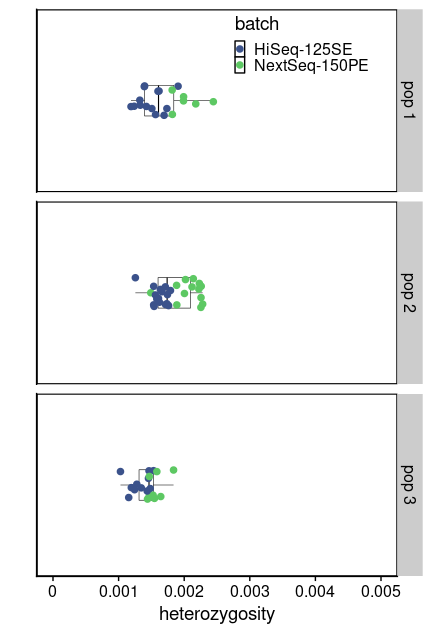
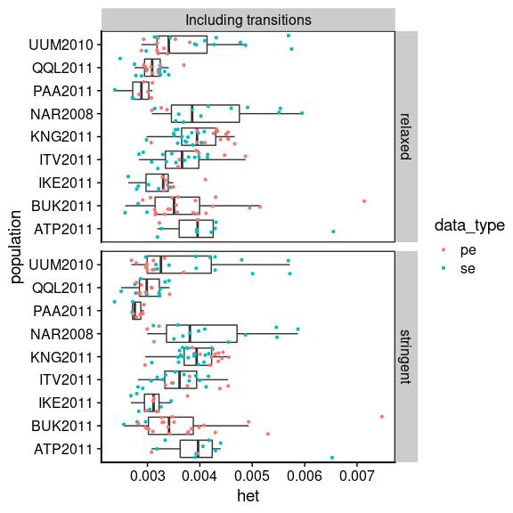
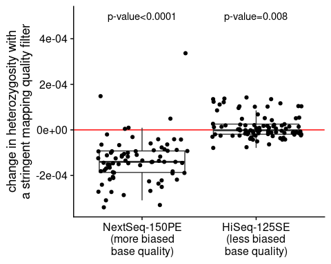

Base quality score miscalibration
================

  - [Estimate heterozygosity including
    transitions](#estimate-heterozygosity-including-transitions)
  - [Rerun a few outlier individuals](#rerun-a-few-outlier-individuals)
  - [Supplementary Figure: heterozygosity with polyG trimming
    only](#supplementary-figure-heterozygosity-with-polyg-trimming-only)
  - [Genome-wide, relaxed vs. stringent mapping quality filter and
    including vs. excluding
    transitions](#genome-wide-relaxed-vs-stringent-mapping-quality-filter-and-including-vs-excluding-transitions)
  - [Effect of having a stringent
    filter](#effect-of-having-a-stringent-filter)
      - [Figure 3](#figure-3)

``` r
library(tidyverse)
library(ggstatsplot)
library(cowplot)
```

Here, we examine the effect of base quality miscalibration by applying a
more stringent base quality filter when estimating heteorzygosity.

## Estimate heterozygosity including transitions

``` bash
## Relaxed quality filter of 20
nohup nice -n 19 bash /workdir/genomic-data-analysis/scripts/get_heterozygosity.sh \
/workdir/batch-effect/ \
/workdir/batch-effect/sample_lists/bam_list_realigned.txt \
/workdir/cod/reference_seqs/gadMor3.fasta \
2 \
10 \
20 \
30 \
> /workdir/batch-effect/nohups/get_heterozygosity.nohup &
## More stringent quality filter of 33
nohup nice -n 19 bash /workdir/genomic-data-analysis/scripts/get_heterozygosity.sh \
/workdir/batch-effect/ \
/workdir/batch-effect/sample_lists/bam_list_realigned.txt \
/workdir/cod/reference_seqs/gadMor3.fasta \
2 \
10 \
33 \
30 \
> /workdir/batch-effect/nohups/get_heterozygosity_stringent.nohup &
```

## Rerun a few outlier individuals

The optimization algorithm may have stuck at a local optimum for these
individuals so I’ll give them another try

``` bash
## Relaxed quality filter of 20, including transitions
echo "/workdir/batch-effect/bam/PAA2011_728_55151_7_pe_bt2_gadMor3_sorted_dedup_overlapclipped_realigned.bam
/workdir/batch-effect/bam/UUM2010_048_55174_7_pe_bt2_gadMor3_sorted_dedup_overlapclipped_realigned.bam
/workdir/batch-effect/bam/BUK2011_057_55110_7_pe_bt2_gadMor3_sorted_dedup_overlapclipped_realigned.bam
/workdir/batch-effect/bam/KNG2011_397_14247X129_4_se_bt2_gadMor3_sorted_dedup_realigned.bam" \
> /workdir/batch-effect/sample_lists/bam_list_realigned_rerun_heterozygosity_1.txt
nohup nice -n 19 bash /workdir/genomic-data-analysis/scripts/get_heterozygosity.sh \
/workdir/batch-effect/ \
/workdir/batch-effect/sample_lists/bam_list_realigned_rerun_heterozygosity_1.txt \
/workdir/cod/reference_seqs/gadMor3.fasta \
2 \
10 \
20 \
30 \
> /workdir/batch-effect/nohups/rerun_heterozygosity_1.nohup &
## Stringent quality filter of 33, including transitions
echo "/workdir/batch-effect/bam/BUK2011_015_55230_7_pe_bt2_gadMor3_sorted_dedup_overlapclipped_realigned.bam
/workdir/batch-effect/bam/ITV2011_782_55236_7_pe_bt2_gadMor3_sorted_dedup_overlapclipped_realigned.bam
/workdir/batch-effect/bam/BUK2011_051_55157_7_pe_bt2_gadMor3_sorted_dedup_overlapclipped_realigned.bam
/workdir/batch-effect/bam/KNG2011_397_14247X129_4_se_bt2_gadMor3_sorted_dedup_realigned.bam" \
> /workdir/batch-effect/sample_lists/bam_list_realigned_rerun_heterozygosity_2.txt
nohup nice -n 19 bash /workdir/genomic-data-analysis/scripts/get_heterozygosity.sh \
/workdir/batch-effect/ \
/workdir/batch-effect/sample_lists/bam_list_realigned_rerun_heterozygosity_2.txt \
/workdir/cod/reference_seqs/gadMor3.fasta \
2 \
10 \
33 \
30 \
> /workdir/batch-effect/nohups/rerun_heterozygosity_2.nohup &
```

## Supplementary Figure: heterozygosity with polyG trimming only

This is to demonstrate that polyG trimming resolves most but not all of
the batch effects in heterozygosity, since base quality miscalibration
also plays a role.

``` r
sample_table <- read_tsv("../sample_lists/sample_table_merged.tsv")
rename_pop <- tibble(population = c("ITV2011", "KNG2011", "QQL2011", "all pops"),
                     population_new =c("pop 1", "pop 2", "pop 3", "all pops"))
for (i in 1:nrow(sample_table)){
  sample_seq_id <- sample_table$sample_seq_id[i]
  sample_id <- sample_table$sample_id_corrected[i]
  population <- sample_table$population[i]
  data_type <- sample_table$data_type[i]
  if (str_detect(data_type,"pe")){
    path <- str_c("../angsd/heterozygosity/", sample_seq_id,  "_bt2_gadMor3_sorted_dedup_overlapclipped_realigned_mindp2_maxdp10_minq20_minmapq30")
  } else {
    path <- str_c("../angsd/heterozygosity/", sample_seq_id,  "_bt2_gadMor3_sorted_dedup_realigned_mindp2_maxdp10_minq20_minmapq30")
  }
  het_relaxed <- read_delim(str_c(path, "_notrans.ml"), col_names = F, delim = " ") %>% 
    transmute(n_sites=(X1+X2+X3), n_snp=X2, het=n_snp/n_sites) %>%
    mutate(sample_id=sample_id, population=population, data_type=data_type, type="Before")
  if(i==1){
    het_final <- het_relaxed
  } else {
    het_final <- bind_rows(het_final, het_relaxed)
  }
}
het_gg <- het_final %>%
  left_join(rename_pop) %>%
  mutate(batch=ifelse(data_type=="pe", "NextSeq-150PE", "HiSeq-125SE")) 
set.seed(42)
het_plot <- het_gg %>%
  filter(population %in% c("KNG2011", "QQL2011", "ITV2011")) %>%
  ggplot(aes(x=population, y=het)) +
  geom_boxplot(outlier.alpha = 0, color="black", size=0.2, width=0.2) +
  geom_jitter(aes(color=batch), height = 0, width = 0.1, size=2) +
  scale_color_viridis_d(begin=0.25, end=0.75) +
  ylab("heterozygosity") +
  facet_grid(population_new~., scales = "free_y") +
  xlab(" ") +
  scale_y_continuous(limits = c(0, 0.005), breaks = 0.001*(0:5), labels = c("0", "0.001", "0.002", "0.003", "0.004", "0.005")) +
  coord_flip() +
  theme_cowplot() +
  theme(panel.background=element_rect(colour="black", size=0.8),
        legend.position = c(0.55, 0.94),
        legend.key.size = unit(0.5, 'lines'),
        strip.text.x = element_text(face = "bold", size=20),
        axis.text.y = element_blank(),
        axis.ticks.y = element_blank()) +
  theme(legend.key = element_rect(fill = "white", colour = "black"))
het_plot
```

<!-- -->

## Genome-wide, relaxed vs. stringent mapping quality filter and including vs. excluding transitions

``` r
sample_table <- read_tsv("../sample_lists/sample_table_merged.tsv")
for (i in 1:nrow(sample_table)){
  sample_seq_id <- sample_table$sample_seq_id[i]
  sample_id <- sample_table$sample_id_corrected[i]
  population <- sample_table$population[i]
  data_type <- sample_table$data_type[i]
  if (str_detect(data_type,"pe")){
    path <- str_c("../angsd/heterozygosity/", sample_seq_id,  "_bt2_gadMor3_sorted_dedup_overlapclipped_realigned_mindp2_maxdp10_minq20_minmapq30")
    path_stringent <- str_c("../angsd/heterozygosity/", sample_seq_id,  "_bt2_gadMor3_sorted_dedup_overlapclipped_realigned_mindp2_maxdp10_minq33_minmapq30")
  } else {
    path <- str_c("../angsd/heterozygosity/", sample_seq_id,  "_bt2_gadMor3_sorted_dedup_realigned_mindp2_maxdp10_minq20_minmapq30")
    path_stringent <- str_c("../angsd/heterozygosity/", sample_seq_id,  "_bt2_gadMor3_sorted_dedup_realigned_mindp2_maxdp10_minq33_minmapq30")
  }
  het_relaxed <- read_delim(str_c(path, ".ml"), col_names = F, delim = " ") %>% 
    transmute(n_sites=(X1+X2+X3), n_snp=X2, het=n_snp/n_sites) %>%
    mutate(sample_id=sample_id, population=population, data_type=data_type, tran="Including transitions", filter="relaxed")
  het_stringent <- read_delim(str_c(path_stringent, ".ml"), col_names = F, delim = " ") %>% 
    transmute(n_sites=(X1+X2+X3), n_snp=X2, het=n_snp/n_sites) %>%
    mutate(sample_id=sample_id, population=population, data_type=data_type, tran="Including transitions", filter="stringent")
  het_combined <- bind_rows(het_relaxed, het_stringent)
  if(i==1){
    het_final <- het_combined
  } else {
    het_final <- bind_rows(het_final, het_combined)
  }
}
het_per_ind <- het_final %>%
  unite(col = type, tran, filter, sep = " ") %>%
  dplyr::select(sample_id, population, data_type, type, het) %>%
  pivot_wider(names_from = type, values_from = het)
set.seed(42)
het_final %>%
  ggplot(aes(x=population, y=het)) +
  geom_boxplot(outlier.alpha = 0) +
  geom_jitter(aes(color=data_type), height = 0, size=0.8) +
  facet_grid(filter~tran) +
  coord_flip() +
  theme_cowplot() +
  theme(panel.background=element_rect(colour="black", size=0.8))
```

<!-- -->

``` r
het_final %>%
  ggplot(aes(x=n_sites, y=het, color=data_type)) +
  geom_point(height = 0, size=1) +
  geom_smooth(se = F, color="black", aes(group=data_type)) +
  facet_grid(filter~tran) +
  theme_cowplot() +
  theme(panel.background=element_rect(colour="black", size=0.8))
```

    ## Warning: Ignoring unknown parameters: height

<!-- -->

## Effect of having a stringent filter

``` r
set.seed(42)
delta_het_filter <- het_final %>%
  dplyr::select(het, sample_id, population, data_type, tran, filter) %>%
  pivot_wider(names_from = filter,  values_from = het) %>%
  mutate(delta = `stringent`- `relaxed`) 
t.test(filter(het_per_ind, data_type=="se")$`Including transitions relaxed`,
       filter(het_per_ind, data_type=="se")$`Including transitions stringent`,
       paired=TRUE)$p.value
```

    ## [1] 0.008145788

``` r
t.test(filter(het_per_ind, data_type=="pe")$`Including transitions relaxed`,
       filter(het_per_ind, data_type=="pe")$`Including transitions stringent`,
       paired=TRUE)$p.value
```

    ## [1] 6.156668e-18

``` r
set.seed(42)
delta_het_filter %>%
  filter(tran=="Including transitions") %>%
  ggplot(aes(x=data_type, y=delta)) +
  geom_hline(yintercept=0, color="red") +
  geom_boxplot(outlier.alpha = 0) +
  geom_jitter(height = 0) +
  annotate(geom = "text", label="p-value<0.0001", x=1, y=0.0005) +
  annotate(geom = "text", label="p-value=0.008", x=2, y=0.0005) +
  scale_x_discrete(labels=c("NextSeq-150PE\n(more biased\nbase quality)", "HiSeq-125SE\n(less biased\nbase quality)")) +
  ylab("change in heterozygosity with\na stringent mapping quality filter") +
  theme_cowplot() +
  theme(axis.title.x = element_blank())
```

<!-- -->

#### Figure 3

``` r
set.seed(42)
figure <- het_final %>%
  mutate(data_type=ifelse(data_type=="pe", "NextSeq-150PE (more miscalibration in base quality scores)", "HiSeq-125SE (less miscalibration in base quality scores)")) %>%
  mutate(filter=ifelse(filter=="relaxed", "relaxed base quality filter (minQ = 20)", "stringent base quality filter (minQ = 33)")) %>%
  filter(tran=="Including transitions") %>%
  mutate(data_type=factor(data_type, levels = c("NextSeq-150PE (more miscalibration in base quality scores)", "HiSeq-125SE (less miscalibration in base quality scores)"))) %>%
  ggstatsplot::grouped_ggwithinstats(
  x = filter,
  y = het,
  #type = "np", # non-parametric statistics
  point.path.args=list(alpha=0.2),
  xlab = element_blank(),
  ylab = "estimated heterozygosity",
  grouping.var = data_type,
  ggtheme = theme_ggstatsplot(),
  bf.message = FALSE,
  ggplot.component = list(theme(panel.grid = element_blank(),
                                axis.line = element_line()))
  )
```

    ## Warning: Ignoring unknown parameters: segment.linetype
    
    ## Warning: Ignoring unknown parameters: segment.linetype

``` r
print(figure)
```

<!-- -->

A more stringent filter decreases heterozygosity estimate of PE samples
but increases that of the the SE samples (very slightly).
