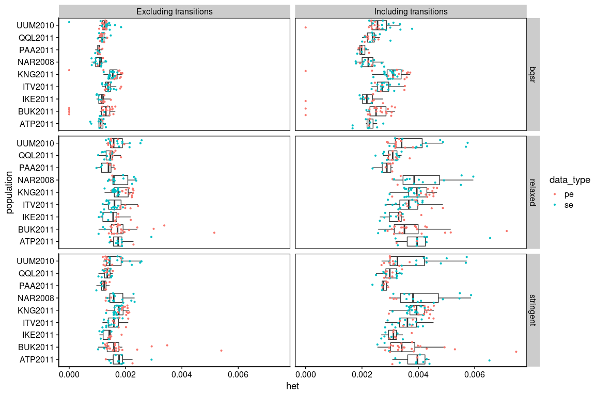
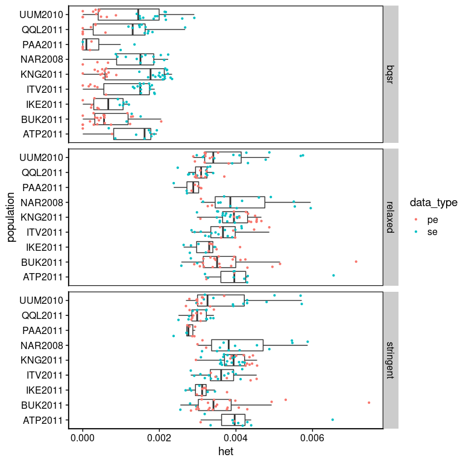

Base quality score recalibration
================

  - [SNP calling with the entire Greenland dataset and relaxed
    filters](#snp-calling-with-the-entire-greenland-dataset-and-relaxed-filters)
  - [SoapSNP GL model in ANGSD](#soapsnp-gl-model-in-angsd)
      - [Create a bed formatted SNP
        list](#create-a-bed-formatted-snp-list)
      - [Mask SNPs in reference genome](#mask-snps-in-reference-genome)
      - [Generate calibration matrix for each batch of
        data](#generate-calibration-matrix-for-each-batch-of-data)
      - [Estimate heterozygosity](#estimate-heterozygosity)
      - [Visualize the result](#visualize-the-result)
  - [GATK BQSR](#gatk-bqsr)
      - [Run all samples](#run-all-samples)
      - [Estimate heterozygosity](#estimate-heterozygosity-1)
      - [Visualize the result](#visualize-the-result-1)
  - [Conclusion for now](#conclusion-for-now)

``` r
library(tidyverse)
```

    ## Warning: replacing previous import 'lifecycle::last_warnings' by
    ## 'rlang::last_warnings' when loading 'pillar'

    ## Warning: replacing previous import 'lifecycle::last_warnings' by
    ## 'rlang::last_warnings' when loading 'tibble'

    ## Warning: replacing previous import 'lifecycle::last_warnings' by
    ## 'rlang::last_warnings' when loading 'hms'

``` r
library(cowplot)
```

## SNP calling with the entire Greenland dataset and relaxed filters

``` bash
nohup /workdir/programs/angsd0.931/angsd/angsd \
-b /workdir/cod/greenland-cod/sample_lists/bam_list_realigned_mincov_filtered.txt \
-ref /workdir/cod/reference_seqs/gadMor3.fasta \
-out /workdir/batch-effect/angsd/global_snp_list_bqsr \
-GL 1 -doMaf 1 -doMajorMinor 4 -P 8 -SNP_pval 1e-6 -minQ 20 -minMapQ 20 \
> /workdir/batch-effect/nohups/global_snp_list_bqsr.nohup &
```

## SoapSNP GL model in ANGSD

#### Create a bed formatted SNP list

``` r
bed_snp_list <- read_tsv("../angsd/global_snp_list_bqsr.mafs.gz") %>%
  transmute(chromo=chromo, position_start=position-1, position_end=position)
write_tsv(bed_snp_list, "../angsd/global_snp_list_bqsr.bed", col_names = FALSE)
```

#### Mask SNPs in reference genome

``` bash
nohup bedtools maskfasta \
-fi /workdir/cod/reference_seqs/gadMor3.fasta \
-bed /workdir/batch-effect/angsd/global_snp_list_bqsr.bed \
-fo /workdir/batch-effect/misc/gadMor3_snp_masked.fasta \
> /workdir/batch-effect/nohups/maskfasta.nohup &
samtools faidx /workdir/batch-effect/misc/gadMor3_snp_masked.fasta 
```

#### Generate calibration matrix for each batch of data

``` bash
nohup /workdir/programs/angsd0.931/angsd/angsd \
-bam /workdir/batch-effect/sample_lists/bam_list_per_pop/bam_list_realigned_se.txt \
-GL 3 \
-tmpdir /workdir/batch-effect/angsd_tmpdir_se/ \
-out /workdir/batch-effect/angsd/soapsnp_se \
-ref  /workdir/batch-effect/misc/gadMor3_snp_masked.fasta \
-minQ 0 \
-minMapQ 30 \
> /workdir/batch-effect/nohups/calibration_matrix_se.nohup &

nohup /workdir/programs/angsd0.931/angsd/angsd \
-bam /workdir/batch-effect/sample_lists/bam_list_per_pop/bam_list_realigned_pe.txt \
-GL 3 \
-tmpdir /workdir/batch-effect/angsd_tmpdir_pe/ \
-out /workdir/batch-effect/angsd/soapsnp_pe \
-ref  /workdir/batch-effect/misc/gadMor3_snp_masked.fasta \
-minQ 0 \
-minMapQ 30 \
> /workdir/batch-effect/nohups/calibration_matrix_pe.nohup &

for K in {0..87}; do
  mkdir /workdir/batch-effect/angsd_tmpdir_se/subdir${K}
  cp /workdir/batch-effect/angsd_tmpdir_se/${K}.counts${K} /workdir/batch-effect/angsd_tmpdir_se/subdir${K}/0.counts0
  cp /workdir/batch-effect/angsd_tmpdir_se/${K}.qual${K} /workdir/batch-effect/angsd_tmpdir_se/subdir${K}/0.qual0
done

for K in {0..74}; do
  mkdir /workdir/batch-effect/angsd_tmpdir_pe/subdir${K}
  cp /workdir/batch-effect/angsd_tmpdir_pe/${K}.counts${K} /workdir/batch-effect/angsd_tmpdir_pe/subdir${K}/0.counts0
  cp /workdir/batch-effect/angsd_tmpdir_pe/${K}.qual${K} /workdir/batch-effect/angsd_tmpdir_pe/subdir${K}/0.qual0
done
```

#### Estimate heterozygosity

Save the following script as
`/workdir/batch-effect/scripts/get_heterozygosity_bqsr.sh`

``` bash
#!/bin/bash
BATCH=$1
SAMPLESIZE=$2

OUTDIR=/workdir/batch-effect/angsd/heterozygosity/
JOB_INDEX=0
JOBS=10
MINDP=2
MAXDP=10
MINQ=0
MINMAPQ=30
KMAX=$(( SAMPLESIZE-1  ))
for K in $(seq 0 $KMAX); do
  LINE=`head /workdir/batch-effect/sample_lists/bam_list_per_pop/bam_list_realigned_${BATCH}.txt -n $(( K+1 )) | tail -n 1`
  NAME_TEMP=`echo "${LINE%.*}"`
  NAME=`echo "${NAME_TEMP##*/}"`
    echo $NAME
  OUTBASE=$NAME'_mindp'$MINDP'_maxdp'$MAXDP'_minq'$MINQ'_minmapq'$MINMAPQ'_bqsr'
  
    /workdir/programs/angsd0.931/angsd/angsd \
  -i $LINE \
  -anc /workdir/cod/reference_seqs/gadMor3.fasta \
  -out $OUTDIR$OUTBASE \
  -GL 3 \
  -tmpdir /workdir/batch-effect/angsd_tmpdir_${BATCH}/subdir${K} \
  -doSaf 1 \
  -P 2 \
  -doCounts 1 \
  -setMinDepth $MINDP \
  -setMaxDepth $MAXDP \
  -minQ $MINQ \
  -minmapq $MINMAPQ &
  
  JOB_INDEX=$(( JOB_INDEX + 1 ))
    if [ $JOB_INDEX == $JOBS ]; then
        wait
        JOB_INDEX=0
    fi
done

wait

for K in $(seq 0 $KMAX); do
  LINE=`head /workdir/batch-effect/sample_lists/bam_list_per_pop/bam_list_realigned_${BATCH}.txt -n $(( K+1 )) | tail -n 1`
  NAME_TEMP=`echo "${LINE%.*}"`
  NAME=`echo "${NAME_TEMP##*/}"`
    echo $NAME
  OUTBASE=$NAME'_mindp'$MINDP'_maxdp'$MAXDP'_minq'$MINQ'_minmapq'$MINMAPQ'_bqsr'
  
  /workdir/programs/angsd0.931/angsd/misc/realSFS \
  ${OUTDIR}${OUTBASE}.saf.idx \
  -P $JOBS \
  > ${OUTDIR}${OUTBASE}.ml
done
```

Save the following script as
`/workdir/batch-effect/scripts/get_heterozygosity_bqsr_notrans.sh`

``` bash
#!/bin/bash
BATCH=$1
SAMPLESIZE=$2

OUTDIR=/workdir/batch-effect/angsd/heterozygosity/
JOB_INDEX=0
JOBS=10
MINDP=2
MAXDP=10
MINQ=0
MINMAPQ=30
KMAX=$(( SAMPLESIZE-1  ))
for K in $(seq 0 $KMAX); do
  LINE=`head /workdir/batch-effect/sample_lists/bam_list_per_pop/bam_list_realigned_${BATCH}.txt -n $(( K+1 )) | tail -n 1`
  NAME_TEMP=`echo "${LINE%.*}"`
  NAME=`echo "${NAME_TEMP##*/}"`
    echo $NAME
  OUTBASE=$NAME'_mindp'$MINDP'_maxdp'$MAXDP'_minq'$MINQ'_minmapq'$MINMAPQ'_bqsr_notrans'
  
    /workdir/programs/angsd0.931/angsd/angsd \
  -i $LINE \
  -anc /workdir/cod/reference_seqs/gadMor3.fasta \
  -out $OUTDIR$OUTBASE \
  -GL 3 \
  -tmpdir /workdir/batch-effect/angsd_tmpdir_${BATCH}/subdir${K} \
  -doSaf 1 \
  -P 2 \
  -doCounts 1 \
  -setMinDepth $MINDP \
  -setMaxDepth $MAXDP \
  -minQ $MINQ \
  -minmapq $MINMAPQ \
  -noTrans 1 &
  
  JOB_INDEX=$(( JOB_INDEX + 1 ))
    if [ $JOB_INDEX == $JOBS ]; then
        wait
        JOB_INDEX=0
    fi
done

wait

for K in $(seq 0 $KMAX); do
  LINE=`head /workdir/batch-effect/sample_lists/bam_list_per_pop/bam_list_realigned_${BATCH}.txt -n $(( K+1 )) | tail -n 1`
  NAME_TEMP=`echo "${LINE%.*}"`
  NAME=`echo "${NAME_TEMP##*/}"`
    echo $NAME
  OUTBASE=$NAME'_mindp'$MINDP'_maxdp'$MAXDP'_minq'$MINQ'_minmapq'$MINMAPQ'_bqsr_notrans'
  
  /workdir/programs/angsd0.931/angsd/misc/realSFS \
  ${OUTDIR}${OUTBASE}.saf.idx \
  -P $JOBS \
  > ${OUTDIR}${OUTBASE}.ml
done
```

``` bash
nohup bash /workdir/batch-effect/scripts/get_heterozygosity_bqsr.sh se 88 > /workdir/batch-effect/nohups/get_saf_bqsr_se.nohup &
nohup bash /workdir/batch-effect/scripts/get_heterozygosity_bqsr.sh pe 75 > /workdir/batch-effect/nohups/get_saf_bqsr_pe.nohup &
nohup bash /workdir/batch-effect/scripts/get_heterozygosity_bqsr_notrans.sh se 88 > /workdir/batch-effect/nohups/get_saf_bqsr_notrans_se.nohup &
nohup bash /workdir/batch-effect/scripts/get_heterozygosity_bqsr_notrans.sh pe 75 > /workdir/batch-effect/nohups/get_saf_bqsr_notrans_pe.nohup &
```

#### Visualize the result

``` r
sample_table <- read_tsv("../sample_lists/sample_table_merged.tsv")
for (i in 1:nrow(sample_table)){
  sample_seq_id <- sample_table$sample_seq_id[i]
  sample_id <- sample_table$sample_id_corrected[i]
  population <- sample_table$population[i]
  data_type <- sample_table$data_type[i]
  if (str_detect(data_type,"pe")){
    path <- str_c("../angsd/heterozygosity/", sample_seq_id,  "_bt2_gadMor3_sorted_dedup_overlapclipped_realigned_mindp2_maxdp10_minq20_minmapq30")
    path_stringent <- str_c("../angsd/heterozygosity/", sample_seq_id,  "_bt2_gadMor3_sorted_dedup_overlapclipped_realigned_mindp2_maxdp10_minq33_minmapq30")
    path_bqsr <- str_c("../angsd/heterozygosity/", sample_seq_id,  "_bt2_gadMor3_sorted_dedup_overlapclipped_realigned_mindp2_maxdp10_minq0_minmapq30_bqsr")
    path_notrans <- str_c("../angsd/heterozygosity/", sample_seq_id,  "_bt2_gadMor3_sorted_dedup_overlapclipped_realigned_mindp2_maxdp10_minq20_minmapq30_notrans")
    path_stringent_notrans <- str_c("../angsd/heterozygosity/", sample_seq_id,  "_bt2_gadMor3_sorted_dedup_overlapclipped_realigned_mindp2_maxdp10_minq33_minmapq30_notrans")
    path_bqsr_notrans <- str_c("../angsd/heterozygosity/", sample_seq_id,  "_bt2_gadMor3_sorted_dedup_overlapclipped_realigned_mindp2_maxdp10_minq0_minmapq30_bqsr_notrans")
  } else {
    path <- str_c("../angsd/heterozygosity/", sample_seq_id,  "_bt2_gadMor3_sorted_dedup_realigned_mindp2_maxdp10_minq20_minmapq30")
    path_stringent <- str_c("../angsd/heterozygosity/", sample_seq_id,  "_bt2_gadMor3_sorted_dedup_realigned_mindp2_maxdp10_minq33_minmapq30")
    path_bqsr <- str_c("../angsd/heterozygosity/", sample_seq_id,  "_bt2_gadMor3_sorted_dedup_realigned_mindp2_maxdp10_minq0_minmapq30_bqsr")
    path_notrans <- str_c("../angsd/heterozygosity/", sample_seq_id,  "_bt2_gadMor3_sorted_dedup_realigned_mindp2_maxdp10_minq20_minmapq30_notrans")
    path_stringent_notrans <- str_c("../angsd/heterozygosity/", sample_seq_id,  "_bt2_gadMor3_sorted_dedup_realigned_mindp2_maxdp10_minq33_minmapq30_notrans")
    path_bqsr_notrans <- str_c("../angsd/heterozygosity/", sample_seq_id,  "_bt2_gadMor3_sorted_dedup_realigned_mindp2_maxdp10_minq0_minmapq30_bqsr_notrans")
  }
  het_relaxed <- read_delim(str_c(path, ".ml"), col_names = F, delim = " ") %>% 
    transmute(n_sites=(X1+X2+X3), n_snp=X2, het=n_snp/n_sites) %>%
    mutate(sample_id=sample_id, population=population, data_type=data_type, tran="Including transitions", filter="relaxed")
  het_stringent <- read_delim(str_c(path_stringent, ".ml"), col_names = F, delim = " ") %>% 
    transmute(n_sites=(X1+X2+X3), n_snp=X2, het=n_snp/n_sites) %>%
    mutate(sample_id=sample_id, population=population, data_type=data_type, tran="Including transitions", filter="stringent")
  het_bqsr <- read_delim(str_c(path_bqsr, ".ml"), col_names = F, delim = " ") %>% 
    transmute(n_sites=(X1+X2+X3), n_snp=X2, het=n_snp/n_sites) %>%
    mutate(sample_id=sample_id, population=population, data_type=data_type, tran="Including transitions", filter="bqsr")
  het_relaxed_notrans <- read_delim(str_c(path_notrans, ".ml"), col_names = F, delim = " ") %>% 
    transmute(n_sites=(X1+X2+X3), n_snp=X2, het=n_snp/n_sites) %>%
    mutate(sample_id=sample_id, population=population, data_type=data_type, tran="Excluding transitions", filter="relaxed")
  het_stringent_notrans <- read_delim(str_c(path_stringent_notrans, ".ml"), col_names = F, delim = " ") %>% 
    transmute(n_sites=(X1+X2+X3), n_snp=X2, het=n_snp/n_sites) %>%
    mutate(sample_id=sample_id, population=population, data_type=data_type, tran="Excluding transitions", filter="stringent")
  het_bqsr_notrans <- read_delim(str_c(path_bqsr_notrans, ".ml"), col_names = F, delim = " ") %>% 
    transmute(n_sites=(X1+X2+X3), n_snp=X2, het=n_snp/n_sites) %>%
    mutate(sample_id=sample_id, population=population, data_type=data_type, tran="Excluding transitions", filter="bqsr")
  het_combined <- bind_rows(het_relaxed, het_stringent, het_bqsr, het_relaxed_notrans, het_stringent_notrans, het_bqsr_notrans)
  if(i==1){
    het_final <- het_combined
  } else {
    het_final <- bind_rows(het_final, het_combined)
  }
}
het_per_ind <- het_final %>%
  unite(col = type, tran, filter, sep = " ") %>%
  dplyr::select(sample_id, population, data_type, type, het) %>%
  pivot_wider(names_from = type, values_from = het)
set.seed(42)
het_final %>%
  ggplot(aes(x=population, y=het)) +
  geom_boxplot(outlier.alpha = 0) +
  geom_jitter(aes(color=data_type), height = 0, size=0.8) +
  facet_grid(filter~tran) +
  coord_flip() +
  theme_cowplot() +
  theme(panel.background=element_rect(colour="black", size=0.8))
```

<!-- -->

``` r
het_final %>%
  ggplot(aes(x=n_sites, y=het, color=data_type)) +
  geom_point(height = 0, size=1) +
  geom_smooth(se = F, color="black", aes(group=data_type)) +
  facet_grid(filter~tran) +
  theme_cowplot() +
  theme(panel.background=element_rect(colour="black", size=0.8))
```

    ## Warning: Ignoring unknown parameters: height

<!-- -->

## GATK BQSR

#### Run all samples

``` bash
/programs/gatk-4.2.0.0/gatk IndexFeatureFile \
-I /workdir/batch-effect/angsd/global_snp_list_bqsr.bed

cp /workdir/batch-effect/sample_lists/bam_list_realigned.txt /workdir/batch-effect/sample_lists/bam_list_realigned.list

nohup /programs/gatk-4.2.0.0/gatk \
BaseRecalibrator \
-I /workdir/batch-effect/sample_lists/bam_list_realigned.list \
-R /workdir/cod/reference_seqs/gadMor3.fasta \
--known-sites /workdir/batch-effect/angsd/global_snp_list_bqsr.bed \
--read-filter MappingQualityReadFilter \
--minimum-mapping-quality 30 \
-O /workdir/batch-effect/bam/recal_data_all_samples.table \
> /workdir/batch-effect/nohups/gatk_bqsr_all_samples.nohup &
```

Save the following script as
`/workdir/batch-effect/scripts/gatk_bqsr.sh`

``` bash
#!/bin/bash
BAMLIST=/workdir/batch-effect/sample_lists/bam_list_realigned.txt
BASEDIR=/workdir/batch-effect/
REFERENCE=/workdir/cod/reference_seqs/gadMor3.fasta

JOB_INDEX=0
JOBS=20

for LINE in `cat $BAMLIST`; do
  NAME_TEMP=`echo "${LINE%.*}"`
  NAME=`echo "${NAME_TEMP##*/}"`
    echo $NAME
  /programs/gatk-4.2.0.0/gatk ApplyBQSR \
  -R $REFERENCE \
  -I $LINE \
  --bqsr-recal-file ${BASEDIR}/bam/recal_data_all_samples.table \
  -O ${BASEDIR}/bam/${NAME}_bqsr.bam &
  
  JOB_INDEX=$(( JOB_INDEX + 1 ))
    if [ $JOB_INDEX == $JOBS ]; then
        wait
        JOB_INDEX=0
    fi
done
```

``` bash
nohup bash /workdir/batch-effect/scripts/gatk_bqsr.sh > /workdir/batch-effect/nohups/gatk_bqsr.nohup &
```

#### Estimate heterozygosity

Save the following script as
`/workdir/batch-effect/scripts/get_heterozygosity_bqsr_gatk.sh`

``` bash
#!/bin/bash
BAMLIST=/workdir/batch-effect/sample_lists/bam_list_realigned.txt
OUTDIR=/workdir/batch-effect/angsd/heterozygosity/
JOB_INDEX=0
JOBS=30
MINDP=2
MAXDP=10
MINQ=0
MINMAPQ=30
for LINE in `cat $BAMLIST`; do
  NAME_TEMP=`echo "${LINE%.*}"`
  NAME=`echo "${NAME_TEMP##*/}"`
    echo $NAME
  OUTBASE=$NAME'_mindp'$MINDP'_maxdp'$MAXDP'_minq'$MINQ'_minmapq'$MINMAPQ'_bqsr_gatk'
  
    /workdir/programs/angsd0.931/angsd/angsd \
  -i $NAME_TEMP'_bqsr.bam' \
  -anc /workdir/cod/reference_seqs/gadMor3.fasta \
  -out $OUTDIR$OUTBASE \
  -GL 1 \
  -doSaf 1 \
  -P 1 \
  -doCounts 1 \
  -setMinDepth $MINDP \
  -setMaxDepth $MAXDP \
  -minQ $MINQ \
  -minmapq $MINMAPQ &
  
  JOB_INDEX=$(( JOB_INDEX + 1 ))
    if [ $JOB_INDEX == $JOBS ]; then
        wait
        JOB_INDEX=0
    fi
done

wait

for LINE in `cat $BAMLIST`; do
  NAME_TEMP=`echo "${LINE%.*}"`
  NAME=`echo "${NAME_TEMP##*/}"`
    echo $NAME
  OUTBASE=$NAME'_mindp'$MINDP'_maxdp'$MAXDP'_minq'$MINQ'_minmapq'$MINMAPQ'_bqsr_gatk'
  
  /workdir/programs/angsd0.931/angsd/misc/realSFS \
  ${OUTDIR}${OUTBASE}.saf.idx \
  -P $JOBS \
  > ${OUTDIR}${OUTBASE}.ml
done
```

``` bash
nohup bash /workdir/batch-effect/scripts/get_heterozygosity_bqsr_gatk.sh > /workdir/batch-effect/nohups/get_heterozygosity_bqsr_gatk.nohup &
```

#### Visualize the result

``` r
sample_table <- read_tsv("../sample_lists/sample_table_merged.tsv")
for (i in 1:nrow(sample_table)){
  sample_seq_id <- sample_table$sample_seq_id[i]
  sample_id <- sample_table$sample_id_corrected[i]
  population <- sample_table$population[i]
  data_type <- sample_table$data_type[i]
  if (str_detect(data_type,"pe")){
    path <- str_c("../angsd/heterozygosity/", sample_seq_id,  "_bt2_gadMor3_sorted_dedup_overlapclipped_realigned_mindp2_maxdp10_minq20_minmapq30")
    path_stringent <- str_c("../angsd/heterozygosity/", sample_seq_id,  "_bt2_gadMor3_sorted_dedup_overlapclipped_realigned_mindp2_maxdp10_minq33_minmapq30")
    path_bqsr <- str_c("../angsd/heterozygosity/", sample_seq_id,  "_bt2_gadMor3_sorted_dedup_overlapclipped_realigned_mindp2_maxdp10_minq0_minmapq30_bqsr_gatk")
  } else {
    path <- str_c("../angsd/heterozygosity/", sample_seq_id,  "_bt2_gadMor3_sorted_dedup_realigned_mindp2_maxdp10_minq20_minmapq30")
    path_stringent <- str_c("../angsd/heterozygosity/", sample_seq_id,  "_bt2_gadMor3_sorted_dedup_realigned_mindp2_maxdp10_minq33_minmapq30")
    path_bqsr <- str_c("../angsd/heterozygosity/", sample_seq_id,  "_bt2_gadMor3_sorted_dedup_realigned_mindp2_maxdp10_minq0_minmapq30_bqsr_gatk")
  }
  het_relaxed <- read_delim(str_c(path, ".ml"), col_names = F, delim = " ") %>% 
    transmute(n_sites=(X1+X2+X3), n_snp=X2, het=n_snp/n_sites) %>%
    mutate(sample_id=sample_id, population=population, data_type=data_type, tran="Including transitions", filter="relaxed")
  het_stringent <- read_delim(str_c(path_stringent, ".ml"), col_names = F, delim = " ") %>% 
    transmute(n_sites=(X1+X2+X3), n_snp=X2, het=n_snp/n_sites) %>%
    mutate(sample_id=sample_id, population=population, data_type=data_type, tran="Including transitions", filter="stringent")
  het_bqsr <- read_delim(str_c(path_bqsr, ".ml"), col_names = F, delim = " ") %>% 
    transmute(n_sites=(X1+X2+X3), n_snp=X2, het=n_snp/n_sites) %>%
    mutate(sample_id=sample_id, population=population, data_type=data_type, tran="Including transitions", filter="bqsr")
  het_combined <- bind_rows(het_relaxed, het_stringent, het_bqsr)
  if(i==1){
    het_final <- het_combined
  } else {
    het_final <- bind_rows(het_final, het_combined)
  }
}
het_per_ind <- het_final %>%
  unite(col = type, tran, filter, sep = " ") %>%
  dplyr::select(sample_id, population, data_type, type, het) %>%
  pivot_wider(names_from = type, values_from = het)
set.seed(42)
het_final %>%
  ggplot(aes(x=population, y=het)) +
  geom_boxplot(outlier.alpha = 0) +
  geom_jitter(aes(color=data_type), height = 0, size=0.8) +
  facet_grid(filter~.) +
  coord_flip() +
  theme_cowplot() +
  theme(panel.background=element_rect(colour="black", size=0.8))
```

<!-- -->

``` r
het_final %>%
  ggplot(aes(x=n_sites, y=het, color=data_type)) +
  geom_point(height = 0, size=1) +
  geom_smooth(se = F, color="black", aes(group=data_type)) +
  facet_grid(filter~tran) +
  theme_cowplot() +
  theme(panel.background=element_rect(colour="black", size=0.8))
```

    ## Warning: Ignoring unknown parameters: height

<!-- -->

## Conclusion for now

Neither the ANGSD nor the GATK method for BQSR has worked well, and this
is likely due to ascertainment bias, since the samples sequenced at
lower coverage are less likely to have its private SNPs called in the
global SNP calling step. Therefore, these SNPs are treated as sequencing
errors, and the base quality scores of these samples are more likely to
be miscalibrated, resulting in lower heterozygosity estimates.
Therefore, we could consider pooling all samples from the same lane
together for BQSR as a next step.

But even then, it seems that the base quality scores for all samples are
downward biased after BQSR, because we do not have an exhaustive
database of variants in the data. I have now tried this with SNP lists
called with the batch-effect samples
(`global_snp_list_bam_list_realigned_mindp46_maxdp184_minind20_minq20.txt`,
minMaf=0.05), Greenlands samples with depth filters
(`global_snp_list_bam_list_realigned_mincov_filtered_mindp249_maxdp1142_minind111_minq20.txt`,
minMaf=0.01), and Greenland samples with only a SNP p-value filter
(`global_snp_list_bqsr.mafs.gz`). In terms of variant database, this is
perhaps the best that we can do.

Some methods that do not depend on such a database, such as KBBQ and
Lacer, are not built for low-coverage data. Therefore, BQSR based on
synthetic sequences (e.g. PhiX) might be the way to go in the future.
