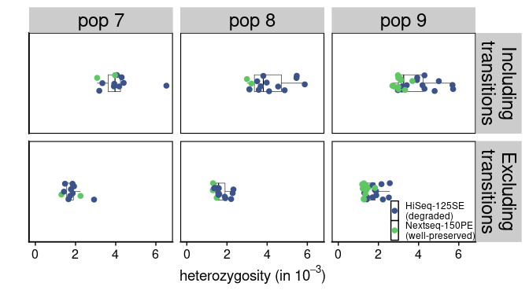
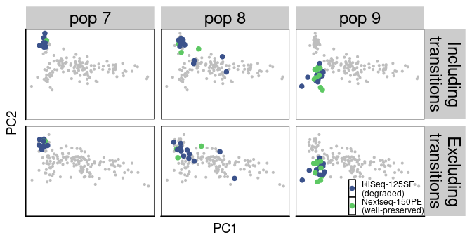

DNA degradation
================

  - [Estimate heterozygositing without
    transitions](#estimate-heterozygositing-without-transitions)
      - [Run ANGSD](#run-angsd)
      - [Genome-wide, relaxed vs. stringent mapping quality filter and
        including vs. excluding
        transitions](#genome-wide-relaxed-vs-stringent-mapping-quality-filter-and-including-vs-excluding-transitions)
      - [Effect of excluding transitions in degraded vs. well-preserved
        samples](#effect-of-excluding-transitions-in-degraded-vs-well-preserved-samples)
  - [A closer look at private
    alleles](#a-closer-look-at-private-alleles)
      - [Extract private alleles and examine proportion of base
        substitutions](#extract-private-alleles-and-examine-proportion-of-base-substitutions)
  - [Exclude transitions from PCA](#exclude-transitions-from-pca)
      - [Come up with a new SNP list](#come-up-with-a-new-snp-list)
      - [Run ANGSD](#run-angsd-1)
      - [PCA results before and after excluding
        transitions](#pca-results-before-and-after-excluding-transitions)
  - [Effectiveness of different mitigation
    strategies](#effectiveness-of-different-mitigation-strategies)
      - [Effectiveness of base quality filtering and transition
        exclusion on the heterozygosity estimation in one population
        (UUM2010)](#effectiveness-of-base-quality-filtering-and-transition-exclusion-on-the-heterozygosity-estimation-in-one-population-uum2010)
      - [All three populations affected by
        degradation](#all-three-populations-affected-by-degradation)
      - [Effectiveness on PCA result](#effectiveness-on-pca-result)
  - [Assemble Figure 5](#assemble-figure-5)

``` r
library(tidyverse)
```

    ## Warning: replacing previous import 'lifecycle::last_warnings' by
    ## 'rlang::last_warnings' when loading 'pillar'

    ## Warning: replacing previous import 'lifecycle::last_warnings' by
    ## 'rlang::last_warnings' when loading 'tibble'

    ## Warning: replacing previous import 'lifecycle::last_warnings' by
    ## 'rlang::last_warnings' when loading 'hms'

``` r
library(ggstatsplot)
```

    ## Warning in .recacheSubclasses(def@className, def, env): undefined subclass
    ## "numericVector" of class "Mnumeric"; definition not updated

``` r
library(cowplot)
library(ggsignif)
source("/workdir/genomic-data-analysis/scripts/individual_pca_functions.R")
```

Here, we examine the effect of DNA degradation by excluding transitions
when estimating heterozygosity. In addition, we study the composition of
private alleles in both batches of data and try to exclude these private
alleles (as well as regions affected by reference bias) from PCAs to
help alleviate batch effects.

## Estimate heterozygositing without transitions

#### Run ANGSD

``` bash
## Relaxed quality filter of 20
nohup bash /workdir/cod/greenland-cod/scripts/get_heterozygosity_notrans.sh \
/workdir/batch-effect/ \
/workdir/batch-effect/sample_lists/bam_list_realigned.txt \
/workdir/cod/reference_seqs/gadMor3.fasta \
2 \
10 \
20 \
30 \
> /workdir/batch-effect/nohups/get_heterozygosity_notrans.nohup &
## More stringent quality filter of 33
nohup nice -n 19 bash /workdir/cod/greenland-cod/scripts/get_heterozygosity_notrans.sh \
/workdir/batch-effect/ \
/workdir/batch-effect/sample_lists/bam_list_realigned.txt \
/workdir/cod/reference_seqs/gadMor3.fasta \
2 \
10 \
33 \
30 \
> /workdir/batch-effect/nohups/get_heterozygosity_notrans_stringent.nohup &

## Rerun a few outlier individuals 
## The optimization algorithm may have stuck at a local optimum for these individuals so I'll give them another try

## Relaxed quality filter of 20, excluding transitions
echo "/workdir/batch-effect/bam/ITV2011_672_55181_7_pe_bt2_gadMor3_sorted_dedup_overlapclipped_realigned.bam
/workdir/batch-effect/bam/PAA2011_708_55139_7_pe_bt2_gadMor3_sorted_dedup_overlapclipped_realigned.bam
/workdir/batch-effect/bam/BUK2011_029_55108_7_pe_bt2_gadMor3_sorted_dedup_overlapclipped_realigned.bam
/workdir/batch-effect/bam/KNG2011_413_55159_7_pe_bt2_gadMor3_sorted_dedup_overlapclipped_realigned.bam
/workdir/batch-effect/bam/UUM2010_038_55119_7_pe_bt2_gadMor3_sorted_dedup_overlapclipped_realigned.bam
/workdir/batch-effect/bam/KNG2011_377_55155_7_pe_bt2_gadMor3_sorted_dedup_overlapclipped_realigned.bam" \
> /workdir/batch-effect/sample_lists/bam_list_realigned_rerun_heterozygosity_3.txt
nohup bash /workdir/cod/greenland-cod/scripts/get_heterozygosity_notrans.sh \
/workdir/batch-effect/ \
/workdir/batch-effect/sample_lists/bam_list_realigned_rerun_heterozygosity_3.txt \
/workdir/cod/reference_seqs/gadMor3.fasta \
2 \
10 \
20 \
30 \
> /workdir/batch-effect/nohups/rerun_heterozygosity_3.nohup &
## Stringent quality filter of 33, excluding transitions
echo "/workdir/batch-effect/bam/NAR2008_002_55156_7_pe_bt2_gadMor3_sorted_dedup_overlapclipped_realigned.bam
/workdir/batch-effect/bam/ATP2011_118_14247X184_6_se_bt2_gadMor3_sorted_dedup_realigned.bam
/workdir/batch-effect/bam/IKE2011_978_55137_7_pe_bt2_gadMor3_sorted_dedup_overlapclipped_realigned.bam
/workdir/batch-effect/bam/QQL2011_860_55166_7_pe_bt2_gadMor3_sorted_dedup_overlapclipped_realigned.bam
/workdir/batch-effect/bam/BUK2011_045_55130_7_pe_bt2_gadMor3_sorted_dedup_overlapclipped_realigned.bam
/workdir/batch-effect/bam/ITV2011_714_55194_7_pe_bt2_gadMor3_sorted_dedup_overlapclipped_realigned.bam
/workdir/batch-effect/bam/UUM2010_038_55119_7_pe_bt2_gadMor3_sorted_dedup_overlapclipped_realigned.bam
/workdir/batch-effect/bam/QQL2011_886_55196_7_pe_bt2_gadMor3_sorted_dedup_overlapclipped_realigned.bam"\
> /workdir/batch-effect/sample_lists/bam_list_realigned_rerun_heterozygosity_4.txt
nohup nice -n 19 bash /workdir/cod/greenland-cod/scripts/get_heterozygosity_notrans.sh \
/workdir/batch-effect/ \
/workdir/batch-effect/sample_lists/bam_list_realigned_rerun_heterozygosity_4.txt \
/workdir/cod/reference_seqs/gadMor3.fasta \
2 \
10 \
33 \
30 \
> /workdir/batch-effect/nohups/rerun_heterozygosity_4.nohup &
```

#### Genome-wide, relaxed vs. stringent mapping quality filter and including vs. excluding transitions

``` r
sample_table <- read_tsv("../sample_lists/sample_table_merged.tsv")
for (i in 1:nrow(sample_table)){
  sample_seq_id <- sample_table$sample_seq_id[i]
  sample_id <- sample_table$sample_id_corrected[i]
  population <- sample_table$population[i]
  data_type <- sample_table$data_type[i]
  if (str_detect(data_type,"pe")){
    path <- str_c("../angsd/heterozygosity/", sample_seq_id,  "_bt2_gadMor3_sorted_dedup_overlapclipped_realigned_mindp2_maxdp10_minq20_minmapq30")
    path_stringent <- str_c("../angsd/heterozygosity/", sample_seq_id,  "_bt2_gadMor3_sorted_dedup_overlapclipped_realigned_mindp2_maxdp10_minq33_minmapq30")
  } else {
    path <- str_c("../angsd/heterozygosity/", sample_seq_id,  "_bt2_gadMor3_sorted_dedup_realigned_mindp2_maxdp10_minq20_minmapq30")
    path_stringent <- str_c("../angsd/heterozygosity/", sample_seq_id,  "_bt2_gadMor3_sorted_dedup_realigned_mindp2_maxdp10_minq33_minmapq30")
  }
  het_relaxed <- read_delim(str_c(path, ".ml"), col_names = F, delim = " ") %>% 
    transmute(n_sites=(X1+X2+X3), n_snp=X2, het=n_snp/n_sites) %>%
    mutate(sample_id=sample_id, population=population, data_type=data_type, tran="Including transitions", filter="relaxed")
  het_relaxed_notrans <- read_delim(str_c(path, "_notrans.ml"), col_names = F, delim = " ") %>% 
    transmute(n_sites=(X1+X2+X3), n_snp=X2, het=n_snp/n_sites) %>%
    mutate(sample_id=sample_id, population=population, data_type=data_type, tran="Excluding transitions", filter="relaxed")
  het_stringent <- read_delim(str_c(path_stringent, ".ml"), col_names = F, delim = " ") %>% 
    transmute(n_sites=(X1+X2+X3), n_snp=X2, het=n_snp/n_sites) %>%
    mutate(sample_id=sample_id, population=population, data_type=data_type, tran="Including transitions", filter="stringent")
  het_stringent_notrans <- read_delim(str_c(path_stringent, "_notrans.ml"), col_names = F, delim = " ") %>% 
    transmute(n_sites=(X1+X2+X3), n_snp=X2, het=n_snp/n_sites) %>%
    mutate(sample_id=sample_id, population=population, data_type=data_type, tran="Excluding transitions", filter="stringent")
  het_combined <- bind_rows(het_relaxed, het_relaxed_notrans, het_stringent, het_stringent_notrans)
  if(i==1){
    het_final <- het_combined
  } else {
    het_final <- bind_rows(het_final, het_combined)
  }
}
het_per_ind <- het_final %>%
  unite(col = type, tran, filter, sep = " ") %>%
  dplyr::select(sample_id, population, data_type, type, het) %>%
  pivot_wider(names_from = type, values_from = het)
## Calculate average heterozygosity while filtering out inversions
set.seed(42)
het_final %>%
  ggplot(aes(x=population, y=het)) +
  geom_boxplot(outlier.alpha = 0) +
  geom_jitter(aes(color=data_type), height = 0, size=0.8) +
  facet_grid(filter~tran) +
  coord_flip() +
  theme_cowplot() +
  theme(panel.background=element_rect(colour="black", size=0.8))
```

<!-- -->

``` r
het_final %>%
  ggplot(aes(x=n_sites, y=het, color=data_type)) +
  geom_point(height = 0, size=1) +
  geom_smooth(se = F, color="black", aes(group=data_type)) +
  facet_grid(filter~tran) +
  theme_cowplot() +
  theme(panel.background=element_rect(colour="black", size=0.8))
```

    ## Warning: Ignoring unknown parameters: height

<!-- -->

#### Effect of excluding transitions in degraded vs. well-preserved samples

``` r
set.seed(42)
delta_het <- het_final %>%
  dplyr::select(het, sample_id, population, data_type, tran, filter) %>%
  pivot_wider(names_from = tran,  values_from = het) %>%
  mutate(delta = `Excluding transitions`-`Including transitions`,
         degradation = ifelse(population %in% c("UUM2010", "NAR2008", "ATP2011") & data_type=="se", "more degraded", "less degraded"),
         type=str_c(data_type, degradation, sep = "\n"))
delta_het %>%
  ggplot(aes(x=type, y=delta)) +
  geom_boxplot(outlier.alpha = 0) +
  geom_jitter(height = 0) +
  facet_wrap(~filter) +
  theme_cowplot()
```

<!-- -->

``` r
set.seed(42)
delta_het %>%
  filter(filter=="stringent") %>%
  ggplot(aes(x=type, y=delta)) +
  geom_boxplot(outlier.alpha = 0) +
  geom_jitter(height = 0) +
  #annotate(geom = "text", label="p-value=0.014", x=1.5, y=0.002) +
  scale_x_discrete(labels=c("NextSeq-150PE\n(well-preserved)\n", "HiSeq-125SE\n(well-preserved)\n", "HiSeq-125SE\n(degraded)\n")) +
  ylab("change in heterozygosity\nafter excluding transitions") +
  theme_cowplot() +
  theme(axis.title.x = element_blank())
```

<!-- -->

``` r
## Only including the three populations where samples are split based on degradation level
delta_het %>%
  filter(filter=="stringent", population %in% c("UUM2010", "NAR2008", "ATP2011")) %>%
  ggplot(aes(x=type, y=delta)) +
  geom_boxplot(outlier.alpha = 0) +
  geom_jitter(height = 0) +
  #annotate(geom = "text", label="p-value=0.014", x=1.5, y=0.002) +
  scale_x_discrete(labels=c("NextSeq-150PE\n(well-preserved)\n", "HiSeq-125SE\n(degraded)\n")) +
  ylab("change in heterozygosity\nafter excluding transitions") +
  ylim(c(NA, 0)) +
  theme_cowplot() +
  theme(axis.title.x = element_blank())
```

<!-- -->

``` r
set.seed(42)
p_a <- delta_het %>%
  filter(filter=="stringent") %>%
  ggstatsplot::ggbetweenstats(x = type, 
                              y = delta,  
                              type = "p", 
                              p.adjust.method = "holm",
                              pairwise.comparisons = TRUE,
                              ggsignif.args = list(textsize = 3),
                              ggplot.component = list(coord_cartesian(ylim=c(-0.004, 0.0001)),
                                                      scale_color_manual(values = c("#5DC863FF", "#3B528BFF", "#414487FF")),
                                                      theme(panel.grid = element_blank(),
                                                            axis.line = element_line()))) +
  #geom_signif(comparisons = list(c("pe\nless degraded", "se\nmore degraded"), c("se\nless degraded", "se\nmore degraded")), y_position = c(-0.001, -0.0012)) +
  scale_x_discrete(labels=c("NextSeq-150PE\n(well-preserved)\n", "HiSeq-125SE\n(well-preserved)\n", "HiSeq-125SE\n(degraded)\n")) +
  ylab("change in heterozygosity estimates \nafter excluding transitions") +
  xlab("sample type") +
  geom_hline(yintercept = 0, linetype=2, color="red")
print(p_a)
```

<!-- -->

This shows that DNA damage has an stronger effect on SE samples (which
are more degraded).

## A closer look at private alleles

#### Extract private alleles and examine proportion of base substitutions

``` r
maf_se <- read_tsv("../angsd/popminind20/se_global_snp_list_bam_list_realigned_mindp46_maxdp184_minind20_minq20_popminind20.mafs.gz") %>%
  transmute(lg = chromo, position = position, major=major, minor = minor, se_maf = knownEM, se_nind=nInd)
maf_pe <- read_tsv("../angsd/popminind20/pe_global_snp_list_bam_list_realigned_mindp46_maxdp184_minind20_minq20_popminind20.mafs.gz")%>%
  transmute(lg = chromo, position = position, major=major, minor = minor, pe_maf = knownEM, pe_nind=nInd)
maf_joined <- inner_join(maf_se, maf_pe) %>%
  mutate(delta = abs(se_maf- pe_maf))
private_alleles <- bind_rows((filter(maf_joined, pe_maf<0.01 | pe_maf>0.99) %>% filter(se_maf>0.1 & se_maf<0.9) %>% transmute(major=major, minor=minor, batch = "HiSeq-125SE\n(a subset of samples\nare degraded)")),
          (filter(maf_joined, se_maf<0.01 | se_maf>0.99) %>% filter(pe_maf>0.1 & pe_maf<0.9) %>% transmute(major=major, minor=minor, batch = "NextSeq-150PE\n(well-preserved)"))) %>%
  mutate(base_substitution = str_c(major, "-to-", minor)) %>%
  mutate(base_substitution = case_when(
    base_substitution %in% c("A-to-C", "T-to-G") ~ "A-to-C\nT-to-G", 
    base_substitution %in% c("A-to-G", "T-to-C") ~ "A-to-G\nT-to-C", 
    base_substitution %in% c("A-to-T", "T-to-A") ~ "A-to-T\nT-to-A", 
    base_substitution %in% c("C-to-A", "G-to-T") ~ "C-to-A\nG-to-T", 
    base_substitution %in% c("C-to-G", "G-to-C") ~ "C-to-G\nG-to-C", 
    base_substitution %in% c("C-to-T", "G-to-A") ~ "C-to-T\nG-to-A"
  )) 
p_b <- private_alleles %>%
  group_by(base_substitution, batch) %>% 
  count() %>% 
  ungroup() %>% 
  group_by(batch) %>%
  mutate(frequency = n / sum(n)) %>%
  ungroup() %>%
  ggplot(aes(x=base_substitution, y=frequency, fill=batch, group=batch)) +
  #geom_line() + 
  #geom_point() +
  geom_col(position = "dodge", color="black")+
  scale_fill_viridis_d(begin = 0.25, end=0.75) +
  ylim(c(NA, 0.3)) +
  labs(x="type of base substitution", y="frequency") +
  theme_ggstatsplot() +
  theme(legend.position = "top",
        panel.grid =element_blank(),
        axis.line = element_line())
print(p_b)
```

<!-- -->

``` r
p_b_2 <- private_alleles %>%
  arrange(base_substitution) %>%
  mutate(base_substitution = factor(base_substitution)) %>%
  ggbarstats(
  x = base_substitution,
  y = batch,
  xlab = "Batch",
  legend.title = "Base substitution",
  palette = "Set2"
  )
print(p_b_2)
```

<!-- -->

C-to-T and G-to-A transitions are enriched in samples that are more
degraded

## Exclude transitions from PCA

Here, we try to exclude transitions after reference bias is accounted
for, to evalutate whether PCA results are affected by DNA degradataion

#### Come up with a new SNP list

``` r
original_snp_list <- read_tsv("/workdir/batch-effect/angsd/global_snp_list_bam_list_realigned_mindp46_maxdp184_minind20_minq20_downsampled_unlinked.txt", col_names = c("lg", "position", "major", "minor")) 
  
anymapq_depth <- read_tsv("../angsd/popminind2/bam_list_realigned_se_anymapq.pos.gz") %>%
  rename(lg=chr, position=pos, total_depth_anymapq=totDepth)
mapq20_depth <- read_tsv("../angsd/popminind20/se_global_snp_list_bam_list_realigned_mindp46_maxdp184_minind20_minq20_popminind20.pos.gz") %>%
  rename(lg=chr, position=pos, total_depth_mapq20=totDepth)
depth <- inner_join(anymapq_depth, mapq20_depth) %>%
 mutate(depth_ratio=total_depth_mapq20/total_depth_anymapq)

depth_ratio_filtered_snp_list <- semi_join(original_snp_list, filter(depth, depth_ratio > 0.9))
depth_ratio_filtered_notrans_snp_list <- depth_ratio_filtered_snp_list %>%
  filter(!(major=="C"& minor=="T"), !(major=="G" & minor=="A"), !(major=="T"& minor=="C"), !(major=="A" & minor=="G"))
write_tsv(depth_ratio_filtered_notrans_snp_list, "../angsd/global_snp_list_depth_ratio_filtered_notrans_snps.txt", col_names = F)
```

#### Run ANGSD

``` bash
## Depth ratio and transition filtered SNPs
cd /workdir/batch-effect/
/workdir/programs/angsd0.931/angsd/angsd sites index /workdir/batch-effect/angsd/global_snp_list_depth_ratio_filtered_notrans_snps.txt
nohup /workdir/programs/angsd0.931/angsd/angsd \
-b sample_lists/bam_list_realigned.txt \
-anc /workdir/cod/reference_seqs/gadMor3.fasta \
-out angsd/bam_list_realigned_depth_ratio_filtered_notrans_snps \
-GL 1 -doGlf 2 -doMaf 1 -doMajorMinor 3 -doCounts 1 -doDepth 1 -dumpCounts 1 \
-P 16 -setMinDepth 2 -setMaxDepth 661 -minInd 2 -minQ 20 -minMapQ 20 -minMaf 0.05 \
-doIBS 2 -makematrix 1 -doCov 1 \
-sites /workdir/batch-effect/angsd/global_snp_list_depth_ratio_filtered_notrans_snps.txt \
-rf /workdir/cod/greenland-cod/angsd/global_snp_list_bam_list_realigned_mincov_contamination_filtered_mindp151_maxdp661_minind102_minq20_downsampled_unlinked.chrs \
>& nohups/get_gl_bam_list_realigned_depth_ratio_filtered_notrans_snps.log &
```

#### PCA results before and after excluding transitions

``` r
rename_pop <- tibble(population = c("ITV2011", "KNG2011", "QQL2011", "BUK2011", "IKE2011", "PAA2011", "ATP2011", "NAR2008", "UUM2010"),
                     population_new =c("pop 1", "pop 2", "pop 3", "pop 4", "pop 5", "pop 6", "pop 7", "pop 8", "pop 9"))
pca_combined <- bind_rows(bind_cols(pca_before, type="Including\ntransitions"), 
                          bind_cols(pca_after, type="Excluding\ntransitions")) %>%
  mutate(type=fct_relevel(type, c("Including\ntransitions", "Excluding\ntransitions"))) %>%
  mutate(batch=ifelse(data_type=="se", "HiSeq-125SE", "NextSeq-150PE")) %>%
  filter(! individual %in% c("UUM2010_036", "UUM2010_038"))
pca_plot <- pca_combined %>%
  left_join(rename_pop) %>%
  filter(population_new %in% c("pop 7", "pop 8", "pop 9")) %>%
  bind_rows(mutate(pca_combined, population = "all pops", population_new="all pops")) %>%
  mutate(population_new=fct_relevel(population_new, c("pop 7", "pop 8", "pop 9", "all pops"))) %>%
  ggplot(aes(x=PC1, y=PC2)) +
  geom_point(data=pca_combined, color="grey", size=0.5) +
  geom_point(aes(color=batch), size=2) +
  scale_color_viridis_d(begin=0.25, end=0.75) +
  facet_grid(population_new~type) +
  theme_cowplot() +
  theme(axis.text = element_blank(),
        axis.ticks = element_blank(),
        panel.border = element_rect(colour="black",size=0.5),
        legend.position = c(0.78, 0.94),
        legend.key.size = unit(0.5, 'lines'),
        strip.text.x = element_text(face = "bold", size=20),
        legend.key = element_rect(fill = "white", colour = "black"))
pca_plot
```

<!-- -->

Including transitions in PCA does not lead to observable batch effects,
and excluding transition does not change the results significantly,
suggesting the DNA degradation is not an major factor causing batch
effects in PCA.

## Effectiveness of different mitigation strategies

#### Effectiveness of base quality filtering and transition exclusion on the heterozygosity estimation in one population (UUM2010)

``` r
## Within KNG2011 only
set.seed(42)
het_final %>%
  filter(str_detect(sample_id, "UUM2010")) %>%
  ggplot(aes(x=data_type, y=het)) +
  geom_boxplot(outlier.alpha = 0) +
  geom_jitter(height = 0) +
  facet_grid(filter~tran, scales = "free") +
  theme_cowplot() +
  theme(panel.background=element_rect(colour="black", size=0.8))
```

<!-- -->

``` r
## PE vs SE before filtering and excluding transitions
t.test(filter(het_final, str_detect(sample_id, "UUM2010"), filter=="relaxed", tran == "Including transitions", data_type=="se")$het,
       filter(het_final, str_detect(sample_id, "UUM2010"), filter=="relaxed", tran == "Including transitions", data_type=="pe")$het)$p.value
```

    ## [1] 0.00346448

``` r
## PE vs SE after filtering and excluding transitions
t.test(filter(het_final, str_detect(sample_id, "UUM2010"), filter=="stringent", tran == "Excluding transitions", data_type=="se")$het,
       filter(het_final, str_detect(sample_id, "UUM2010"), filter=="stringent", tran == "Excluding transitions", data_type=="pe")$het)$p.value
```

    ## [1] 0.001337545

This shows that after excluding transitions and using stringent depth
and quality filters, batch effects on heterozygosity estimate are
somewhat reduced.

#### All three populations affected by degradation

``` r
rename_pop <- tibble(population = c("ITV2011", "KNG2011", "QQL2011", "BUK2011", "IKE2011", "PAA2011", "ATP2011", "NAR2008", "UUM2010"),
                     population_new =c("pop 1", "pop 2", "pop 3", "pop 4", "pop 5", "pop 6", "pop 7", "pop 8", "pop 9"))
set.seed(42)
p_c <- het_final %>%
  left_join(rename_pop) %>%
  filter(population_new %in% str_c("pop ", 7:9), filter=="stringent") %>%
  mutate(batch=ifelse(data_type=="pe", "Nextseq-150PE\n(well-preserved)", "HiSeq-125SE\n(degraded)")) %>%
  mutate(type=ifelse(tran=="Including transitions", "Including\ntransitions", "Excluding\ntransitions")) %>%
  mutate(type=fct_relevel(type, c("Including\ntransitions", "Excluding\ntransitions"))) %>%
  ggplot(aes(x="", y=het*10^3)) +
  geom_boxplot(outlier.alpha = 0, color="black", size=0.2, width=0.2) +
  geom_jitter(aes(color=batch), height = 0, width = 0.1, size=2) +
  scale_color_viridis_d(begin=0.25, end=0.75) +
  ylim(c(0,NA)) +
  facet_grid(type~population_new, scales = "free_y") +
  xlab(" ") +
  ylab(expression(paste("heterozygosity (in ", 10^-3, ")"))) +
  coord_flip() +
  theme_cowplot() +
  theme(panel.background=element_rect(colour="black", size=0.8),
        legend.position = c(0.81, 0.12),
        legend.text = element_text(size=9),
        legend.key.size = unit(0.5, 'lines'),
        strip.text.y = element_text(size=18),
        strip.text.x = element_text(size=18),
        axis.text.y = element_blank(),
        axis.ticks.y = element_blank(),
        legend.key = element_rect(fill = "white", colour = "black"),
        legend.title = element_blank())
print(p_c)
```

<!-- -->

#### Effectiveness on PCA result

``` r
p_d <- pca_combined_select_pops %>%
  left_join(rename_pop) %>%
  ggplot(aes(x=PC1, y=PC2)) +
  geom_point(data=pca_combined, color="grey", size=0.8) +
  geom_point(aes(color=batch), size=2) +
  scale_color_viridis_d(begin=0.25, end=0.75) +
  facet_grid(type~population_new) +
  ylim(c(-0.15, NA)) +
  theme_cowplot() +
  theme(axis.text = element_blank(),
        axis.ticks = element_blank(),
        panel.border = element_rect(colour="black",size=0.5),
        legend.position = c(0.81, 0.12),
        legend.text = element_text(size=9),
        legend.key.size = unit(0.5, 'lines'),
        strip.text.x = element_text(size=18),
        strip.text.y = element_text(size=18),
        legend.key = element_rect(fill = "white", colour = "black"),
        legend.title = element_blank())
p_d
```

<!-- -->

## Assemble Figure 5

``` r
#bottom <- cowplot::plot_grid(p_b, p_a,nrow = 1, labels = c("C", "D"), scale = 0.9)
#top <- cowplot::plot_grid(p_c, p_d, nrow = 1, labels = c("A", "B"), scale = 0.9)
figure <- cowplot::plot_grid(p_c, p_d, p_b, p_a, nrow = 4, labels = c("A", "B", "C", "D"), rel_heights = c(3.9, 3.6, 3.6, 6.5))
print(figure)
```

<!-- -->
