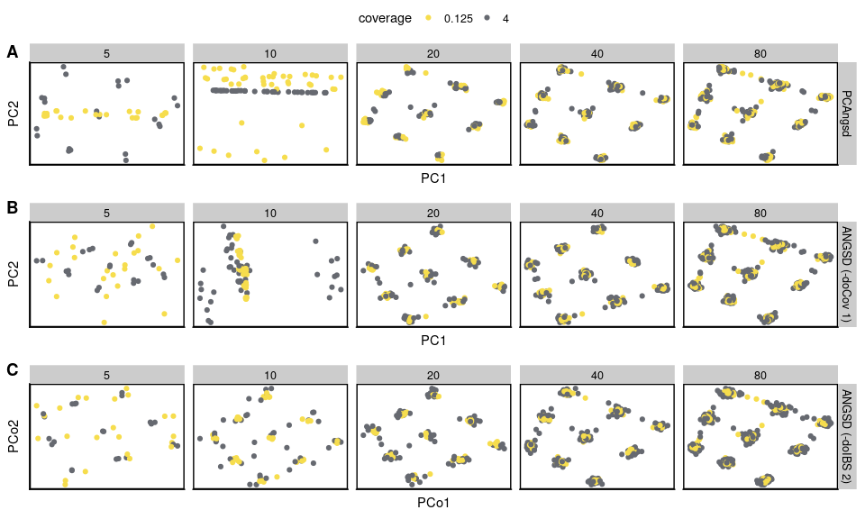

Sequencing depth
================

``` r
library(tidyverse)
```

    ## Warning: replacing previous import 'lifecycle::last_warnings' by
    ## 'rlang::last_warnings' when loading 'pillar'

    ## Warning: replacing previous import 'lifecycle::last_warnings' by
    ## 'rlang::last_warnings' when loading 'tibble'

    ## Warning: replacing previous import 'lifecycle::last_warnings' by
    ## 'rlang::last_warnings' when loading 'hms'

``` r
library(RcppCNPy)
library(cowplot)
library(scales)
library(ggrepel)
library(MASS)
source("/workdir/genomic-data-analysis/scripts/individual_pca_functions.R")
```

Here, we examine the effect of variation in sequencing depth by running
PCA on simulated data. We also run PCAngsd on the real cod data to
demonstrate its potential vulnerability to batch effects caused by
variable sequencing depth.

The simulation was done as part of the [lcWGS guide
project](https://github.com/therkildsen-lab/lcwgs-simulation)
(specifically see
[link](https://github.com/therkildsen-lab/lcwgs-simulation/blob/master/markdowns/simulation_workflow_spatial_pop_sim.md#uneven-coverage)),
and the simulation output are store in the directory
`/workdir/lcwgs-simulation` on the `nt246` server.

I will just include the visualization script below.

## Analysis with simulated data

#### PCA with PCAngsd

``` r
i=1
for (sample_size in c(5,10,20,40,80)){
  pop_label <- read_lines(paste0("/fs/cbsubscb16/storage/lcwgs-simulation/spatial_pop_sim/rep_1/sample_lists/bam_list_",sample_size,"_uneven_coverage.txt")) %>%
    str_extract('p[1-9]')
  coverage <- ifelse(1:(sample_size*9) %% 2 == 1,0.125, 4)
  ## Read covariance matrix
  cov_matrix <- npyLoad(paste0("/fs/cbsubscb16/storage/lcwgs-simulation/spatial_pop_sim/rep_1/angsd/pcagnsd_bam_list_",sample_size,"_uneven_coverage.cov.npy")) %>%
    as.matrix()
  ## Perform eigen decomposition
  e <- eigen(cov_matrix)
  e_value<-e$values
  x_variance<-e_value[1]/sum(e_value)*100
  y_variance<-e_value[2]/sum(e_value)*100
  e_vector <- as.data.frame(e$vectors)[,1:5]
  pca_table <- bind_cols(pop_label=pop_label, e_vector) %>%
    transmute(population=pop_label, PC1=rescale(V1, c(-1, 1)), PC2=rescale(V2, c(-1, 1)), PC3=rescale(V3, c(-1, 1)), PC4=rescale(V4, c(-1, 1)), PC5=rescale(V5, c(-1, 1)), coverage=coverage, sample_size=sample_size)
  ## Bind PCA tables and DAPC tables for all sample size and coverage combinations
  if (i==1){
    pca_table_final <- pca_table
  } else {
    pca_table_final <- bind_rows(pca_table_final,pca_table)
  }
  i=i+1
}
ggplot(pca_table_final,aes(x=PC1, y=PC2, color=population, shape=as.character(coverage))) +
  geom_point() +
  facet_grid(.~sample_size, scales="free") +
  theme_bw() +
  theme(panel.grid = element_blank(),
        axis.text = element_blank(),
        axis.ticks = element_blank(),
        legend.position = "none")
```

<!-- -->

``` r
p1 <- pca_table_final %>%
  mutate(method="PCAngsd") %>%
  ggplot(aes(x=PC1, y=PC2, color=as.character(coverage))) +
  geom_point() +
  facet_grid(method~sample_size, scales="free") +
  scale_color_viridis_d(name = "coverage", option = "cividis", begin = 0.95, end = 0.4) +
  theme_cowplot() +
  theme(panel.border = element_rect(size = 1, color = "black"),
        text = element_text(size=11), 
        axis.text = element_blank(),
        axis.ticks = element_blank(), 
        legend.position = "top",
        legend.justification = "center")
p1
```

<!-- -->

``` r
for_poster_1 <- pca_table_final %>%
  mutate(method="PCAngsd") %>%
  filter(sample_size==10) %>% 
  ggplot(aes(x=PC1, y=PC2, color=as.character(coverage), shape=population)) +
  geom_point() +
  facet_wrap(~method, scales="free") +
  scale_color_viridis_d(name = "coverage", option = "cividis", begin = 0.95, end = 0.4) +
  scale_shape_manual(values = 21:29-4, guide="none") +
  theme_cowplot() +
  theme(panel.border = element_rect(size = 1, color = "black"),
        text = element_text(size=11), 
        axis.text = element_blank(),
        axis.ticks = element_blank(), 
        legend.position = "none",
        legend.justification = "center")
```

### PCA with covMat

``` r
i=1
for (sample_size in c(5,10,20,40,80)){
  pop_label <- read_lines(paste0("/fs/cbsubscb16/storage/lcwgs-simulation/spatial_pop_sim/rep_1/sample_lists/bam_list_",sample_size,"_uneven_coverage.txt")) %>%
    str_extract('p[1-9]')
  coverage <- ifelse(1:(sample_size*9) %% 2 == 1,0.125, 4)
  ## Read covariance matrix
  cov_matrix <- read_tsv(paste0("/fs/cbsubscb16/storage/lcwgs-simulation/spatial_pop_sim/rep_1/angsd/bam_list_",sample_size,"_uneven_coverage.covMat"), col_names = F) %>%
    as.matrix() %>%
    .[,-(sample_size*9+1)]
  cov_matrix[is.na(cov_matrix)]<- median(cov_matrix, na.rm = T)
  ## Perform eigen decomposition
  e <- eigen(cov_matrix)
  e_value<-e$values
  x_variance<-e_value[1]/sum(e_value)*100
  y_variance<-e_value[2]/sum(e_value)*100
  e_vector <- as.data.frame(e$vectors)[,1:5]
  pca_table <- bind_cols(pop_label=pop_label, e_vector) %>%
    transmute(population=pop_label, PC1=rescale(V1, c(-1, 1)), PC2=rescale(V2, c(-1, 1)), PC3=rescale(V3, c(-1, 1)), PC4=rescale(V3, c(-1, 1)), PC5=rescale(V5, c(-1, 1)), sample_size=sample_size, coverage=coverage)
  ## Bind PCA tables and DAPC tables for all sample size and coverage combinations
  if (i==1){
    pca_table_final <- pca_table
  } else {
    pca_table_final <- bind_rows(pca_table_final,pca_table)
  }
  i=i+1
}
ggplot(pca_table_final,aes(x=PC1, y=PC2, color=population, shape=as.character(coverage))) +
  geom_point() +
  facet_grid(.~sample_size, scales="free") +
  theme_bw() +
  theme(panel.grid = element_blank(),
        axis.text = element_blank(),
        axis.ticks = element_blank(),
        legend.position = "none")
```

<!-- -->

``` r
p2 <- pca_table_final %>%
  mutate(method="ANGSD (-doCov 1)") %>%
  ggplot(aes(x=PC1, y=PC2, color=as.character(coverage))) +
  geom_point() +
  scale_color_viridis_d(name = "coverage", option = "cividis", begin = 0.95, end = 0.4) +
  facet_grid(method~sample_size, scales="free") +
  theme_cowplot() +
  theme(panel.border = element_rect(size = 1, color = "black"),
        text = element_text(size=11), 
        axis.text = element_blank(),
        axis.ticks = element_blank(), 
        legend.position = "none")
p2
```

<!-- -->

``` r
for_poster_2 <- pca_table_final %>%
  mutate(method="ANGSD (-doCov 1)") %>%
  filter(sample_size==10) %>% 
  ggplot(aes(x=PC1, y=PC2, color=as.character(coverage), shape=population)) +
  geom_point() +
  facet_wrap(~method, scales="free") +
  scale_color_viridis_d(name = "coverage", option = "cividis", begin = 0.95, end = 0.4) +
  scale_shape_manual(values = 21:29-4, guide="none") +
  theme_cowplot() +
  theme(panel.border = element_rect(size = 1, color = "black"),
        text = element_text(size=11), 
        axis.text = element_blank(),
        axis.ticks = element_blank(), 
        legend.position = "none",
        legend.justification = "center")
```

### PCoA with ibsMat

``` r
i=1
for (sample_size in c(5,10,20,40,80)){
  pop_label <- read_lines(paste0("/fs/cbsubscb16/storage/lcwgs-simulation/spatial_pop_sim/rep_1/sample_lists/bam_list_",sample_size,"_uneven_coverage.txt")) %>%
    str_extract('p[1-9]')
  coverage <- ifelse(1:(sample_size*9) %% 2 == 1,0.125, 4)
  ## Read covariance matrix
  dist_matrix <- read_tsv(paste0("/fs/cbsubscb16/storage/lcwgs-simulation/spatial_pop_sim/rep_1/angsd/bam_list_",sample_size,"_uneven_coverage.ibsMat"), col_names = F) %>%
    as.matrix() %>%
    .[,-(sample_size*9+1)]
  dist_matrix[is.na(dist_matrix)] <- mean(dist_matrix, na.rm = T)
  ## Perform MDS
  mds <- cmdscale(as.dist(dist_matrix), k=5) %>%
    as.data.frame() 
  mds_table <- bind_cols(pop_label=pop_label, mds) %>%
    transmute(population=pop_label, PCo1=rescale(V1, c(-1, 1)), PCo2=rescale(V2, c(-1, 1)), PCo3=rescale(V3, c(-1, 1)), PCo4=rescale(V4, c(-1, 1)), PCo5=rescale(V5, c(-1, 1)), coverage=coverage, sample_size=sample_size)
  eigen_value <- cmdscale(as.dist(dist_matrix), k=5, eig = T)$eig
  var_explained <- round(eigen_value/sum(eigen_value)*100, 2)
  ## Bind PCoA tables and DAPC tables for all sample size and coverage combinations
  if (i==1){
    mds_table_final <- mds_table
  } else {
    mds_table_final <- bind_rows(mds_table_final,mds_table)
  }
  i=i+1
}
ggplot(mds_table_final,aes(x=PCo1, y=PCo2, color=population)) +
  geom_point() +
  facet_grid(.~sample_size, scales="free") +
  theme_bw() +
  theme(panel.grid = element_blank(),
        axis.text = element_blank(),
        axis.ticks = element_blank(),
        legend.position = "none")
```

<!-- -->

``` r
p3 <- mds_table_final %>%
  mutate(method="ANGSD (-doIBS 2)") %>%
  ggplot(aes(x=PCo1, y=PCo2, color=as.character(coverage))) +
  geom_point() +
  facet_grid(method~sample_size, scales="free") +
  scale_color_viridis_d(name = "coverage", option = "cividis", begin = 0.95, end = 0.4) +
  theme_cowplot() +
  theme(panel.border = element_rect(size = 1, color = "black"),
        text = element_text(size=11), 
        axis.text = element_blank(),
        axis.ticks = element_blank(), 
        legend.position = "none")
p3
```

<!-- -->

``` r
for_poster_3 <- mds_table_final %>%
  mutate(method="ANGSD (-doIBS 2)") %>%
  filter(sample_size==10) %>%
  ggplot(aes(x=PCo1, y=PCo2, color=as.character(coverage), shape=population)) +
  geom_point() +
  facet_wrap(~method, scales="free") +
  scale_color_viridis_d(name = "sequencing\ndepth", option = "cividis", begin = 0.95, end = 0.4) +
  scale_shape_manual(values = 21:29-4, guide="none") +
  theme_cowplot() +
  theme(panel.border = element_rect(size = 1, color = "black"),
        text = element_text(size=11), 
        axis.text = element_blank(),
        axis.ticks = element_blank(), 
        legend.position = "right")
```

### Assemble plots for batch effect paper

``` r
figure_6 <- cowplot::plot_grid(p1, p2, p3, ncol = 1, rel_heights = c(1.2, 1, 1), labels=c("A", "B", "C"), label_y=c(0.8, 1, 1))
figure_6
```

<!-- -->

``` r
ggsave("../figures/figure_6.pdf", figure_6, width=10, height=6, units = "in")
```

### Assemble plots for batch effect poster

``` r
depth_figure_poster <- cowplot::plot_grid(for_poster_1, for_poster_2, for_poster_3, ncol = 3, rel_widths = c(1.8, 1.8, 2.7))
depth_figure_poster
```

<!-- -->

## Test PCAngsd with real cod data using the filtered SNP list

``` bash
nohup python2 /workdir/programs/pcangsd/pcangsd.py \
-beagle /workdir/batch-effect/angsd/bam_list_realigned_depth_ratio_filtered_snps.beagle.gz \
-minMaf 0.05 \
-threads 8 \
-o /workdir/batch-effect/angsd/bam_list_realigned_depth_ratio_filtered_snps_pcangsd \
> /workdir/batch-effect/nohups/run_pcangsd_depth_ratio_filtered_snps.nohup &
```

#### Supplementary Figure: PCA with PCAngsd

``` r
pca_combined <- bind_rows(bind_cols(pca_angsd, type="PCA with ANGSD"), 
                          bind_cols(pca_pcangsd, type="PCA with PCAngsd")) %>%
  mutate(type=fct_relevel(type, c("PCA with ANGSD", "PCA with PCAngsd"))) %>%
  mutate(batch=ifelse(data_type=="se", "HiSeq-125SE", "NextSeq-150PE")) %>%
  filter(! (individual %in% c("UUM2010_036", "UUM2010_038") & type == "PCA with ANGSD")) %>%
  filter(! (individual %in% c("UUM2010_026", "UUM2010_030") & type == "PCA with PCAngsd"))
pca_plot <- bind_rows(pca_combined, mutate(pca_combined, population="all pops")) %>%
  left_join(rename_pop) %>%
  mutate(population_new=ifelse(is.na(population_new), "all pops", population_new)) %>% 
  mutate(population_new=fct_relevel(population_new, c(str_c("pop ", 1:9), "all pops"))) %>%
  ggplot(aes(x=PC1, y=PC2)) +
  geom_point(data=pca_combined, color="grey", size=0.3) +
  geom_point(aes(color=batch), size=1.5) +
  scale_color_viridis_d(begin=0.25, end=0.75) +
  facet_grid(population_new~type) +
  theme_cowplot() +
  theme(axis.text = element_blank(),
        axis.ticks = element_blank(),
        panel.border = element_rect(colour="black",size=0.8),
        legend.position = c(0.72, 0.99),
        legend.key.size = unit(0.5, 'lines'),
        legend.text = element_text(size=8),
        strip.text.y = element_text(size=10),
        strip.text.x = element_text(size=10),
        legend.key = element_rect(fill = "white", colour = "black"),
        legend.title = element_blank())
pca_plot
```

<!-- -->
