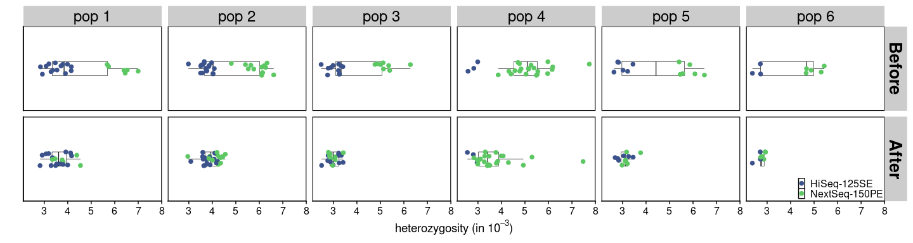
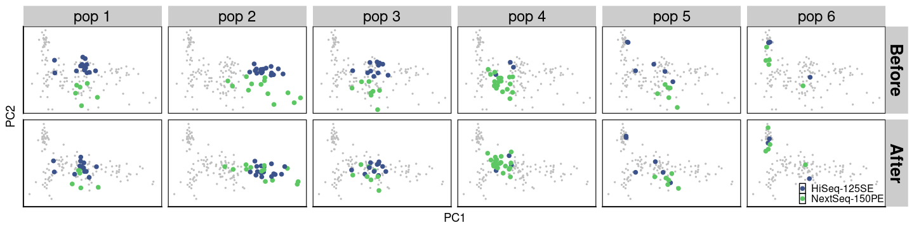
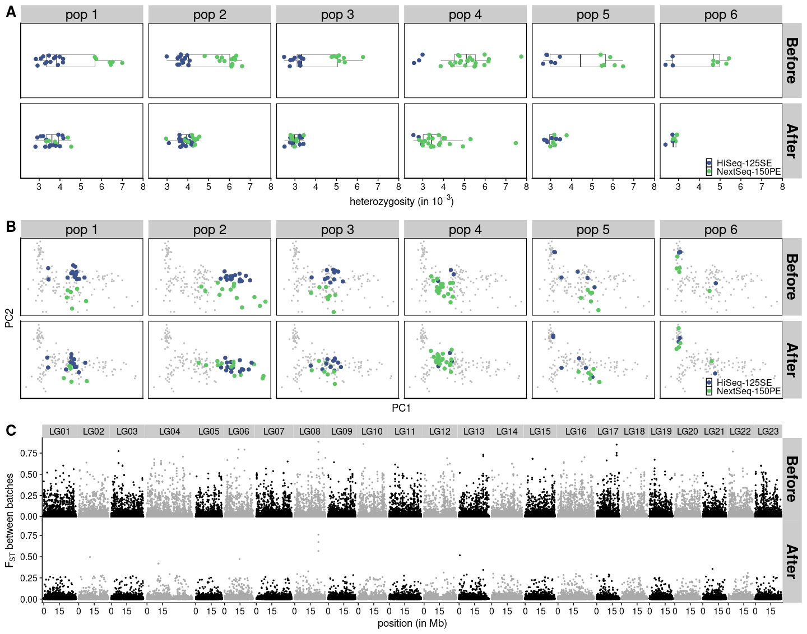

Figures
================

``` r
library(tidyverse)
library(cowplot)
library(RcppCNPy)
source("/workdir/genomic-data-analysis/scripts/individual_pca_functions.R")
```

## Figure 1

#### Heterozygosity

Here, I am comparing heterozygosity estimated from:

1.  polyG trimmed, relaxed read quality filtering of 20 (before)

2.  sliding window trimmed, stringent read quality filtering of 33
    (after)

Both have transitions filtered, have a stringent maximum depth filter of
10, and a stringent mapping quality filter of 30.

``` r
sample_table <- read_tsv("../sample_lists/sample_table_merged.tsv")
for (i in 1:nrow(sample_table)){
  sample_seq_id <- sample_table$sample_seq_id[i]
  sample_id <- sample_table$sample_id_corrected[i]
  population <- sample_table$population[i]
  data_type <- sample_table$data_type[i]
  if (str_detect(data_type,"pe")){
    path <- str_c("../../cod/greenland-cod/angsd/heterozygosity/", sample_seq_id,  "_bt2_gadMor3_minq20_sorted_dedup_overlapclipped_realigned_mindp2_maxdp10_minq20_minmapq30")
    path_stringent <- str_c("../angsd/heterozygosity/", sample_seq_id,  "_bt2_gadMor3_sorted_dedup_overlapclipped_realigned_mindp2_maxdp10_minq33_minmapq30")
  } else {
    path <- str_c("../../cod/greenland-cod/angsd/heterozygosity/", sample_seq_id,  "_bt2_gadMor3_minq20_sorted_dedup_realigned_mindp2_maxdp10_minq20_minmapq30")
    path_stringent <- str_c("../angsd/heterozygosity/", sample_seq_id,  "_bt2_gadMor3_sorted_dedup_realigned_mindp2_maxdp10_minq33_minmapq30")
  }
  het_relaxed <- read_delim(str_c(path, "_notrans.ml"), col_names = F, delim = " ") %>% 
    transmute(n_sites=(X1+X2+X3), n_snp=X2, het=n_snp/n_sites) %>%
    mutate(sample_id=sample_id, population=population, data_type=data_type, type="Before")
  het_stringent_notrans <- read_delim(str_c(path_stringent, "_notrans.ml"), col_names = F, delim = " ") %>% 
    transmute(n_sites=(X1+X2+X3), n_snp=X2, het=n_snp/n_sites) %>%
    mutate(sample_id=sample_id, population=population, data_type=data_type, type="After")
  het_combined <- bind_rows(het_relaxed, het_stringent_notrans)
  if(i==1){
    het_final <- het_combined
  } else {
    het_final <- bind_rows(het_final, het_combined)
  }
}
set.seed(42)
het_plot <- het_final %>%
  mutate(type=fct_relevel(type, c("Before", "After"))) %>%
  mutate(batch=ifelse(data_type=="pe", "NextSeq", "HiSeq")) %>%
  ggplot(aes(x=population, y=het)) +
  geom_boxplot(outlier.alpha = 0, color="black", size=0.2, width=0.5) +
  geom_jitter(aes(color=batch), height = 0, width = 0.3, size=2) +
  scale_color_viridis_d(begin=0.25, end=0.75) +
  scale_y_continuous(labels = c("0", "0.002", "0.004", "0.006")) +
  ylab("heterozygosity") +
  facet_grid(~type) +
  coord_flip() +
  theme_cowplot() +
  theme(panel.background=element_rect(colour="black", size=0.8),
        legend.position = c(0.8, 0.9),
        legend.key.size = unit(0.5, 'lines'),
        strip.text.x = element_text(face = "bold", size=20))
het_plot
```

<!-- -->

#### PCA

Here, I am comparing PCA result from

1.  the original LD pruned SNP list

2.  a subsetted SNP list with private SNPs in each batch (those that are
    fixed in one batch and are at intermediate frequency in the other
    batch) and SNPs with depth ratio \< 0.9 filtered out

Both have gone through sliding window trimming, have base quality and
mapping quality filters of 20, minimum individual filter of 20, and etc.
Both PCA are performed through ANGSD’s `-doCov 1`.

Also, note that two outlier individuals from UUM2010 are removed from
these plots for clearer results.

``` r
pca_combined <- bind_rows(bind_cols(pca_before, type="Before"), 
                          bind_cols(pca_after, type="After")) %>%
  mutate(type=fct_relevel(type, c("Before", "After"))) %>%
  mutate(batch=ifelse(data_type=="se", "HiSeq", "NextSeq"))
pca_combined_select_pops <- filter(pca_combined, population %in% c("KNG2011", "QQL2011", "ITV2011"))
pca_combined_background <- bind_rows(mutate(pca_combined, population = "KNG2011"),
                                     mutate(pca_combined, population = "QQL2011"),
                                     mutate(pca_combined, population = "ITV2011"))
pca_plot <- pca_combined_select_pops %>%
  ggplot(aes(x=PC1, y=PC2)) +
  geom_point(data=pca_combined_background, color="grey", size=0.5) +
  geom_point(aes(color=batch), size=2) +
  scale_color_viridis_d(begin=0.25, end=0.75) +
  facet_grid(population~type) +
  ylim(NA, 0.2) +
  xlim(-0.15, NA) +
  theme_cowplot() +
  theme(axis.text = element_blank(),
        axis.ticks = element_blank(),
        panel.border = element_rect(colour="black",size=0.5),
        legend.position = c(0.85, 0.92),
        legend.key.size = unit(0.5, 'lines'),
        strip.text.x = element_text(face = "bold", size=20))
pca_plot
```

<!-- -->

#### Fst

Here, I am plotting Fst estimated from sliding window trimmed data with
relaxed mapping quality and read quality filter (both 20). There is a
minimum number of individuals filter of 20 for both batches of data. I
compare the Fst result before and after applying a depth ratio filter of
0.9.

``` r
maf_se <- read_tsv("../angsd/popminind20/se_global_snp_list_bam_list_realigned_mincov_contamination_filtered_mindp151_maxdp661_minind102_minq20_downsampled_unlinked_popminind20.mafs.gz") %>%
  transmute(lg = chromo, position = position, major=major, minor = minor, se_maf = knownEM, se_nind=nInd)
maf_pe <- read_tsv("../angsd/popminind20/pe_global_snp_list_bam_list_realigned_mincov_contamination_filtered_mindp151_maxdp661_minind102_minq20_downsampled_unlinked_popminind20.mafs.gz")%>%
  transmute(lg = chromo, position = position, major=major, minor = minor, pe_maf = knownEM, pe_nind=nInd)
fst <- read_tsv("../angsd/popminind20/pe_se_global_snp_list_bam_list_realigned_mincov_contamination_filtered_mindp151_maxdp661_minind102_minq20_downsampled_unlinked_popminind20.alpha_beta.txt", col_names = F) %>%
  mutate(X5=X3/X4) %>%
  transmute(lg=X1, position = X2, alpha=X3, beta=X4, fst = X5)
anymapq_depth <- read_tsv("../angsd/popminind2/bam_list_realigned_se_anymapq.pos.gz") %>%
  rename(lg=chr, position=pos, total_depth_anymapq=totDepth)
mapq20_depth <- read_tsv("../angsd/popminind20/se_global_snp_list_bam_list_realigned_mincov_contamination_filtered_mindp151_maxdp661_minind102_minq20_downsampled_unlinked_popminind20.pos.gz") %>%
  rename(lg=chr, position=pos, total_depth_mapq20=totDepth)
maf_joined <- inner_join(maf_se, maf_pe) %>%
  left_join(fst)
depth <- inner_join(anymapq_depth, mapq20_depth) %>%
  mutate(depth_ratio=total_depth_mapq20/total_depth_anymapq)
fst_plot <- maf_joined %>%
  left_join(depth) %>%
  filter(depth_ratio > 0.9) %>%
  mutate(type="After") %>%
  bind_rows(maf_joined %>% left_join(depth) %>% mutate(type="Before")) %>%
  mutate(type=fct_relevel(type, c("Before", "After"))) %>%
  ggplot(aes(x=position/10^6, y=fst, color=lg)) +
  geom_point(size = 0.5) +
  scale_color_manual(values = rep(c("black", "darkgrey"), 12)) +
  scale_x_continuous(breaks = c(0,15)) +
  facet_grid(type~lg, scales = "free_x", space = "free_x") +
  xlab("position (in Mb)") +
  ylab("Fst") +
  theme_cowplot() +
  theme(panel.spacing = unit(0.0, "lines")) +
  theme(legend.position = "none",
        strip.text.y = element_text(face = "bold", size=15))
fst_plot
```

<!-- -->

#### Combine the plots

``` r
top <- plot_grid(het_plot, pca_plot, labels = c('A', 'B'), label_size = 20)
plot_grid(top, fst_plot, labels = c(NA, 'C'), label_size = 20, nrow = 2, rel_heights = c(1, 0.5))
```

<!-- -->
