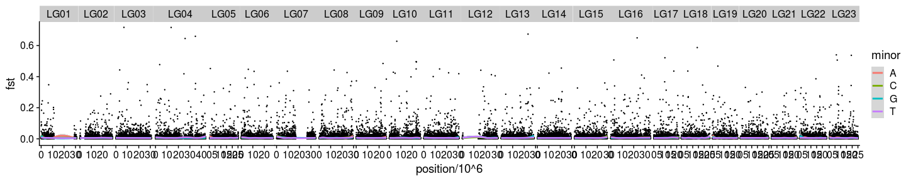
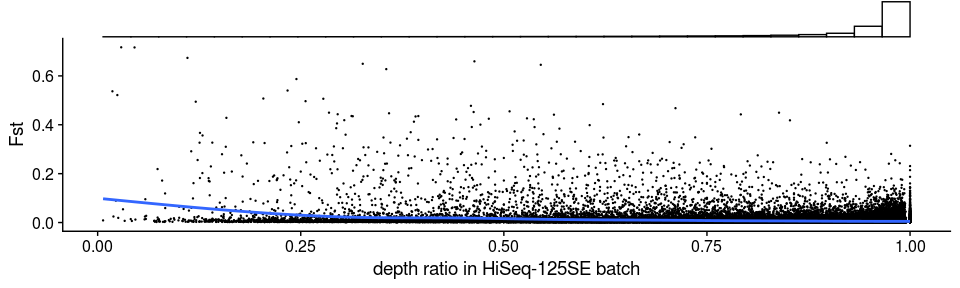
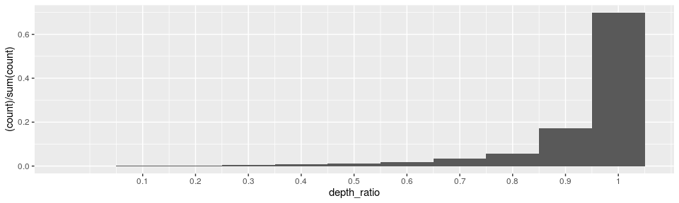
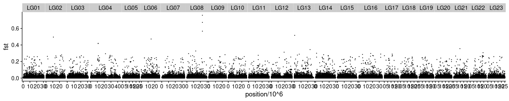
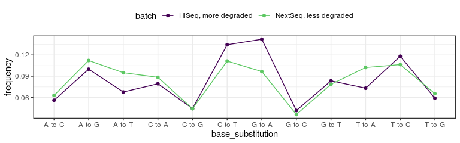

Fst-based analyses
================

``` r
library(tidyverse)
library(RcppCNPy)
library(cowplot)
```

## Get saf, maf, and Fst with ANGSD

#### Sliding window trimmed PE samples (new)

``` bash
## MAF and SAF
nohup bash /workdir/genomic-data-analysis/scripts/get_maf_per_pop.sh \
/workdir/batch-effect/ \
/workdir/batch-effect/sample_lists/sample_table_merged.tsv \
6 \
bam_list_realigned_ \
/workdir/cod/reference_seqs/gadMor3.fasta \
/workdir/cod/greenland-cod/angsd/global_snp_list_bam_list_realigned_mincov_contamination_filtered_mindp151_maxdp661_minind102_minq20_downsampled_unlinked.txt \
20 661 20 20 \
> /workdir/batch-effect/nohups/get_maf_per_pop.nohup &
## Fst
nohup bash /workdir/genomic-data-analysis/scripts/get_fst.sh \
/workdir/batch-effect/angsd/popminind20/ \
/workdir/batch-effect/sample_lists/sample_table_merged.tsv \
6 \
_global_snp_list_bam_list_realigned_mincov_contamination_filtered_mindp151_maxdp661_minind102_minq20_downsampled_unlinked_popminind20 \
> /workdir/batch-effect/nohups/get_fst.nohup &
## Get depth count from se samples without a mapping quality filter
cd /workdir/batch-effect
nohup /workdir/programs/angsd0.931/angsd/angsd \
-b sample_lists/bam_list_per_pop/bam_list_realigned_se.txt \
-anc /workdir/cod/reference_seqs/gadMor3.fasta \
-out angsd/popminind2/bam_list_realigned_se_anymapq \
-doCounts 1 -doDepth 1 -dumpCounts 1 \
-P 16 -setMinDepth 2 -minInd 2 -minQ 20 \
-sites /workdir/cod/greenland-cod/angsd/global_snp_list_bam_list_realigned_mincov_contamination_filtered_mindp151_maxdp661_minind102_minq20_downsampled_unlinked.txt \
-rf /workdir/cod/greenland-cod/angsd/global_snp_list_bam_list_realigned_mincov_contamination_filtered_mindp151_maxdp661_minind102_minq20_downsampled_unlinked.chrs \
>& nohups/get_depth_anymapq_bam_list_realigned_se.log &
```

## Plot Fst with sliding window trimmed PE samples

#### Without filtering

``` r
maf_se <- read_tsv("../angsd/popminind20/se_global_snp_list_bam_list_realigned_mincov_contamination_filtered_mindp151_maxdp661_minind102_minq20_downsampled_unlinked_popminind20.mafs.gz") %>%
  transmute(lg = chromo, position = position, major=major, minor = minor, se_maf = knownEM, se_nind=nInd)
maf_pe <- read_tsv("../angsd/popminind20/pe_global_snp_list_bam_list_realigned_mincov_contamination_filtered_mindp151_maxdp661_minind102_minq20_downsampled_unlinked_popminind20.mafs.gz")%>%
  transmute(lg = chromo, position = position, major=major, minor = minor, pe_maf = knownEM, pe_nind=nInd)
fst <- read_tsv("../angsd/popminind20/pe_se_global_snp_list_bam_list_realigned_mincov_contamination_filtered_mindp151_maxdp661_minind102_minq20_downsampled_unlinked_popminind20.alpha_beta.txt", col_names = F) %>%
  mutate(X5=X3/X4) %>%
  transmute(lg=X1, position = X2, alpha=X3, beta=X4, fst = X5)
maf_joined <- inner_join(maf_se, maf_pe) %>%
  left_join(fst) %>%
  #filter(se_nind>=20, pe_nind>=20) %>%
  mutate(delta = abs(se_maf- pe_maf)) %>%
  arrange(desc(fst))
summarise(maf_joined, average_fst = sum(alpha)/sum(beta))
```

    ## # A tibble: 1 x 1
    ##   average_fst
    ##         <dbl>
    ## 1     0.00533

``` r
maf_joined %>% filter(se_maf > 0.01 & se_maf<0.99) %>% summarise(average_fst = sum(alpha)/sum(beta))
```

    ## # A tibble: 1 x 1
    ##   average_fst
    ##         <dbl>
    ## 1     0.00486

``` r
head(maf_joined)
```

    ## # A tibble: 6 x 12
    ##   lg    position major minor  se_maf se_nind pe_maf pe_nind alpha  beta   fst
    ##   <chr>    <dbl> <chr> <chr>   <dbl>   <dbl>  <dbl>   <dbl> <dbl> <dbl> <dbl>
    ## 1 LG03   7041486 G     C     8.19e-1      32 0.0930      35 0.559 0.780 0.717
    ## 2 LG04  13667425 G     C     8.07e-1      31 0.0302      23 0.558 0.779 0.716
    ## 3 LG13  23405220 A     C     2.00e-6      51 0.664       46 0.430 0.638 0.674
    ## 4 LG04  34812164 T     A     1.00e+0      23 0.233       20 0.413 0.626 0.660
    ## 5 LG16  22964950 T     A     1.00e+0      27 0.313       28 0.399 0.615 0.649
    ## 6 LG04  25867867 T     C     2.00e-6      51 0.676       25 0.388 0.601 0.645
    ## # … with 1 more variable: delta <dbl>

``` r
maf_joined %>%
  ggplot(aes(x=position/10^6, y=fst)) +
  geom_point(size = 0.2) +
  geom_smooth(aes(color=minor)) +
  facet_grid(~lg, scales = "free_x", space = "free_x") +
  theme_cowplot() +
  theme(panel.spacing = unit(0.0, "lines"))
```

<!-- -->

#### Check correlation with read depth distribution before mapping quality filter

``` r
anymapq_depth <- read_tsv("../angsd/popminind2/bam_list_realigned_se_anymapq.pos.gz") %>%
  rename(lg=chr, position=pos, total_depth_anymapq=totDepth)
mapq20_depth <- read_tsv("../angsd/popminind20/se_global_snp_list_bam_list_realigned_mincov_contamination_filtered_mindp151_maxdp661_minind102_minq20_downsampled_unlinked_popminind20.pos.gz") %>%
  rename(lg=chr, position=pos, total_depth_mapq20=totDepth)
depth <- inner_join(anymapq_depth, mapq20_depth) %>%
  mutate(depth_ratio=total_depth_mapq20/total_depth_anymapq)
p <- maf_joined %>%
  left_join(depth) %>%
  ggplot(aes(x=depth_ratio, y=fst)) +
  geom_point(size=0.2) +
  geom_smooth() +
  theme_cowplot()
ggExtra::ggMarginal(p, type = "histogram", size=5, margins="x")
```

<!-- -->

``` r
maf_joined %>%
  left_join(depth) %>%
  ggplot() +
  geom_histogram(aes(x=depth_ratio, y = (..count..)/sum(..count..)), binwidth = 0.1) +
  scale_x_continuous(breaks = c(1:10/10), labels = c(1:10/10))
```

<!-- -->

``` r
maf_joined %>%
  left_join(depth) %>%
  filter(depth_ratio > 0.9) %>%
  ggplot(aes(x=position/10^6, y=fst)) +
  geom_point(size = 0.2) +
  geom_smooth(aes(color=minor)) +
  facet_grid(~lg, scales = "free_x", space = "free_x") +
  theme_cowplot() +
  theme(panel.spacing = unit(0.0, "lines"))
```

<!-- -->

``` r
maf_joined %>%
  left_join(depth) %>% 
  filter(depth_ratio > 0.9) %>%
  summarise(mean_fst=sum(alpha)/sum(beta))
```

    ## # A tibble: 1 x 1
    ##   mean_fst
    ##      <dbl>
    ## 1  0.00456

``` r
depth_filtered_maf <- maf_joined #%>%
  #left_join(depth) %>%
  #filter(depth_ratio > 0.8)

bind_rows((filter(depth_filtered_maf, pe_maf<0.01 | pe_maf>0.99) %>% filter(se_maf>0.1 & se_maf<0.9) %>% transmute(major=major, minor=minor, batch = "HiSeq, more degraded")),
          (filter(depth_filtered_maf, se_maf<0.01 | se_maf>0.99) %>% filter(pe_maf>0.1 & pe_maf<0.9) %>% transmute(major=major, minor=minor, batch = "NextSeq, less degraded"))) %>%
  mutate(base_substitution = str_c(major, "-to-", minor)) %>%
  group_by(base_substitution, batch) %>% 
  count() %>% 
  ungroup() %>% 
  group_by(batch) %>%
  mutate(frequency = n / sum(n)) %>%
  ungroup() %>%
  ggplot(aes(x=base_substitution, y=frequency, color=batch, group=batch)) +
  geom_line() + 
  geom_point() +
  scale_color_viridis_d(end=0.75) +
  theme_bw() +
  theme(legend.position = "top")
```

<!-- -->

#### Spot check some outlier SNPs

LG13:23405220 LG04:13667425 LG18:13944731 LG23:6170006 LG03:7041486

``` bash
cd /workdir/batch-effect/
## SE samples
for FILE in `cat /workdir/batch-effect/sample_lists/bam_list_per_pop/bam_list_realigned_se.txt`; do 
samtools view -b $FILE "LG13:23395220-23415220" > ${FILE%bam}'se_LG13.bam'
samtools view -b $FILE "LG04:13657425-13677425" > ${FILE%bam}'se_LG04.bam'
samtools view -b $FILE "LG18:13934731-13954731" > ${FILE%bam}'se_LG18.bam'
samtools view -b $FILE "LG23:6160006-6180006" > ${FILE%bam}'se_LG23.bam'
samtools view -b $FILE "LG03:7031486-7051486" > ${FILE%bam}'se_LG03.bam'
done
samtools merge /workdir/batch-effect/bam/fst_outliers/fst_outliers_se.bam /workdir/batch-effect/bam/*se_LG??.bam
samtools index /workdir/batch-effect/bam/fst_outliers/fst_outliers_se.bam
## PE samples
for FILE in `cat /workdir/batch-effect/sample_lists/bam_list_per_pop/bam_list_realigned_pe.txt`; do 
samtools view -b $FILE "LG13:23395220-23415220" > ${FILE%bam}'pe_LG13.bam'
samtools view -b $FILE "LG04:13657425-13677425" > ${FILE%bam}'pe_LG04.bam'
samtools view -b $FILE "LG18:13934731-13954731" > ${FILE%bam}'pe_LG18.bam'
samtools view -b $FILE "LG23:6160006-6180006" > ${FILE%bam}'pe_LG23.bam'
samtools view -b $FILE "LG03:7031486-7051486" > ${FILE%bam}'pe_LG03.bam'
done
samtools merge /workdir/batch-effect/bam/fst_outliers/fst_outliers_pe.bam /workdir/batch-effect/bam/*pe_LG??.bam
samtools index /workdir/batch-effect/bam/fst_outliers/fst_outliers_pe.bam
## PE samples, raw bam files
INPUTPATH='/workdir/cod/greenland-cod/bam/'
OUTPUTPATH='/workdir/batch-effect/bam/fst_outliers/'

for K in {2..168}; do
  SAMPLE=`head /workdir/batch-effect/sample_lists/sample_table_unmerged.tsv -n $K | tail -n 1 | cut -f 4`
  LANE=`head /workdir/batch-effect/sample_lists/sample_table_unmerged.tsv -n $K | tail -n 1 | cut -f 2`
  SEQID=`head /workdir/batch-effect/sample_lists/sample_table_unmerged.tsv -n $K | tail -n 1 | cut -f 3`
  DATATYPE=`head /workdir/batch-effect/sample_lists/sample_table_unmerged.tsv -n $K | tail -n 1 | cut -f 6`
  
  PREFIX=$SAMPLE'_'$SEQID'_'$LANE'_'$DATATYPE'_bt2_gadMor3'
  
  if [ ! -f $OUTPUTPATH$PREFIX'_se_raw_LG13.bam' ]; then
  if [ $DATATYPE = se ]; then
      samtools sort $INPUTPATH$PREFIX'.bam' > $OUTPUTPATH'/tmp.bam'
      samtools index $OUTPUTPATH'/tmp.bam'
      #echo $INPUTPATH$PREFIX'.bam'
      #echo $OUTPUTPATH$PREFIX'_minq20_sorted.bam'
      samtools view -b $OUTPUTPATH'/tmp.bam' "LG13:23395220-23415220" > $OUTPUTPATH$PREFIX'_se_raw_LG13.bam'
      samtools view -b $OUTPUTPATH'/tmp.bam' "LG04:13657425-13677425" > $OUTPUTPATH$PREFIX'_se_raw_LG04.bam'
      samtools view -b $OUTPUTPATH'/tmp.bam' "LG18:13934731-13954731" > $OUTPUTPATH$PREFIX'_se_raw_LG18.bam'
      samtools view -b $OUTPUTPATH'/tmp.bam' "LG23:6160006-6180006" > $OUTPUTPATH$PREFIX'_se_raw_LG23.bam'
      samtools view -b $OUTPUTPATH'/tmp.bam' "LG03:7031486-7051486" > $OUTPUTPATH$PREFIX'_se_raw_LG03.bam'
  fi
  fi
done

samtools merge /workdir/batch-effect/bam/fst_outliers/fst_outliers_se_raw.bam /workdir/batch-effect/bam/fst_outliers/*se_raw_LG??.bam
samtools index /workdir/batch-effect/bam/fst_outliers/fst_outliers_se_raw.bam
```
