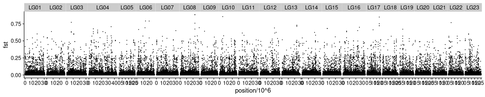

Fst-based analyses
================

``` r
library(tidyverse)
library(RcppCNPy)
library(cowplot)
```

## Get saf, maf, and Fst

#### Sliding window trimmed PE samples (new)

``` bash
## MAF and SAF
nohup bash /workdir/genomic-data-analysis/scripts/get_maf_per_pop.sh \
/workdir/batch-effect/ \
/workdir/batch-effect/sample_lists/sample_table_merged.tsv \
6 \
bam_list_realigned_ \
/workdir/cod/reference_seqs/gadMor3.fasta \
/workdir/cod/greenland-cod/angsd/global_snp_list_bam_list_realigned_mincov_contamination_filtered_mindp151_maxdp661_minind102_minq20_downsampled_unlinked.txt \
2 661 2 20 \
> /workdir/batch-effect/nohups/get_maf_per_pop.nohup &
## Fst
nohup bash /workdir/genomic-data-analysis/scripts/get_fst.sh \
/workdir/batch-effect/angsd/popminind2/ \
/workdir/batch-effect/sample_lists/sample_table_merged.tsv \
6 \
_global_snp_list_bam_list_realigned_mincov_contamination_filtered_mindp151_maxdp661_minind102_minq20_downsampled_unlinked_popminind2 \
> /workdir/batch-effect/nohups/get_fst.nohup &
```

## Fst with sliding window trimmed PE samples

#### Read in Fst and MAF results

``` r
###### original setup
maf_se <- read_tsv("../angsd/popminind2/se_global_snp_list_bam_list_realigned_mincov_contamination_filtered_mindp151_maxdp661_minind102_minq20_downsampled_unlinked_popminind2.mafs.gz") %>%
  transmute(lg = chromo, position = position, major=major, minor = minor, se_maf = knownEM, se_nind=nInd)
maf_pe <- read_tsv("../angsd/popminind2/pe_global_snp_list_bam_list_realigned_mincov_contamination_filtered_mindp151_maxdp661_minind102_minq20_downsampled_unlinked_popminind2.mafs.gz")%>%
  transmute(lg = chromo, position = position, major=major, minor = minor, pe_maf = knownEM, pe_nind=nInd)
fst <- read_tsv("../angsd/popminind2/pe_se_global_snp_list_bam_list_realigned_mincov_contamination_filtered_mindp151_maxdp661_minind102_minq20_downsampled_unlinked_popminind2.alpha_beta.txt", col_names = F) %>%
  mutate(X5=X3/X4) %>%
  transmute(lg=X1, position = X2, alpha=X3, beta=X4, fst = X5)
maf_joined <- inner_join(maf_se, maf_pe) %>%
  left_join(fst) %>%
  filter(se_nind>=20, pe_nind >=20) %>%
  mutate(delta = abs(se_maf- pe_maf)) %>%
  arrange(desc(fst))
summarise(maf_joined, average_fst = sum(alpha)/sum(beta))
```

    ## # A tibble: 1 x 1
    ##   average_fst
    ##         <dbl>
    ## 1     0.00638

``` r
maf_joined %>% filter(se_maf > 0.01 & se_maf<0.99) %>% summarise(average_fst = sum(alpha)/sum(beta))
```

    ## # A tibble: 1 x 1
    ##   average_fst
    ##         <dbl>
    ## 1     0.00583

``` r
head(maf_joined)
```

    ## # A tibble: 6 x 12
    ##   lg    position major minor  se_maf se_nind pe_maf pe_nind alpha  beta   fst
    ##   <chr>    <dbl> <chr> <chr>   <dbl>   <dbl>  <dbl>   <dbl> <dbl> <dbl> <dbl>
    ## 1 LG04  34812164 T     A     1.00e+0      23 0.233       20 0.460 0.661 0.696
    ## 2 LG13  23405220 A     C     2.00e-6      52 0.666       46 0.438 0.644 0.680
    ## 3 LG04  13667425 G     C     8.07e-1      31 0.0302      23 0.502 0.742 0.676
    ## 4 LG04  25867867 T     C     2.00e-6      51 0.676       25 0.413 0.622 0.663
    ## 5 LG16  22964950 T     A     1.00e+0      27 0.313       28 0.416 0.629 0.661
    ## 6 LG18  13944731 T     C     4.00e-6      20 0.674       21 0.378 0.600 0.630
    ## # … with 1 more variable: delta <dbl>

#### Plot Fst

``` r
maf_joined %>%
  ggplot(aes(x=position/10^6, y=fst)) +
  geom_point(size = 0.2) +
  geom_smooth(aes(color=minor)) +
  facet_grid(~lg, scales = "free_x", space = "free_x") +
  theme_cowplot() +
  theme(panel.spacing = unit(0.0, "lines"))
```

<!-- -->

#### Spot check some outlier SNPs

LG13:23405220 LG04:13667425 LG18:13944731 LG23:6170006 LG03:7041486

``` bash
cd /workdir/batch-effect/
## SE samples
for FILE in `cat /workdir/batch-effect/sample_lists/bam_list_per_pop/bam_list_realigned_se.txt`; do 
samtools view -b $FILE "LG13:23395220-23415220" > ${FILE%bam}'se_LG13.bam'
samtools view -b $FILE "LG04:13657425-13677425" > ${FILE%bam}'se_LG04.bam'
samtools view -b $FILE "LG18:13934731-13954731" > ${FILE%bam}'se_LG18.bam'
samtools view -b $FILE "LG23:6160006-6180006" > ${FILE%bam}'se_LG23.bam'
samtools view -b $FILE "LG03:7031486-7051486" > ${FILE%bam}'se_LG03.bam'
done
samtools merge /workdir/batch-effect/bam/fst_outliers/fst_outliers_se.bam /workdir/batch-effect/bam/*se_LG??.bam
samtools index /workdir/batch-effect/bam/fst_outliers/fst_outliers_se.bam
## PE samples
for FILE in `cat /workdir/batch-effect/sample_lists/bam_list_per_pop/bam_list_realigned_pe.txt`; do 
samtools view -b $FILE "LG13:23395220-23415220" > ${FILE%bam}'pe_LG13.bam'
samtools view -b $FILE "LG04:13657425-13677425" > ${FILE%bam}'pe_LG04.bam'
samtools view -b $FILE "LG18:13934731-13954731" > ${FILE%bam}'pe_LG18.bam'
samtools view -b $FILE "LG23:6160006-6180006" > ${FILE%bam}'pe_LG23.bam'
samtools view -b $FILE "LG03:7031486-7051486" > ${FILE%bam}'pe_LG03.bam'
done
samtools merge /workdir/batch-effect/bam/fst_outliers/fst_outliers_pe.bam /workdir/batch-effect/bam/*pe_LG??.bam
samtools index /workdir/batch-effect/bam/fst_outliers/fst_outliers_pe.bam
## PE samples, raw bam files
INPUTPATH='/workdir/cod/greenland-cod/bam/'
OUTPUTPATH='/workdir/batch-effect/bam/fst_outliers/'

for K in {2..168}; do
  SAMPLE=`head /workdir/batch-effect/sample_lists/sample_table_unmerged.tsv -n $K | tail -n 1 | cut -f 4`
  LANE=`head /workdir/batch-effect/sample_lists/sample_table_unmerged.tsv -n $K | tail -n 1 | cut -f 2`
  SEQID=`head /workdir/batch-effect/sample_lists/sample_table_unmerged.tsv -n $K | tail -n 1 | cut -f 3`
  DATATYPE=`head /workdir/batch-effect/sample_lists/sample_table_unmerged.tsv -n $K | tail -n 1 | cut -f 6`
  
  PREFIX=$SAMPLE'_'$SEQID'_'$LANE'_'$DATATYPE'_bt2_gadMor3'
  
  if [ ! -f $OUTPUTPATH$PREFIX'_se_raw_LG13.bam' ]; then
  if [ $DATATYPE = se ]; then
      samtools sort $INPUTPATH$PREFIX'.bam' > $OUTPUTPATH'/tmp.bam'
      samtools index $OUTPUTPATH'/tmp.bam'
      #echo $INPUTPATH$PREFIX'.bam'
      #echo $OUTPUTPATH$PREFIX'_minq20_sorted.bam'
      samtools view -b $OUTPUTPATH'/tmp.bam' "LG13:23395220-23415220" > $OUTPUTPATH$PREFIX'_se_raw_LG13.bam'
      samtools view -b $OUTPUTPATH'/tmp.bam' "LG04:13657425-13677425" > $OUTPUTPATH$PREFIX'_se_raw_LG04.bam'
      samtools view -b $OUTPUTPATH'/tmp.bam' "LG18:13934731-13954731" > $OUTPUTPATH$PREFIX'_se_raw_LG18.bam'
      samtools view -b $OUTPUTPATH'/tmp.bam' "LG23:6160006-6180006" > $OUTPUTPATH$PREFIX'_se_raw_LG23.bam'
      samtools view -b $OUTPUTPATH'/tmp.bam' "LG03:7031486-7051486" > $OUTPUTPATH$PREFIX'_se_raw_LG03.bam'
  fi
  fi
done

samtools merge /workdir/batch-effect/bam/fst_outliers/fst_outliers_se_raw.bam /workdir/batch-effect/bam/fst_outliers/*se_raw_LG??.bam
samtools index /workdir/batch-effect/bam/fst_outliers/fst_outliers_se_raw.bam
```
