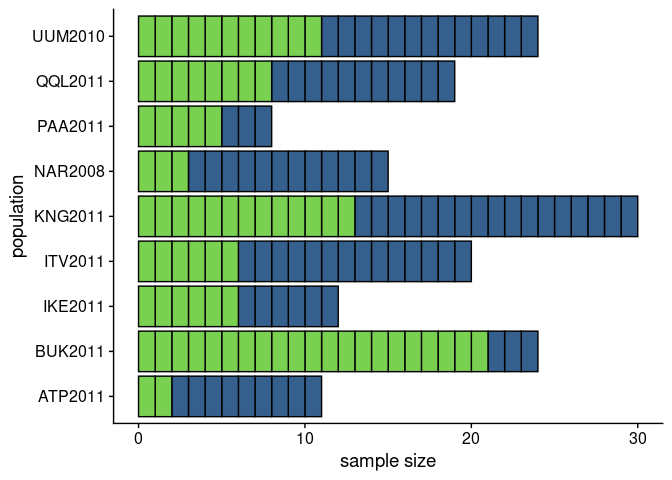
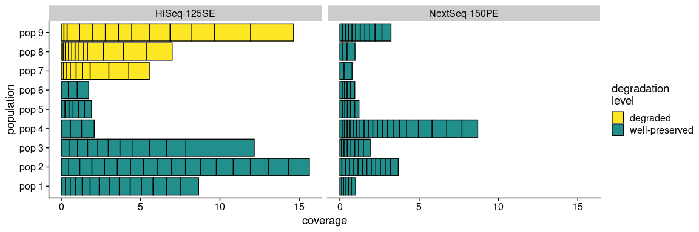
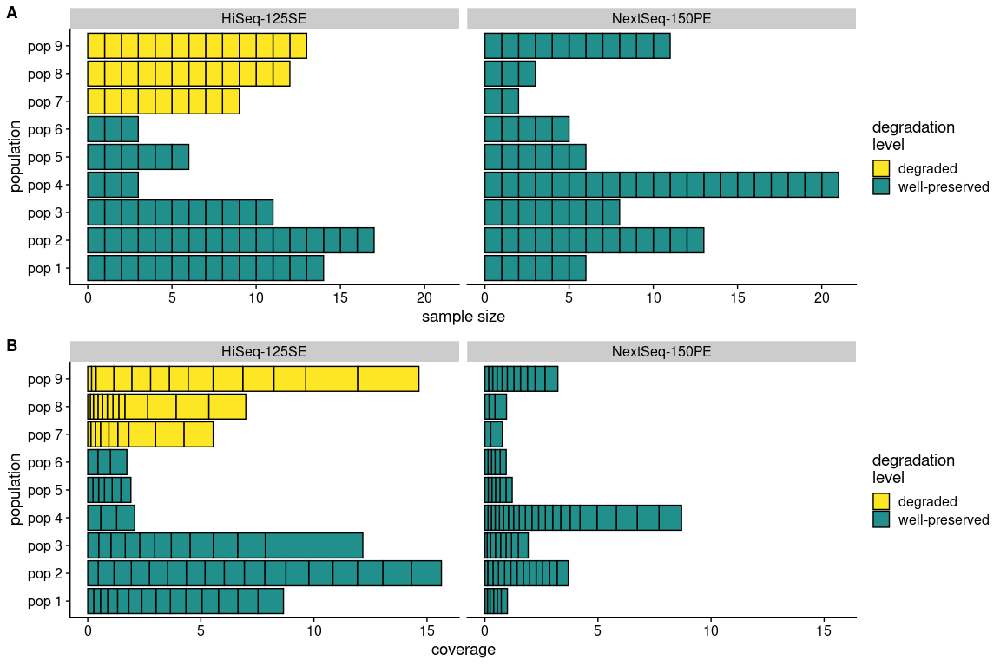

Original pipeline
================

  - [Load packages](#load-packages)
  - [Adapter clipping](#adapter-clipping)
  - [PolyG trimming](#polyg-trimming)
  - [Fastq file counting](#fastq-file-counting)
  - [Reference genome manipulation](#reference-genome-manipulation)
      - [first rename the chromosomes in the gadMor3
        genome](#first-rename-the-chromosomes-in-the-gadmor3-genome)
      - [build bowtie reference index](#build-bowtie-reference-index)
  - [Map to reference genome](#map-to-reference-genome)
  - [Count unmerged bam files](#count-unmerged-bam-files)
  - [Merge duplicated samples](#merge-duplicated-samples)
      - [Create merged sample table](#create-merged-sample-table)
      - [Create merging script](#create-merging-script)
      - [Run merging script](#run-merging-script)
  - [Deduplicate (all samples) and clip overlapping read pairs (pe
    only)](#deduplicate-all-samples-and-clip-overlapping-read-pairs-pe-only)
  - [Realign around indels](#realign-around-indels)
  - [Count merged bam files](#count-merged-bam-files)
  - [Count read depth per position](#count-read-depth-per-position)
  - [Heterozygosity estimation](#heterozygosity-estimation)
  - [Come up with sample lists and tables for the batch effect
    project](#come-up-with-sample-lists-and-tables-for-the-batch-effect-project)
  - [Some visualizations](#some-visualizations)
      - [Sample size and coverage in each
        batch](#sample-size-and-coverage-in-each-batch)
      - [Color by DNA degradation
        level](#color-by-dna-degradation-level)

This is the
[pipeline](https://github.com/therkildsen-lab/greenland-cod/blob/53e0e516b477ee245212eaffc92d35c3dea4f498/markdowns/data_processing.md)
that I used when I first processed the samples for the Greenland cod
project. A subset of the samples used in the Greenland cod project are
selected for this study on batch effects (see last two sections of this
document). The project directory for Greenland cod is
`/workdir/cod/greenland-cod/`, which is used in most scripts here.

Also note that most of the shell scripts that this pipeline uses are
located in two Github repos that store generic scripts for lcWGS data
[processing](https://github.com/therkildsen-lab/data-processing) and
[analysis](https://github.com/therkildsen-lab/genomic-data-analysis).

In this batch effect project, we only use the results of this pipeline
to illustrate the prevalence of polyG tails (Figure 2) and its impact on
our heterozygosity estimates. Also, we use the final bam files of this
pipeline in our calculation of per-sample coverage (Table 1, Figure S1).

## Load packages

``` r
library(tidyverse)
```

    ## ── Attaching packages ─────────────────────────────────────── tidyverse 1.3.1 ──

    ## ✓ ggplot2 3.3.3     ✓ purrr   0.3.4
    ## ✓ tibble  3.1.2     ✓ dplyr   1.0.7
    ## ✓ tidyr   1.1.3     ✓ stringr 1.4.0
    ## ✓ readr   1.4.0     ✓ forcats 0.5.1

    ## ── Conflicts ────────────────────────────────────────── tidyverse_conflicts() ──
    ## x dplyr::filter() masks stats::filter()
    ## x dplyr::lag()    masks stats::lag()

``` r
library(cowplot)
library(googlesheets4)
```

## Adapter clipping

``` bash
nohup bash /workdir/data-processing/scripts/adapter_clipping.sh /workdir/cod/greenland-cod/sample_lists/sample_list_pe_1.tsv /workdir/cod/greenland-cod/sample_lists/sample_table.tsv /workdir/backup/cod/greenland_cod/fastq/ /workdir/cod/greenland-cod/ _R1.fastq.gz _R2.fastq.gz /workdir/cod/reference_seqs/NexteraPE_NT.fa >& /workdir/cod/greenland-cod/nohups/adapter_clipping_pe_1.nohup &
nohup bash /workdir/data-processing/scripts/adapter_clipping.sh /workdir/cod/greenland-cod/sample_lists/sample_list_pe_2.tsv /workdir/cod/greenland-cod/sample_lists/sample_table.tsv /workdir/backup/cod/greenland_cod/fastq/ /workdir/cod/greenland-cod/ _R1.fastq.gz _R2.fastq.gz /workdir/cod/reference_seqs/NexteraPE_NT.fa >& /workdir/cod/greenland-cod/nohups/adapter_clipping_pe_2.nohup &
nohup bash /workdir/data-processing/scripts/adapter_clipping.sh /workdir/cod/greenland-cod/sample_lists/sample_list_se_1.tsv /workdir/cod/greenland-cod/sample_lists/sample_table.tsv /workdir/backup/cod/greenland_cod/fastq/ /workdir/cod/greenland-cod/ .txt.gz .txt.gz /workdir/cod/reference_seqs/NexteraPE_NT.fa >& /workdir/cod/greenland-cod/nohups/adapter_clipping_se_1.nohup &
nohup bash /workdir/data-processing/scripts/adapter_clipping.sh /workdir/cod/greenland-cod/sample_lists/sample_list_se_2.tsv /workdir/cod/greenland-cod/sample_lists/sample_table.tsv /workdir/backup/cod/greenland_cod/fastq/ /workdir/cod/greenland-cod/ _R1.fastq.gz _R1.fastq.gz /workdir/cod/reference_seqs/NexteraPE_NT.fa >& /workdir/cod/greenland-cod/nohups/adapter_clipping_se_2.nohup &
nohup bash /workdir/data-processing/scripts/adapter_clipping.sh /workdir/cod/greenland-cod/sample_lists/sample_list_se_3.tsv /workdir/cod/greenland-cod/sample_lists/sample_table.tsv /workdir/backup/cod/greenland_cod/fastq/ /workdir/cod/greenland-cod/ _R1_001.fastq.gz _R1_001.fastq.gz /workdir/cod/reference_seqs/NexteraPE_NT.fa >& /workdir/cod/greenland-cod/nohups/adapter_clipping_se_3.nohup &
```

## PolyG trimming

Here, we use fastp to perform polyG trimming. Note that fastp will
perform polyG trimming on NextSeq data in default but not on HiSeq data.
Therefore, we only ran fastp on NextSeq data and skipped this step for
HiSeq, but the result would have been the same if we ran it on HiSeq as
well (in which case no trimming would be performed).

The option that we used with fastp is `--trim_poly_g -Q -L -A`. With
this option, the default quality, length, and adapter trimming are
turned off.

``` bash
nohup bash /workdir/data-processing/scripts/quality_filtering.sh /workdir/cod/greenland-cod/sample_lists/sample_list_pe_1.tsv /workdir/cod/greenland-cod/sample_lists/sample_table.tsv /workdir/cod/greenland-cod/ polyg >& /workdir/cod/greenland-cod/nohups/quality_filtering_pe_1.nohup &
nohup bash /workdir/data-processing/scripts/quality_filtering.sh /workdir/cod/greenland-cod/sample_lists/sample_list_pe_2.tsv /workdir/cod/greenland-cod/sample_lists/sample_table.tsv /workdir/cod/greenland-cod/ polyg >& /workdir/cod/greenland-cod/nohups/quality_filtering_pe_2.nohup &
nohup bash /workdir/data-processing/scripts/quality_filtering.sh /workdir/cod/greenland-cod/sample_lists/sample_list_se_2.tsv /workdir/cod/greenland-cod/sample_lists/sample_table.tsv /workdir/cod/greenland-cod/ polyg >& /workdir/cod/greenland-cod/nohups/quality_filtering_se_2.nohup &
```

## Fastq file counting

``` bash
nohup bash /workdir/data-processing/scripts/count_fastq.sh /workdir/cod/greenland-cod/sample_lists/sample_list_pe_1.tsv /workdir/cod/greenland-cod/sample_lists/sample_table.tsv /workdir/backup/cod/greenland_cod/fastq/ /workdir/cod/greenland-cod/ @N true >& /workdir/cod/greenland-cod/sample_lists/fastq_count_pe_1.tsv 2> nohup.err < /dev/null &
nohup bash /workdir/data-processing/scripts/count_fastq.sh /workdir/cod/greenland-cod/sample_lists/sample_list_pe_2.tsv /workdir/cod/greenland-cod/sample_lists/sample_table.tsv /workdir/backup/cod/greenland_cod/fastq/ /workdir/cod/greenland-cod/ @N true >& /workdir/cod/greenland-cod/sample_lists/fastq_count_pe_2.tsv 2> nohup.err < /dev/null &
nohup bash /workdir/data-processing/scripts/count_fastq.sh /workdir/cod/greenland-cod/sample_lists/sample_list_se_1.tsv /workdir/cod/greenland-cod/sample_lists/sample_table.tsv /workdir/backup/cod/greenland_cod/fastq/ /workdir/cod/greenland-cod/ @HISEQ false >& /workdir/cod/greenland-cod/sample_lists/fastq_count_se_1.tsv 2> nohup.err < /dev/null &
nohup bash /workdir/data-processing/scripts/count_fastq.sh /workdir/cod/greenland-cod/sample_lists/sample_list_se_2.tsv /workdir/cod/greenland-cod/sample_lists/sample_table.tsv /workdir/backup/cod/greenland_cod/fastq/ /workdir/cod/greenland-cod/ @N true >& /workdir/cod/greenland-cod/sample_lists/fastq_count_se_2.tsv 2> nohup.err < /dev/null &
nohup bash /workdir/data-processing/scripts/count_fastq.sh /workdir/cod/greenland-cod/sample_lists/sample_list_se_3.tsv /workdir/cod/greenland-cod/sample_lists/sample_table.tsv /workdir/backup/cod/greenland_cod/fastq/ /workdir/cod/greenland-cod/ @D00550 false >& /workdir/cod/greenland-cod/sample_lists/fastq_count_se_3.tsv 2> nohup.err < /dev/null &
```

## Reference genome manipulation

#### first rename the chromosomes in the gadMor3 genome

``` r
library(tidyverse)
gadmor3 <- read_lines("/workdir/cod/reference_seqs/gadMor3.fna")
pattern_replacement <- tibble(pattern = c(paste0("NC_0", (1:23)+44047, ".1" ), 
                                       " Gadus morhua chromosome .*, gadMor3.0, whole genome shotgun sequence",
                                        "NC_002081.1"), 
                           replacement =  c(paste0("LG", formatC(1:23, width = 2, format = "d", flag = "0")), 
                                            "",
                                            "MT_genome")) %>% 
  deframe()
gadmor3_new <- str_replace_all(gadmor3_new, pattern_replacement)
write_lines(gadmor3_new, "/workdir/cod/reference_seqs/gadMor3.fasta")
```

#### build bowtie reference index

``` bash
nohup bash /workdir/data-processing/scripts/build_bowtie_ref_index.sh \
/workdir/cod/reference_seqs/gadMor3.fasta \
gadMor3 \
> /workdir/cod/greenland-cod/nohups/build_bowtie_ref_index.nohup &
```

## Map to reference genome

Note that in this step, we filtered the bam files with a minimum mapping
quality of 20. In subsequent pipelines (with sliding window trimming),
this minimum mapping quality filter was not used.

``` bash
nohup bash /workdir/data-processing/scripts/low_coverage_mapping.sh \
/workdir/cod/greenland-cod/sample_lists/sample_list_pe_1.tsv \
/workdir/cod/greenland-cod/sample_lists/sample_table.tsv \
/workdir/cod/greenland-cod/qual_filtered/ \
/workdir/cod/greenland-cod/ \
_adapter_clipped_qual_filtered_f_paired.fastq.gz \
_adapter_clipped_qual_filtered_r_paired.fastq.gz \
very-sensitive \
/workdir/cod/reference_seqs/gadMor3.fasta \
gadMor3 \
> /workdir/cod/greenland-cod/nohups/low_coverage_mapping_pe_1.nohup &
nohup bash /workdir/data-processing/scripts/low_coverage_mapping.sh \
/workdir/cod/greenland-cod/sample_lists/sample_list_pe_2.tsv \
/workdir/cod/greenland-cod/sample_lists/sample_table.tsv \
/workdir/cod/greenland-cod/qual_filtered/ \
/workdir/cod/greenland-cod/ \
_adapter_clipped_qual_filtered_f_paired.fastq.gz \
_adapter_clipped_qual_filtered_r_paired.fastq.gz \
very-sensitive \
/workdir/cod/reference_seqs/gadMor3.fasta \
gadMor3 \
> /workdir/cod/greenland-cod/nohups/low_coverage_mapping_pe_2.nohup &
nohup bash /workdir/data-processing/scripts/low_coverage_mapping.sh \
/workdir/cod/greenland-cod/sample_lists/sample_list_se_1.tsv \
/workdir/cod/greenland-cod/sample_lists/sample_table.tsv \
/workdir/cod/greenland-cod/adapter_clipped/ \
/workdir/cod/greenland-cod/ \
_adapter_clipped_se.fastq.gz \
_adapter_clipped_se.fastq.gz \
very-sensitive \
/workdir/cod/reference_seqs/gadMor3.fasta \
gadMor3 \
> /workdir/cod/greenland-cod/nohups/low_coverage_mapping_se_1.nohup &
nohup bash /workdir/data-processing/scripts/low_coverage_mapping.sh \
/workdir/cod/greenland-cod/sample_lists/sample_list_se_2.tsv \
/workdir/cod/greenland-cod/sample_lists/sample_table.tsv \
/workdir/cod/greenland-cod/qual_filtered/ \
/workdir/cod/greenland-cod/ \
_adapter_clipped_qual_filtered_se.fastq.gz \
_adapter_clipped_qual_filtered_se.fastq.gz \
very-sensitive \
/workdir/cod/reference_seqs/gadMor3.fasta \
gadMor3 \
> /workdir/cod/greenland-cod/nohups/low_coverage_mapping_se_2.nohup &
nohup bash /workdir/data-processing/scripts/low_coverage_mapping.sh \
/workdir/cod/greenland-cod/sample_lists/sample_list_se_3.tsv \
/workdir/cod/greenland-cod/sample_lists/sample_table.tsv \
/workdir/cod/greenland-cod/adapter_clipped/ \
/workdir/cod/greenland-cod/ \
_adapter_clipped_se.fastq.gz \
_adapter_clipped_se.fastq.gz \
very-sensitive \
/workdir/cod/reference_seqs/gadMor3.fasta \
gadMor3 \
> /workdir/cod/greenland-cod/nohups/low_coverage_mapping_se_3.nohup &
```

## Count unmerged bam files

``` bash
nohup bash /workdir/data-processing/scripts/count_bam_unmerged.sh /workdir/cod/greenland-cod/sample_lists/sample_list_pe_1.tsv /workdir/cod/greenland-cod/sample_lists/sample_table.tsv /workdir/cod/greenland-cod/ gadMor3 >& /workdir/cod/greenland-cod/sample_lists/bam_count_unmerged_pe_1.tsv 2> nohup.err < /dev/null &
nohup bash /workdir/data-processing/scripts/count_bam_unmerged.sh /workdir/cod/greenland-cod/sample_lists/sample_list_pe_2.tsv /workdir/cod/greenland-cod/sample_lists/sample_table.tsv /workdir/cod/greenland-cod/ gadMor3 >& /workdir/cod/greenland-cod/sample_lists/bam_count_unmerged_pe_2.tsv 2> nohup.err < /dev/null &
nohup bash /workdir/data-processing/scripts/count_bam_unmerged.sh /workdir/cod/greenland-cod/sample_lists/sample_list_se_1.tsv /workdir/cod/greenland-cod/sample_lists/sample_table.tsv /workdir/cod/greenland-cod/ gadMor3 >& /workdir/cod/greenland-cod/sample_lists/bam_count_unmerged_se_1.tsv 2> nohup.err < /dev/null &
nohup bash /workdir/data-processing/scripts/count_bam_unmerged.sh /workdir/cod/greenland-cod/sample_lists/sample_list_se_2.tsv /workdir/cod/greenland-cod/sample_lists/sample_table.tsv /workdir/cod/greenland-cod/ gadMor3 >& /workdir/cod/greenland-cod/sample_lists/bam_count_unmerged_se_2.tsv 2> nohup.err < /dev/null &
nohup bash /workdir/data-processing/scripts/count_bam_unmerged.sh /workdir/cod/greenland-cod/sample_lists/sample_list_se_3.tsv /workdir/cod/greenland-cod/sample_lists/sample_table.tsv /workdir/cod/greenland-cod/ gadMor3 >& /workdir/cod/greenland-cod/sample_lists/bam_count_unmerged_se_3.tsv 2> nohup.err < /dev/null &
```

## Merge duplicated samples

#### Create merged sample table

``` r
library(tidyverse)
## Define base directory and reference name
basedir <- "/workdir/cod/greenland-cod/"
refname <- "gadMor3"
## Read in unmerged sample tables and combine pe and se
sample_table<-read_tsv("/workdir/cod/greenland-cod/sample_lists/sample_table.tsv") %>%
  mutate(sample_seq_id=paste(sample_id,seq_id,lane_number, sep = "_"))
## Add a sample_id_corrected column, just in case that the same sample got assigned different IDs, or a few of the IDs are wrong
# This is not the case for the Greenland cod project
# When this happends, just edit "wrong_id" and "correct_id"
sample_table <- mutate(sample_table, sample_id_corrected=ifelse(sample_id!="wrong_id", sample_id, "correct_id"))
## Create a merged table by keeping only one row for each unique sample
# seq_id, lane_number, and data_type are all replaced with "merged" for duplicated samples
sample_table_merged <- group_by(sample_table, sample_id_corrected) %>%
  summarise(population=unique(population), seq_id=ifelse(n()==1,seq_id, "merged"), lane_number=ifelse(length(unique(lane_number))==1,unique(lane_number), "merged"), data_type=paste0(unique(data_type), collapse = "")) %>%
  mutate(sample_seq_id=paste(sample_id_corrected, seq_id, lane_number, data_type, sep = "_")) %>%
  select(sample_seq_id, lane_number, seq_id, sample_id_corrected, population, data_type)
## Rename some populations
API2011_inlet_id <- paste0("API2011_", formatC(c(6,7,15,20,22,33,39,40,41,42,43,44,45,46,47),width=3, format="d", flag="0"))
sample_table_merged <- sample_table_merged %>%
  mutate(population_new=ifelse(population == "API2011" , "API2011_O", population)) %>%
  mutate(population_new=ifelse(sample_id_corrected %in% API2011_inlet_id, "API2011_I", population_new)) %>%
  mutate(population_new=ifelse(population_new == "IKE45" , "UUM45", population_new))
## Write the merged table
write_tsv(sample_table_merged, "/workdir/cod/greenland-cod/sample_lists/sample_table_merged.tsv")
## Create bam lists as inputs for future steps
bam_list_merged <- paste0(basedir, "bam/", sample_table_merged$sample_seq_id, "_bt2_", refname, "_minq20_sorted.bam")
bam_list_dedup_overlapclipped <- transmute(sample_table_merged, suffix=ifelse(data_type=="se", paste0("_bt2_", refname, "_minq20_sorted_dedup.bam"), paste0("_bt2_", refname, "_minq20_sorted_dedup_overlapclipped.bam"))) %>%
  .$suffix %>%
  paste0(basedir, "bam/", sample_table_merged$sample_seq_id, .)
bam_list_realigned <- transmute(sample_table_merged, suffix=ifelse(data_type=="se", paste0("_bt2_", refname, "_minq20_sorted_dedup_realigned.bam"), paste0("_bt2_", refname, "_minq20_sorted_dedup_overlapclipped_realigned.bam"))) %>%
  .$suffix %>%
  paste0(basedir, "bam/", sample_table_merged$sample_seq_id, .)
write_lines(bam_list_merged, "/workdir/cod/greenland-cod/sample_lists/bam_list_merged.tsv")
write_lines(bam_list_dedup_overlapclipped, "/workdir/cod/greenland-cod/sample_lists/bam_list_dedup_overlapclipped.tsv")
write_lines(bam_list_realigned, "/workdir/cod/greenland-cod/sample_lists/bam_list_realigned.tsv")
## Split merged bamfile list into two, so that everything else other than the third single end batch can be processed first. 
bam_list_merged_1 <- filter(sample_table_merged, !lane_number%in%c("9", "10", "11", "12")) %>%
  .$sample_seq_id %>%
  paste0(basedir, "bam/", ., "_bt2_", refname, "_minq20_sorted.bam")
bam_list_merged_2 <- filter(sample_table_merged, lane_number%in%c("9", "10", "11", "12")) %>%
  .$sample_seq_id %>%
  paste0(basedir, "bam/", ., "_bt2_", refname, "_minq20_sorted.bam")
write_lines(bam_list_merged_1, "/workdir/cod/greenland-cod/sample_lists/bam_list_merged_1.tsv")
write_lines(bam_list_merged_2, "/workdir/cod/greenland-cod/sample_lists/bam_list_merged_2.tsv")
```

Note: I created `pop_order_original.txt` and `pop_order.txt` manually.
These files are used to reorder the factor levels of the population
vector in many different analyses. `pop_order_original.txt` has a single
`API` population and has `IKE45` instead of `UUM45`.

#### Create merging script

``` r
## Find all duplicated samples
duplicated_samples <- (sample_table$sample_id_corrected)[duplicated(sample_table$sample_id_corrected)]
duplicated_samples_seq_ids <- sample_table_merged[match(duplicated_samples,sample_table_merged$sample_id_corrected),] %>%
  .$sample_seq_id
merging_script<-NULL
## Loop through all duplicated samples 
for (i in 1:length(duplicated_samples)){
  duplicated_sample <- duplicated_samples[i]
  duplicated_samples_seq_id <- duplicated_samples_seq_ids[i]
  ## Extract the bam file names from the unmerged sample table
  input <- filter(sample_table, sample_id_corrected==duplicated_sample) %>%
    mutate(unmerged_bam=paste(sample_id, seq_id, lane_number, data_type, "bt2", refname, "minq20_sorted.bam", sep = "_")) %>% 
    # Note that sample_id is used in here instead of sample_id_corrected, since the unmerged bam file still uses sample_id as part of its name, not the corrected one.
    .$unmerged_bam %>%
    paste0(basedir, "bam/", .) %>%
    paste(collapse = " ")
  
  ## Paste together the command line
  merging_script[i] <- paste0("samtools merge ", basedir, "bam/", duplicated_samples_seq_id, "_bt2_", refname, "_minq20_sorted.bam ", input)
}
## Write the script
write_lines(merging_script, "/workdir/cod/greenland-cod/scripts/merge_bam.sh")
```

#### Run merging script

``` bash
nohup bash /workdir/cod/greenland-cod/scripts/merge_bam.sh > /workdir/cod/greenland-cod/nohups/merge_bam.nohup &
```

## Deduplicate (all samples) and clip overlapping read pairs (pe only)

``` bash
nohup bash /workdir/data-processing/scripts/deduplicate_clipoverlap.sh \
/workdir/cod/greenland-cod/sample_lists/bam_list_merged_1.tsv \
/workdir/cod/greenland-cod/sample_lists/sample_table_merged.tsv \
/workdir/cod/greenland-cod/ \
gadMor3 \
> /workdir/cod/greenland-cod/nohups/deduplicate_clipoverlap_1.nohup &
nohup bash /workdir/data-processing/scripts/deduplicate_clipoverlap.sh \
/workdir/cod/greenland-cod/sample_lists/bam_list_merged_2.tsv \
/workdir/cod/greenland-cod/sample_lists/sample_table_merged.tsv \
/workdir/cod/greenland-cod/ \
gadMor3 \
> /workdir/cod/greenland-cod/nohups/deduplicate_clipoverlap_2.nohup &
```

## Realign around indels

**Important:** Rename the extension of the bam list to `.list` as
required by GATK

``` bash
cp /workdir/cod/greenland-cod/sample_lists/bam_list_dedup_overlapclipped.tsv \
/workdir/cod/greenland-cod/sample_lists/bam_list_dedup_overlapclipped.list
nohup bash /workdir/data-processing/scripts/realign_indels.sh \
/workdir/cod/greenland-cod/sample_lists/bam_list_dedup_overlapclipped.list \
/workdir/cod/greenland-cod/ \
/workdir/cod/reference_seqs/gadMor3.fasta \
gadMor3 \
> /workdir/cod/greenland-cod/nohups/realign_indels.nohup &
```

## Count merged bam files

``` bash
nohup bash /workdir/data-processing/scripts/count_bam_merged.sh /workdir/cod/greenland-cod/sample_lists/bam_list_merged_1.tsv /workdir/cod/greenland-cod/sample_lists/sample_table_merged.tsv /workdir/cod/greenland-cod/ gadMor3 >& /workdir/cod/greenland-cod/sample_lists/bam_count_merged_1.tsv 2> nohup.err < /dev/null &
nohup bash /workdir/data-processing/scripts/count_bam_merged.sh /workdir/cod/greenland-cod/sample_lists/bam_list_merged_2.tsv /workdir/cod/greenland-cod/sample_lists/sample_table_merged.tsv /workdir/cod/greenland-cod/ gadMor3 >& /workdir/cod/greenland-cod/sample_lists/bam_count_merged_2.tsv 2> nohup.err < /dev/null &
```

## Count read depth per position

The following script count depth of all bam files together at once,
creating a massive matrix. Then awk script can be used to summarize this
matrix. (R can’t be used because the matrix is a few hundred GB.) This
script is simple to run, but it might be rather slow and I decided to
**not** use it for this project.

``` bash
nohup bash /workdir/data-processing/scripts/count_depth_per_position_all_samples.sh /workdir/cod/greenland-cod/sample_lists/bam_list_realigned.tsv /workdir/cod/greenland-cod/ > /workdir/cod/greenland-cod/nohups/count_depth_per_position_all_samples.nohup &
```

There is an alternative way to do the same thing, by counting each bam
file individually in a loop. Then R can be used to loop through these
individual depth files and summarize the results. Count bam files
individually may take a long time, but R is better than awk in terms of
analysis.

``` bash
nohup bash /workdir/data-processing/scripts/count_depth_per_position_per_sample.sh /workdir/cod/greenland-cod/sample_lists/bam_list_realigned.tsv > /workdir/cod/greenland-cod/nohups/count_depth_per_position_per_sample.nohup &
nohup Rscript /workdir/data-processing/scripts/summarize_depth_per_position.R \
"/workdir/cod/greenland-cod/sample_lists/bam_list_realigned_mincov_filtered.txt" \
"/workdir/cod/greenland-cod/sample_lists/sample_table_merged.tsv" \
"/workdir/cod/greenland-cod/" \
> /workdir/cod/greenland-cod/nohups/summarize_depth_per_position.out 2>&1 &
```

## Heterozygosity estimation

``` bash
nohup bash /workdir/genomic-data-analysis/scripts/get_heterozygosity.sh \
/workdir/cod/greenland-cod/ \
/workdir/cod/greenland-cod/sample_lists/bam_list_realigned_mincov_contamination_filtered.txt \
/workdir/cod/reference_seqs/gadMor3.fasta \
2 \
10 \
20 \
30 \
> /workdir/cod/greenland-cod/nohups/get_heterozygosity_bam_list_realigned_mincov_contamination_filtered.nohup &

## Rerun five samples due to algorithm stuck at local maximum (with estimated heterozygosity=0)
echo "/workdir/cod/greenland-cod/angsd/heterozygosity/UUM2010_036_55109_7_pe_bt2_gadMor3_minq20_sorted_dedup_overlapclipped_realigned_mindp2_maxdp10_minq20_minmapq30
/workdir/cod/greenland-cod/angsd/heterozygosity/UUM2010_096_55133_7_pe_bt2_gadMor3_minq20_sorted_dedup_overlapclipped_realigned_mindp2_maxdp10_minq20_minmapq30
/workdir/cod/greenland-cod/angsd/heterozygosity/ATP2011_118_14247X184_6_se_bt2_gadMor3_minq20_sorted_dedup_realigned_mindp2_maxdp10_minq20_minmapq30
/workdir/cod/greenland-cod/angsd/heterozygosity/QQL2011_888_55216_7_pe_bt2_gadMor3_minq20_sorted_dedup_overlapclipped_realigned_mindp2_maxdp10_minq20_minmapq30
/workdir/cod/greenland-cod/angsd/heterozygosity/ATP2011_111_55173_7_pe_bt2_gadMor3_minq20_sorted_dedup_overlapclipped_realigned_mindp2_maxdp10_minq20_minmapq30" \
> /workdir/batch-effect/sample_lists/saf_list_rerun_heterozygosity.txt
for LINE in `cat /workdir/batch-effect/sample_lists/saf_list_rerun_heterozygosity.txt`; do
  /workdir/programs/angsd0.931/angsd/misc/realSFS \
  $LINE'.saf.idx' \
  -P 4 \
  > $LINE'.ml' &
done
```

## Come up with sample lists and tables for the batch effect project

``` r
base_dir = "/workdir/batch-effect/"
# Read in the full sample table from the Greenland cod project
sample_table_full <- read_tsv("../../cod/greenland-cod/sample_lists/sample_table_merged_mincov_contamination_filtered.tsv") %>%
  bind_cols(bam_list = read_lines("../../cod/greenland-cod/sample_lists/bam_list_realigned_mincov_contamination_filtered.txt"))
```

    ## 
    ## ── Column specification ────────────────────────────────────────────────────────
    ## cols(
    ##   sample_seq_id = col_character(),
    ##   lane_number = col_character(),
    ##   seq_id = col_character(),
    ##   sample_id_corrected = col_character(),
    ##   population = col_character(),
    ##   data_type = col_character(),
    ##   population_new = col_character()
    ## )

``` r
# Select a subset of populations that were sequenced in both Hiseq and Nextseq platforms
# Note that there are some QQL samples that appear to be "merged", but they were merged from lane 1 and 2
sample_table_merged <- filter(sample_table_full, 
                                    population %in% c("IKE2011", "QQL2011", "ITV2011", "KNG2011", "BUK2011", "NAR2008", "UUM2010", "PAA2011", "ATP2011")) %>%
  filter(data_type != "pese")
## Raw bam file list for the pair end samples
bam_list_merged_pe <- sample_table_merged %>%
  filter(data_type=="pe") %>%
  mutate(bam_list = str_c(base_dir, "bam/", sample_seq_id, "_bt2_gadMor3_sorted.bam")) %>%
  dplyr::select(bam_list)
## Raw bam file list for the single end samples
bam_list_merged_se <- sample_table_merged %>%
  filter(data_type=="se") %>%
  mutate(bam_list = str_c(base_dir, "bam/", sample_seq_id, "_bt2_gadMor3_sorted.bam")) %>%
  dplyr::select(bam_list)
## Overlap clipped bamlist for all samples
bam_list_overlap_clipped <- sample_table_merged %>%
  mutate(bam_list = ifelse(data_type == "pe", 
                           str_c(base_dir, "bam/", sample_seq_id, "_bt2_gadMor3_sorted_dedup_overlapclipped.bam"),
                           str_c(base_dir, "bam/", sample_seq_id, "_bt2_gadMor3_sorted_dedup.bam"))) %>%
  dplyr::select(bam_list)
## Indel realigned bamlist for all samples
bam_list_realigned <- sample_table_merged %>%
  mutate(bam_list = ifelse(data_type == "pe", 
                           str_c(base_dir, "bam/", sample_seq_id, "_bt2_gadMor3_sorted_dedup_overlapclipped_realigned.bam"),
                           str_c(base_dir, "bam/", sample_seq_id, "_bt2_gadMor3_sorted_dedup_realigned.bam"))) %>%
  dplyr::select(bam_list, data_type)

## Get unmerged sample table for the select subset of samples
sample_table_unmerged <- read_tsv("../../cod/greenland-cod/sample_lists/sample_table.tsv") %>%
  semi_join(sample_table_merged, by=c("sample_id"="sample_id_corrected"))
```

    ## 
    ## ── Column specification ────────────────────────────────────────────────────────
    ## cols(
    ##   prefix = col_character(),
    ##   lane_number = col_character(),
    ##   seq_id = col_character(),
    ##   sample_id = col_character(),
    ##   population = col_character(),
    ##   data_type = col_character()
    ## )

``` r
## Fastq list of pe and se samples
fastq_list_pe <- filter(sample_table_unmerged, lane_number == 7)$prefix
fastq_list_se <- filter(sample_table_unmerged, lane_number != 7)$prefix
```

``` r
# Write the objects created above
sample_table_merged %>%
  dplyr::select(-bam_list) %>%
  write_tsv("../sample_lists/sample_table_merged.tsv")
write_tsv(bam_list_merged_pe, "../sample_lists/bam_list_merged_pe.txt", col_names = F)
write_tsv(bam_list_merged_se, "../sample_lists/bam_list_merged_se.txt", col_names = F)
write_tsv(bam_list_overlap_clipped, "../sample_lists/bam_list_dedup_overlapclipped.txt", col_names = F)
bam_list_realigned %>%
  dplyr::select(bam_list) %>%
  write_tsv("../sample_lists/bam_list_realigned.txt", col_names = F)
bam_list_realigned %>%
  filter(data_type=="pe") %>%
  dplyr::select(bam_list) %>%
  write_tsv("../sample_lists/bam_list_per_pop/bam_list_realigned_pe.txt", col_names = F)
bam_list_realigned %>%
  filter(data_type=="se") %>%
  dplyr::select(bam_list) %>%
  write_tsv("../sample_lists/bam_list_per_pop/bam_list_realigned_se.txt", col_names = F)
write_tsv(sample_table_unmerged, "../sample_lists/sample_table_unmerged.tsv")
write_lines(fastq_list_pe, "../sample_lists/fastq_list_pe.txt")
write_lines(fastq_list_se, "../sample_lists/fastq_list_se.txt")
```

## Some visualizations

#### Sample size and coverage in each batch

``` r
## Sample distribution
sample_size_plot <- sample_table_merged %>%
  mutate(data_type=ifelse(data_type=="pe", "NextSeq-150PE", "HiSeq-125SE")) %>%
  mutate(sample_id_corrected=fct_reorder(sample_id_corrected, data_type)) %>%
  ggplot(aes(x=population_new, fill=data_type, group=sample_id_corrected)) +
  geom_bar(color="black") +
  scale_fill_viridis_d(begin=0.3, end=0.8) +
  xlab("population")+
  ylab("sample size") +
  theme_cowplot() +
  coord_flip() +
  theme(legend.position = "none")
sample_size_plot
```

<!-- -->

``` r
## Number of bases
base_count <- read_tsv("../sample_lists/count_merged_old.tsv") %>%
  dplyr::select(sample_id_corrected, final_mapped_bases)
```

    ## 
    ## ── Column specification ────────────────────────────────────────────────────────
    ## cols(
    ##   sample_id_corrected = col_character(),
    ##   population = col_character(),
    ##   batch = col_character(),
    ##   raw_bases = col_double(),
    ##   adapter_clipped_bases = col_double(),
    ##   ready_to_map_bases = col_double(),
    ##   mapped_bases = col_double(),
    ##   qual_filtered_mapped_bases = col_double(),
    ##   dedup_mapped_bases = col_double(),
    ##   final_mapped_bases = col_double(),
    ##   avg_fragment_size = col_double(),
    ##   data_type = col_character(),
    ##   lane_number = col_character(),
    ##   sample_seq_id = col_character(),
    ##   duplication_rate = col_double(),
    ##   low_conc = col_character()
    ## )

``` r
coverage_plot <- sample_table_merged %>%
  mutate(data_type=ifelse(data_type=="pe", "NextSeq-150PE", "HiSeq-125SE")) %>%
  left_join(base_count) %>%
  arrange(data_type, desc(final_mapped_bases)) %>%
  mutate(sample_id_corrected=as_factor(sample_id_corrected)) %>%
  ggplot(aes(x=population_new, y=final_mapped_bases/0.67/10^9, fill=data_type, group=sample_id_corrected)) +
  geom_col(color="black") +
  scale_fill_viridis_d(begin=0.3, end=0.8) +
  labs(x="population", y="coverage", fill="batch")+
  theme_cowplot() +
  coord_flip()
```

    ## Joining, by = "sample_id_corrected"

``` r
coverage_plot
```

<!-- -->

``` r
sample_table_merged %>%
  left_join(base_count) %>%
  ggplot(aes(x=final_mapped_bases, fill=data_type)) +
  geom_histogram(position="dodge") +
  theme_cowplot()
```

    ## Joining, by = "sample_id_corrected"

    ## `stat_bin()` using `bins = 30`. Pick better value with `binwidth`.

<!-- -->

``` r
sample_table_merged %>%
  left_join(base_count) %>%
  group_by(data_type) %>%
  summarise(sample_size=n(), avearge_final_coverage=mean(final_mapped_bases)/0.67/10^9)
```

    ## Joining, by = "sample_id_corrected"

    ## # A tibble: 2 x 3
    ##   data_type sample_size avearge_final_coverage
    ##   <chr>           <int>                  <dbl>
    ## 1 pe                 75                  0.299
    ## 2 se                 88                  0.788

``` r
cowplot::plot_grid(sample_size_plot, coverage_plot, nrow = 1, rel_widths = c(1, 1.2))
```

<!-- -->

#### Color by DNA degradation level

``` r
## Read in degradation score from Google Sheet and write it as a text file
extraction_info <- read_sheet("https://docs.google.com/spreadsheets/d/1I3Pj5VUWfP2eUwwZj1ggAjqgbRmrT0MrLtbQ1lOGaPE/edit#gid=287879888", "dna_extraction")
write_tsv(extraction_info, "../sample_lists/extraction_info.tsv")
```

``` r
extraction_info <- read_tsv("../sample_lists/extraction_info.tsv") %>%
  filter(extraction_method != "Chan Tn5 bead") %>%
  dplyr::select(sample_id, degradation_level) %>%
  mutate(degradation_level = as.character(degradation_level),
         degradation_level = ifelse(degradation_level==0, "NA", degradation_level)) 
```

    ## 
    ## ── Column specification ────────────────────────────────────────────────────────
    ## cols(
    ##   .default = col_character(),
    ##   extraction_year = col_double(),
    ##   extraction_month = col_double(),
    ##   extraction_day = col_double(),
    ##   rnase = col_logical(),
    ##   elution_vol = col_double(),
    ##   elution_conc = col_double(),
    ##   degradation_level = col_double(),
    ##   notes = col_logical()
    ## )
    ## ℹ Use `spec()` for the full column specifications.

``` r
sample_table_degradation <- left_join(sample_table_merged, extraction_info, by=c("sample_id_corrected"="sample_id"))
degradation_sample_size <- sample_table_degradation %>%
  mutate(data_type=ifelse(data_type=="pe", "NextSeq-150PE", "HiSeq-125SE")) %>%
  mutate(sample_id_corrected=fct_reorder(sample_id_corrected, degradation_level)) %>%
  mutate(degradation_level=ifelse(degradation_level=="1", "well-preserved", "degraded")) %>%
  ggplot(aes(x=population_new, fill=degradation_level, group=sample_id_corrected)) +
  geom_bar(color="black") +
  scale_fill_viridis_d(begin=0.5, end=1, direction = -1) +
  xlab("population")+
  ylab("sample size") +
  facet_wrap(~data_type) +
  theme_cowplot() +
  coord_flip()
degradation_sample_size
```

<!-- -->

``` r
degradation_coverage <- sample_table_degradation %>%
  mutate(data_type=ifelse(data_type=="pe", "NextSeq-150PE", "HiSeq-125SE")) %>%
  left_join(base_count) %>%
  arrange(desc(final_mapped_bases)) %>%
  mutate(degradation_level=ifelse(degradation_level=="1", "well-preserved", "degraded")) %>%
  mutate(sample_id_corrected=as_factor(sample_id_corrected)) %>%
  ggplot(aes(x=population_new, y=final_mapped_bases/0.67/10^9, fill=degradation_level, group=sample_id_corrected)) +
  geom_col(color="black") +
  scale_fill_viridis_d(begin=0.5, end=1, direction = -1) +
  labs(x="population", y="coverage", fill="degradation\nlevel")+
  facet_wrap(~data_type) +
  theme_cowplot() +
  coord_flip()
```

    ## Joining, by = "sample_id_corrected"

``` r
degradation_coverage
```

<!-- -->

``` r
cowplot::plot_grid(degradation_sample_size, degradation_coverage, nrow = 2, labels = c("A", "B"))
```

<!-- -->
