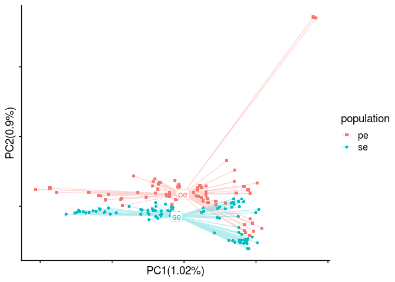
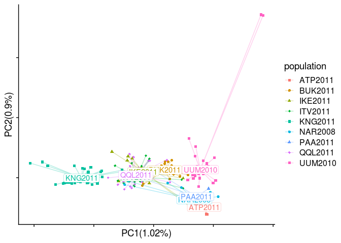
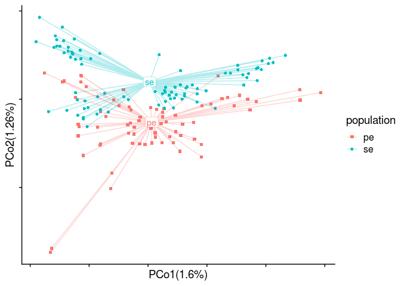
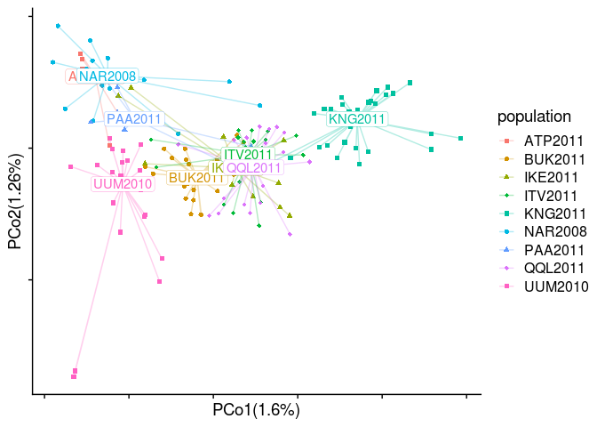
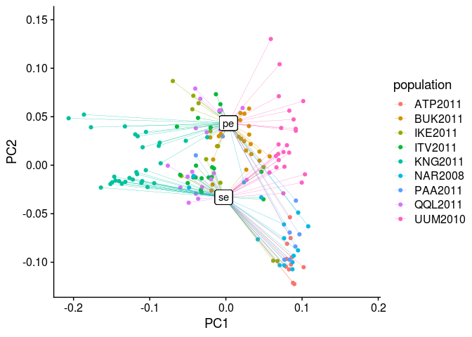
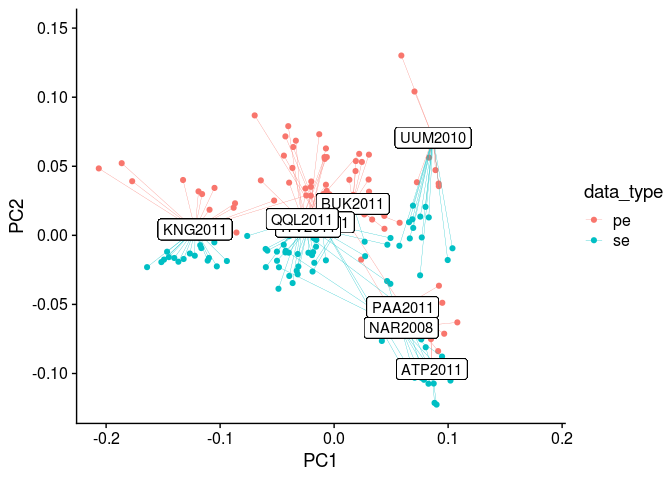
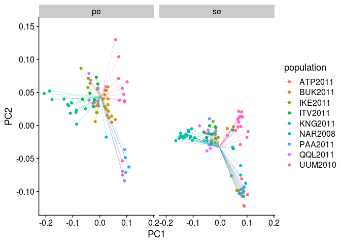
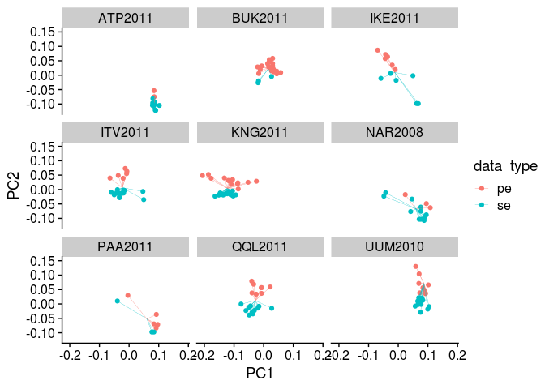

PCA-based analyses
================

``` r
library(tidyverse)
library(RcppCNPy)
library(cowplot)
source("/workdir/genomic-data-analysis/scripts/individual_pca_functions.R")
```

## Run PCAngsd

#### polyG trimmed PE samples (original)

``` bash
## original setup
## something on the server has messed up and the GL calculation didn't finish but was really close, so I will just use this result for now
cd /workdir/cod/greenland-cod/angsd
zcat bam_list_realigned_mincov_contamination_filtered_batch_effect_mindp2_maxdp661_minind2_minq20.beagle.gz | head -n 844341 | gzip > batch_effect_test.beagle.gz
nohup python2 /workdir/programs/pcangsd/pcangsd.py \
-beagle /workdir/cod/greenland-cod/angsd/batch_effect_test.beagle.gz \
-minMaf 0.05 \
-threads 8 \
-o /workdir/cod/greenland-cod/angsd/pcangsd_bam_list_realigned_mincov_contamination_filtered_batch_effect_mindp2_maxdp661_minind2_minq20_minmaf5 \
> /workdir/cod/greenland-cod/nohups/run_pcangsd_selection_mincov_contamination_filtered_batch_effect.nohup &
## more stringent filtering
nohup python2 /workdir/programs/pcangsd/pcangsd.py \
-beagle /workdir/cod/greenland-cod/angsd/bam_list_realigned_mincov_contamination_filtered_batch_effect_mindp2_maxdp661_minind2_stringent_filter.beagle.gz \
-minMaf 0.05 \
-threads 8 \
-o /workdir/cod/greenland-cod/angsd/pcangsd_bam_list_realigned_mincov_contamination_filtered_batch_effect_mindp2_maxdp661_minind2_stringent_filter_minmaf5 \
> /workdir/cod/greenland-cod/nohups/run_pcangsd_selection_mincov_contamination_filtered_batch_effect_stringent_filter.nohup &
```

## PCA with sliding window trimmed PE samples

``` r
sample_table <- read_tsv("../sample_lists/sample_table_merged.tsv")
## original setup
#genome_cov <- npyLoad("../angsd/bam_list_realigned_pcangsd.cov.npy")
genome_cov <- read_tsv("../angsd/bam_list_realigned.covMat", col_names = F)[1:163,]
PCA(genome_cov, sample_table$sample_id_corrected, sample_table$data_type, 1, 2, show.ellipse = F, show.line = T)
```

<!-- -->

``` r
pca_table_data_type <- pca_table[,1:6] %>% rename(data_type=population)
PCA(genome_cov, sample_table$sample_id_corrected, sample_table$population, 1, 2, show.ellipse = F, show.line = T)
```

<!-- -->

``` r
pca_table_population <- pca_table[,1:6]

genome_dist <- read_tsv("../angsd/bam_list_realigned.ibsMat", col_names = F)[1:163,]
PCoA(genome_dist, sample_table$sample_id_corrected, sample_table$data_type, 10, 1, 2, show.ellipse = F, show.line = T)
```

<!-- -->

``` r
PCoA(genome_dist, sample_table$sample_id_corrected, sample_table$population, 10, 1, 2, show.ellipse = F, show.line = T)
```

<!-- -->

``` r
pca_table_data_type_summary <- group_by(pca_table_data_type, data_type) %>%
  summarise(PC1_mean=mean(PC1), PC2_mean=mean(PC2), PC3_mean=mean(PC3), PC4_mean=mean(PC4))
pca_table_population_summary <- group_by(pca_table, population) %>%
  summarise(PC1_mean=mean(PC1), PC2_mean=mean(PC2), PC3_mean=mean(PC3), PC4_mean=mean(PC4))
pca_table_combined <- left_join(pca_table_data_type, pca_table_population)

pca_table_combined %>%
  left_join(pca_table_data_type_summary) %>%
  ggplot() +
  geom_point(aes(x=PC1, y=PC2, color=population)) +
  geom_segment(aes(x=PC1, y=PC2, xend=PC1_mean, yend=PC2_mean, color=population), size = 0.1) +
  geom_label(aes(x=PC1_mean, y=PC2_mean, label=data_type)) +
  ylim(NA, 0.15) +
  theme_cowplot()
```

<!-- -->

``` r
pca_table_combined %>%
  left_join(pca_table_population_summary) %>%
  ggplot() +
  geom_point(aes(x=PC1, y=PC2, color=data_type)) +
  geom_segment(aes(x=PC1, y=PC2, xend=PC1_mean, yend=PC2_mean, color=data_type), size = 0.1) +
  geom_label(aes(x=PC1_mean, y=PC2_mean, label=population)) +
  ylim(NA, 0.15) +
  theme_cowplot()
```

<!-- -->

``` r
pca_table_combined %>%
  left_join(pca_table_data_type_summary) %>%
  ggplot() +
  geom_point(aes(x=PC1, y=PC2, color=population)) +
  geom_segment(aes(x=PC1, y=PC2, xend=PC1_mean, yend=PC2_mean, color=population), size = 0.1) +
  #geom_label(aes(x=PC1_mean, y=PC2_mean, label=data_type)) +
  ylim(NA, 0.15) +
  facet_wrap(~data_type) +
  theme_cowplot()
```

<!-- -->

``` r
pca_table_combined %>%
  left_join(pca_table_population_summary) %>%
  ggplot() +
  geom_point(aes(x=PC1, y=PC2, color=data_type)) +
  geom_segment(aes(x=PC1, y=PC2, xend=PC1_mean, yend=PC2_mean, color=data_type), size = 0.1) +
  #geom_label(aes(x=PC1_mean, y=PC2_mean, label=population)) +
  ylim(NA, 0.15) +
  facet_wrap(~population) +
  theme_cowplot()
```

<!-- -->
