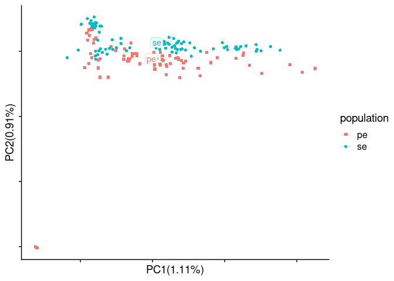
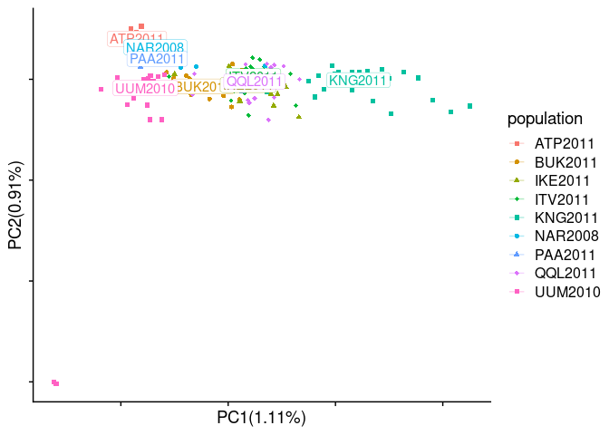
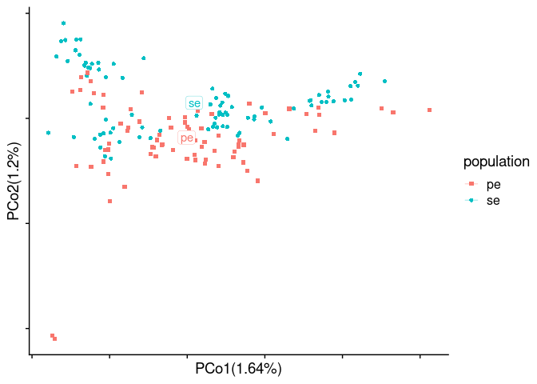
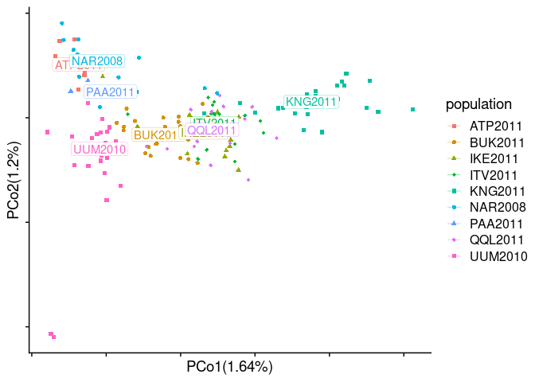
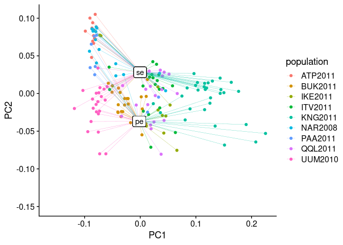

PCA-based analyses
================

``` r
library(tidyverse)
library(RcppCNPy)
library(cowplot)
source("/workdir/genomic-data-analysis/scripts/individual_pca_functions.R")
```

## Run PCAngsd

#### polyG trimmed PE samples (original)

``` bash
## original setup
## something on the server has messed up and the GL calculation didn't finish but was really close, so I will just use this result for now
cd /workdir/cod/greenland-cod/angsd
zcat bam_list_realigned_mincov_contamination_filtered_batch_effect_mindp2_maxdp661_minind2_minq20.beagle.gz | head -n 844341 | gzip > batch_effect_test.beagle.gz
nohup python2 /workdir/programs/pcangsd/pcangsd.py \
-beagle /workdir/cod/greenland-cod/angsd/batch_effect_test.beagle.gz \
-minMaf 0.05 \
-threads 8 \
-o /workdir/cod/greenland-cod/angsd/pcangsd_bam_list_realigned_mincov_contamination_filtered_batch_effect_mindp2_maxdp661_minind2_minq20_minmaf5 \
> /workdir/cod/greenland-cod/nohups/run_pcangsd_selection_mincov_contamination_filtered_batch_effect.nohup &
## more stringent filtering
nohup python2 /workdir/programs/pcangsd/pcangsd.py \
-beagle /workdir/cod/greenland-cod/angsd/bam_list_realigned_mincov_contamination_filtered_batch_effect_mindp2_maxdp661_minind2_stringent_filter.beagle.gz \
-minMaf 0.05 \
-threads 8 \
-o /workdir/cod/greenland-cod/angsd/pcangsd_bam_list_realigned_mincov_contamination_filtered_batch_effect_mindp2_maxdp661_minind2_stringent_filter_minmaf5 \
> /workdir/cod/greenland-cod/nohups/run_pcangsd_selection_mincov_contamination_filtered_batch_effect_stringent_filter.nohup &
```

## Run PCA excluding private SNPs

#### Come up with a new SNP list

``` r
maf_pe <- read_tsv("../angsd/popminind20/pe_global_snp_list_bam_list_realigned_mincov_contamination_filtered_mindp151_maxdp661_minind102_minq20_downsampled_unlinked_popminind20.mafs.gz") %>%
  transmute(lg = chromo, position = position, major=major, minor = minor, pe_maf = knownEM, pe_nind=nInd)

maf_se <- read_tsv("../angsd/popminind20/se_global_snp_list_bam_list_realigned_mincov_contamination_filtered_mindp151_maxdp661_minind102_minq20_downsampled_unlinked_popminind20.mafs.gz") %>%
  transmute(lg = chromo, position = position, major=major, minor = minor, se_maf = knownEM, se_nind=nInd)

maf_joined <- inner_join(maf_pe, maf_se) %>% 
  mutate(delta=abs(se_maf-pe_maf))

maf_joined_excluding_private <- filter(maf_joined, !((pe_maf<0.01 | pe_maf>0.99)&(se_maf>0.1 & se_maf<0.9))) %>%
  filter(!((se_maf<0.01 | se_maf>0.99)&(pe_maf>0.1 & pe_maf<0.9)))

maf_excluding_pe <- maf_se %>%
  filter(!(se_maf<0.1 | se_maf>0.9))

maf_excluding_se <-  maf_pe %>%
  filter(!(pe_maf<0.1 | pe_maf>0.9))

anymapq_depth <- read_tsv("../angsd/popminind2/bam_list_realigned_se_anymapq.pos.gz") %>%
  rename(lg=chr, position=pos, total_depth_anymapq=totDepth)
mapq20_depth <- read_tsv("../angsd/popminind20/se_global_snp_list_bam_list_realigned_mincov_contamination_filtered_mindp151_maxdp661_minind102_minq20_downsampled_unlinked_popminind20.pos.gz") %>%
  rename(lg=chr, position=pos, total_depth_mapq20=totDepth)
depth <- inner_join(anymapq_depth, mapq20_depth) %>%
  mutate(depth_ratio=total_depth_mapq20/total_depth_anymapq)

maf_joined_excluding_private_filtering_depth <- maf_joined_excluding_private %>%
  left_join(depth) %>%
  filter(depth_ratio > 0.9)
  
original_snp_list <- read_tsv("/workdir/cod/greenland-cod/angsd/global_snp_list_bam_list_realigned_mincov_contamination_filtered_mindp151_maxdp661_minind102_minq20_downsampled_unlinked.txt", col_names = c("lg", "position", "major", "minor")) 
  
new_snp_list <- semi_join(original_snp_list, maf_joined_excluding_private_filtering_depth)
write_tsv(new_snp_list, "../angsd/global_snp_list_private_snps_depth_ratio_filtered.txt", col_names = F)

se_snp_list <- semi_join(original_snp_list, maf_excluding_pe)
write_tsv(se_snp_list, "../angsd/global_snp_list_se_snps_depth_ratio_filtered.txt", col_names = F)

pe_snp_list <- semi_join(original_snp_list, maf_excluding_se)
write_tsv(pe_snp_list, "../angsd/global_snp_list_pe_snps_depth_ratio_filtered.txt", col_names = F)
```

#### Run ANGSD

``` bash
## Private SNPs, depth ratio filtered
cd /workdir/batch-effect/
/workdir/programs/angsd0.931/angsd/angsd sites index /workdir/batch-effect/angsd/global_snp_list_private_snps_depth_ratio_filtered.txt
nohup /workdir/programs/angsd0.931/angsd/angsd \
-b sample_lists/bam_list_realigned.txt \
-anc /workdir/cod/reference_seqs/gadMor3.fasta \
-out angsd/bam_list_realigned_private_snps_depth_ratio_filtered \
-GL 1 -doGlf 2 -doMaf 1 -doMajorMinor 3 -doCounts 1 -doDepth 1 -dumpCounts 1 \
-P 16 -setMinDepth 2 -setMaxDepth 661 -minInd 2 -minQ 20 -minMapQ 20 -minMaf 0.05 \
-doIBS 2 -makematrix 1 -doCov 1 \
-sites /workdir/batch-effect/angsd/global_snp_list_private_snps_depth_ratio_filtered.txt \
-rf /workdir/cod/greenland-cod/angsd/global_snp_list_bam_list_realigned_mincov_contamination_filtered_mindp151_maxdp661_minind102_minq20_downsampled_unlinked.chrs \
>& nohups/get_gl_bam_list_realigned_private_snps_depth_ratio_filtered.log &
## SE SNPs
cd /workdir/batch-effect/
/workdir/programs/angsd0.931/angsd/angsd sites index /workdir/batch-effect/angsd/global_snp_list_se_snps_depth_ratio_filtered.txt
nohup /workdir/programs/angsd0.931/angsd/angsd \
-b sample_lists/bam_list_realigned.txt \
-anc /workdir/cod/reference_seqs/gadMor3.fasta \
-out angsd/bam_list_realigned_se_snps \
-GL 1 -doGlf 2 -doMaf 1 -doMajorMinor 3 -doCounts 1 -doDepth 1 -dumpCounts 1 \
-P 16 -setMinDepth 2 -setMaxDepth 661 -minInd 2 -minQ 20 -minMapQ 20 -minMaf 0.05 \
-doIBS 2 -makematrix 1 -doCov 1 \
-sites /workdir/batch-effect/angsd/global_snp_list_se_snps_depth_ratio_filtered.txt \
-rf /workdir/cod/greenland-cod/angsd/global_snp_list_bam_list_realigned_mincov_contamination_filtered_mindp151_maxdp661_minind102_minq20_downsampled_unlinked.chrs \
>& nohups/get_gl_bam_list_realigned_se_snps.log &
## PE SNPs
cd /workdir/batch-effect/
/workdir/programs/angsd0.931/angsd/angsd sites index /workdir/batch-effect/angsd/global_snp_list_pe_snps_depth_ratio_filtered.txt
nohup /workdir/programs/angsd0.931/angsd/angsd \
-b sample_lists/bam_list_realigned.txt \
-anc /workdir/cod/reference_seqs/gadMor3.fasta \
-out angsd/bam_list_realigned_pe_snps \
-GL 1 -doGlf 2 -doMaf 1 -doMajorMinor 3 -doCounts 1 -doDepth 1 -dumpCounts 1 \
-P 16 -setMinDepth 2 -setMaxDepth 661 -minInd 2 -minQ 20 -minMapQ 20 -minMaf 0.05 \
-doIBS 2 -makematrix 1 -doCov 1 \
-sites /workdir/batch-effect/angsd/global_snp_list_pe_snps_depth_ratio_filtered.txt \
-rf /workdir/cod/greenland-cod/angsd/global_snp_list_bam_list_realigned_mincov_contamination_filtered_mindp151_maxdp661_minind102_minq20_downsampled_unlinked.chrs \
>& nohups/get_gl_bam_list_realigned_pe_snps.log &
```

#### Run PCAngsd

``` bash
nohup python2 /workdir/programs/pcangsd/pcangsd.py \
-beagle /workdir/batch-effect/angsd/bam_list_realigned_private_snps_depth_ratio_filtered.beagle.gz \
-minMaf 0.05 \
-threads 8 \
-o /workdir/batch-effect/angsd/bam_list_realigned_private_snps_depth_ratio_filtered_pcangsd \
> /workdir/batch-effect/nohups/run_pcangsd_private_snps_depth_ratio_filtered.nohup &
```

## PCA with sliding window trimmed PE samples

``` r
sample_table <- read_tsv("../sample_lists/sample_table_merged.tsv")
## original setup
#genome_cov <- npyLoad("../angsd/bam_list_realigned_pcangsd.cov.npy")
genome_cov <- read_tsv("../angsd/bam_list_realigned.covMat", col_names = F)[1:163,]
PCA(genome_cov, sample_table$sample_id_corrected, sample_table$data_type, 1, 2, show.ellipse = F, show.line = T)
```

<!-- -->

``` r
pca_table_data_type <- pca_table[,1:6] %>% rename(data_type=population)
PCA(genome_cov, sample_table$sample_id_corrected, sample_table$population, 1, 2, show.ellipse = F, show.line = T)
```

<!-- -->

``` r
pca_table_population <- pca_table[,1:6]

genome_dist <- read_tsv("../angsd/bam_list_realigned.ibsMat", col_names = F)[1:163,]
PCoA(genome_dist, sample_table$sample_id_corrected, sample_table$data_type, 10, 1, 2, show.ellipse = F, show.line = T)
```

<!-- -->

``` r
PCoA(genome_dist, sample_table$sample_id_corrected, sample_table$population, 10, 1, 2, show.ellipse = F, show.line = T)
```

<!-- -->

``` r
pca_table_data_type_summary <- group_by(pca_table_data_type, data_type) %>%
  summarise(PC1_mean=mean(PC1), PC2_mean=mean(PC2), PC3_mean=mean(PC3), PC4_mean=mean(PC4))
pca_table_population_summary <- group_by(pca_table, population) %>%
  summarise(PC1_mean=mean(PC1), PC2_mean=mean(PC2), PC3_mean=mean(PC3), PC4_mean=mean(PC4))
pca_table_combined <- left_join(pca_table_data_type, pca_table_population)

pca_table_combined %>%
  left_join(pca_table_data_type_summary) %>%
  ggplot() +
  geom_point(aes(x=PC1, y=PC2, color=population)) +
  geom_segment(aes(x=PC1, y=PC2, xend=PC1_mean, yend=PC2_mean, color=population), size = 0.1) +
  geom_label(aes(x=PC1_mean, y=PC2_mean, label=data_type)) +
  ylim(NA, 0.15) +
  theme_cowplot()
```

<!-- -->

``` r
pca_table_combined %>%
  left_join(pca_table_population_summary) %>%
  ggplot() +
  geom_point(aes(x=PC1, y=PC2, color=data_type)) +
  geom_segment(aes(x=PC1, y=PC2, xend=PC1_mean, yend=PC2_mean, color=data_type), size = 0.1) +
  geom_label(aes(x=PC1_mean, y=PC2_mean, label=population)) +
  ylim(NA, 0.15) +
  theme_cowplot()
```

<!-- -->

``` r
pca_table_combined %>%
  left_join(pca_table_data_type_summary) %>%
  ggplot() +
  geom_point(aes(x=PC1, y=PC2, color=population)) +
  geom_segment(aes(x=PC1, y=PC2, xend=PC1_mean, yend=PC2_mean, color=population), size = 0.1) +
  #geom_label(aes(x=PC1_mean, y=PC2_mean, label=data_type)) +
  ylim(NA, 0.15) +
  facet_wrap(~data_type) +
  theme_cowplot()
```

<!-- -->

``` r
pca_table_combined %>%
  left_join(pca_table_population_summary) %>%
  ggplot() +
  geom_point(aes(x=PC1, y=PC2, color=data_type)) +
  geom_segment(aes(x=PC1, y=PC2, xend=PC1_mean, yend=PC2_mean, color=data_type), size = 0.1) +
  #geom_label(aes(x=PC1_mean, y=PC2_mean, label=population)) +
  ylim(NA, 0.15) +
  facet_wrap(~population) +
  theme_cowplot()
```

<!-- -->
