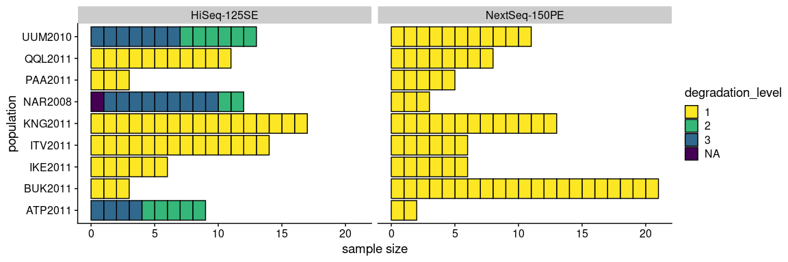
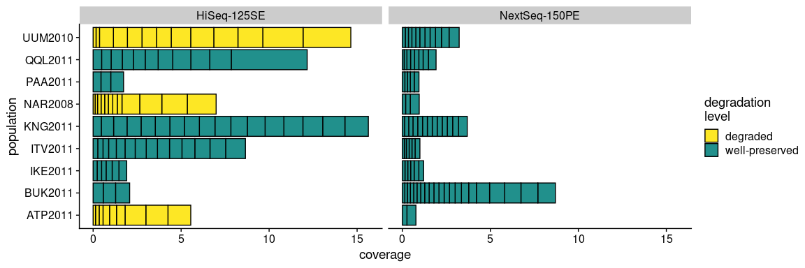

Core data processing and analysis pipeline
================

## Load packages

``` r
library(tidyverse)
library(cowplot)
library(googlesheets4)
```

## Come up with some sample lists and tables

``` r
base_dir = "/workdir/batch-effect/"
# Read in the full sample table from the Greenland cod project
sample_table_full <- read_tsv("../../cod/greenland-cod/sample_lists/sample_table_merged_mincov_contamination_filtered.tsv") %>%
  bind_cols(bam_list = read_lines("../../cod/greenland-cod/sample_lists/bam_list_realigned_mincov_contamination_filtered.txt"))
# Select a subset of populations that were sequenced in both Hiseq and Nextseq platforms
# Note that there are some QQL samples that appear to be "merged", but they were merged from lane 1 and 2
sample_table_merged <- filter(sample_table_full, 
                                    population %in% c("IKE2011", "QQL2011", "ITV2011", "KNG2011", "BUK2011", "NAR2008", "UUM2010", "PAA2011", "ATP2011")) %>%
  filter(data_type != "pese")
## Raw bam file list for the pair end samples
bam_list_merged_pe <- sample_table_merged %>%
  filter(data_type=="pe") %>%
  mutate(bam_list = str_c(base_dir, "bam/", sample_seq_id, "_bt2_gadMor3_sorted.bam")) %>%
  dplyr::select(bam_list)
## Raw bam file list for the single end samples
bam_list_merged_se <- sample_table_merged %>%
  filter(data_type=="se") %>%
  mutate(bam_list = str_c(base_dir, "bam/", sample_seq_id, "_bt2_gadMor3_sorted.bam")) %>%
  dplyr::select(bam_list)
## Overlap clipped bamlist for all samples
bam_list_overlap_clipped <- sample_table_merged %>%
  mutate(bam_list = ifelse(data_type == "pe", 
                           str_c(base_dir, "bam/", sample_seq_id, "_bt2_gadMor3_sorted_dedup_overlapclipped.bam"),
                           str_c(base_dir, "bam/", sample_seq_id, "_bt2_gadMor3_sorted_dedup.bam"))) %>%
  dplyr::select(bam_list)
## Indel realigned bamlist for all samples
bam_list_realigned <- sample_table_merged %>%
  mutate(bam_list = ifelse(data_type == "pe", 
                           str_c(base_dir, "bam/", sample_seq_id, "_bt2_gadMor3_sorted_dedup_overlapclipped_realigned.bam"),
                           str_c(base_dir, "bam/", sample_seq_id, "_bt2_gadMor3_sorted_dedup_realigned.bam"))) %>%
  dplyr::select(bam_list, data_type)

## Get unmerged sample table for the select subset of samples
sample_table_unmerged <- read_tsv("../../cod/greenland-cod/sample_lists/sample_table.tsv") %>%
  semi_join(sample_table_merged, by=c("sample_id"="sample_id_corrected"))
## Fastq list of pe and se samples
fastq_list_pe <- filter(sample_table_unmerged, lane_number == 7)$prefix
fastq_list_se <- filter(sample_table_unmerged, lane_number != 7)$prefix

## Sample distribution
sample_size_plot <- sample_table_merged %>%
  mutate(data_type=ifelse(data_type=="pe", "NextSeq-150PE", "HiSeq-125SE")) %>%
  mutate(sample_id_corrected=fct_reorder(sample_id_corrected, data_type)) %>%
  ggplot(aes(x=population_new, fill=data_type, group=sample_id_corrected)) +
  geom_bar(color="black") +
  scale_fill_viridis_d(begin=0.3, end=0.8) +
  xlab("population")+
  ylab("sample size") +
  theme_cowplot() +
  coord_flip() +
  theme(legend.position = "none")
sample_size_plot
```

<!-- -->

``` r
## Number of bases
base_count <- read_tsv("../sample_lists/count_merged_old.tsv") %>%
  dplyr::select(sample_id_corrected, final_mapped_bases)
coverage_plot <- sample_table_merged %>%
  mutate(data_type=ifelse(data_type=="pe", "NextSeq-150PE", "HiSeq-125SE")) %>%
  left_join(base_count) %>%
  arrange(data_type, desc(final_mapped_bases)) %>%
  mutate(sample_id_corrected=as_factor(sample_id_corrected)) %>%
  ggplot(aes(x=population_new, y=final_mapped_bases/0.67/10^9, fill=data_type, group=sample_id_corrected)) +
  geom_col(color="black") +
  scale_fill_viridis_d(begin=0.3, end=0.8) +
  labs(x="population", y="coverage", fill="batch")+
  theme_cowplot() +
  coord_flip()
coverage_plot
```

<!-- -->

``` r
sample_table_merged %>%
  left_join(base_count) %>%
  ggplot(aes(x=final_mapped_bases, fill=data_type)) +
  geom_histogram(position="dodge") +
  theme_cowplot()
```

<!-- -->

``` r
sample_table_merged %>%
  left_join(base_count) %>%
  group_by(data_type) %>%
  summarise(sample_size=n(), avearge_final_coverage=mean(final_mapped_bases)/0.67/10^9)
```

    ## # A tibble: 2 x 3
    ##   data_type sample_size avearge_final_coverage
    ##   <chr>           <int>                  <dbl>
    ## 1 pe                 75                  0.299
    ## 2 se                 88                  0.788

``` r
cowplot::plot_grid(sample_size_plot, coverage_plot, nrow = 1, rel_widths = c(1, 1.2))
```

<!-- -->

``` r
# Write the objects created above
sample_table_merged %>%
  dplyr::select(-bam_list) %>%
  write_tsv("../sample_lists/sample_table_merged.tsv")
write_tsv(bam_list_merged_pe, "../sample_lists/bam_list_merged_pe.txt", col_names = F)
write_tsv(bam_list_merged_se, "../sample_lists/bam_list_merged_se.txt", col_names = F)
write_tsv(bam_list_overlap_clipped, "../sample_lists/bam_list_dedup_overlapclipped.txt", col_names = F)
bam_list_realigned %>%
  dplyr::select(bam_list) %>%
  write_tsv("../sample_lists/bam_list_realigned.txt", col_names = F)
bam_list_realigned %>%
  filter(data_type=="pe") %>%
  dplyr::select(bam_list) %>%
  write_tsv("../sample_lists/bam_list_per_pop/bam_list_realigned_pe.txt", col_names = F)
bam_list_realigned %>%
  filter(data_type=="se") %>%
  dplyr::select(bam_list) %>%
  write_tsv("../sample_lists/bam_list_per_pop/bam_list_realigned_se.txt", col_names = F)
write_tsv(sample_table_unmerged, "../sample_lists/sample_table_unmerged.tsv")
write_lines(fastq_list_pe, "../sample_lists/fastq_list_pe.txt")
write_lines(fastq_list_se, "../sample_lists/fastq_list_se.txt")
```

``` r
## Read in degradation score from Google Sheet and write it as a text file
extraction_info <- read_sheet("https://docs.google.com/spreadsheets/d/1I3Pj5VUWfP2eUwwZj1ggAjqgbRmrT0MrLtbQ1lOGaPE/edit#gid=287879888", "dna_extraction")
write_tsv(extraction_info, "../sample_lists/extraction_info.tsv")
```

``` r
extraction_info <- read_tsv("../sample_lists/extraction_info.tsv") %>%
  filter(extraction_method != "Chan Tn5 bead") %>%
  dplyr::select(sample_id, degradation_level) %>%
  mutate(degradation_level = as.character(degradation_level),
         degradation_level = ifelse(degradation_level==0, "NA", degradation_level)) 
sample_table_degradation <- left_join(sample_table_merged, extraction_info, by=c("sample_id_corrected"="sample_id"))
sample_table_degradation %>%
  mutate(data_type=ifelse(data_type=="pe", "NextSeq-150PE", "HiSeq-125SE")) %>%
  mutate(sample_id_corrected=fct_reorder(sample_id_corrected, degradation_level)) %>%
  ggplot(aes(x=population_new, fill=degradation_level, group=sample_id_corrected)) +
  geom_bar(color="black") +
  scale_fill_viridis_d(begin=0, end=1, direction = -1) +
  xlab("population")+
  ylab("sample size") +
  facet_wrap(~data_type) +
  theme_cowplot() +
  coord_flip()
```

<!-- -->

``` r
sample_table_degradation %>%
  mutate(data_type=ifelse(data_type=="pe", "NextSeq-150PE", "HiSeq-125SE")) %>%
  left_join(base_count) %>%
  arrange(desc(final_mapped_bases)) %>%
  mutate(degradation_level=ifelse(degradation_level=="1", "well-preserved", "degraded")) %>%
  mutate(sample_id_corrected=as_factor(sample_id_corrected)) %>%
  ggplot(aes(x=population_new, y=final_mapped_bases/0.67/10^9, fill=degradation_level, group=sample_id_corrected)) +
  geom_col(color="black") +
  scale_fill_viridis_d(begin=0.5, end=1, direction = -1) +
  labs(x="population", y="coverage", fill="degradation\nlevel")+
  facet_wrap(~data_type) +
  theme_cowplot() +
  coord_flip()
```

<!-- -->

## Process the PE data

#### polyG trimming (`--trim_poly_g`)

``` bash
echo 'BASEDIR=/workdir/batch-effect/
INPUTDIR=/workdir/cod/greenland-cod/adapter_clipped/
SAMPLELIST=$BASEDIR/sample_lists/fastq_list_pe.txt
SAMPLETABLE=$BASEDIR/sample_lists/sample_table_unmerged.tsv

for SAMPLEFILE in `cat $SAMPLELIST`; do
  SAMPLE_ID=`grep -P "${SAMPLEFILE}\t" $SAMPLETABLE | cut -f 4`
  SEQ_ID=`grep -P "${SAMPLEFILE}\t" $SAMPLETABLE | cut -f 3`
  LANE_ID=`grep -P "${SAMPLEFILE}\t" $SAMPLETABLE | cut -f 2`
  SAMPLE_SEQ_ID=$SAMPLE_ID"_"$SEQ_ID"_"$LANE_ID
  
  ## The input and output path and file prefix
  SAMPLEADAPT=$INPUTDIR$SAMPLE_SEQ_ID
  SAMPLEQUAL=$BASEDIR"polyg_trimmed/"$SAMPLE_SEQ_ID

  /workdir/programs/fastp --trim_poly_g -L -A \
  -i $SAMPLEADAPT"_adapter_clipped_f_paired.fastq.gz" \
  -I $SAMPLEADAPT"_adapter_clipped_r_paired.fastq.gz" \
  -o $SAMPLEQUAL"_adapter_clipped_qual_filtered_f_paired.fastq.gz" \
  -O $SAMPLEQUAL"_adapter_clipped_qual_filtered_r_paired.fastq.gz" \
  -h $SAMPLEQUAL"_adapter_clipped_qual_filtered_fastp.html"
done' > /workdir/batch-effect/scripts/trim_polyg_batch_effect.sh

nohup bash /workdir/batch-effect/scripts/trim_polyg_batch_effect.sh > /workdir/batch-effect/nohups/cut_right_batch_effect.nohups &
```

#### Sliding window trimming (`--cut_right`)

``` bash
echo 'SAMPLELIST=/workdir/cod/greenland-cod/sample_lists/sample_list_pe_1.tsv 
SAMPLETABLE=/workdir/cod/greenland-cod/sample_lists/sample_table_pe.tsv
BASEDIR=/workdir/batch-effect/
INPUTDIR=/workdir/cod/greenland-cod/adapter_clipped/

for SAMPLEFILE in `cat $SAMPLELIST`; do
  SAMPLE_ID=`grep -P "${SAMPLEFILE}\t" $SAMPLETABLE | cut -f 4`
  SEQ_ID=`grep -P "${SAMPLEFILE}\t" $SAMPLETABLE | cut -f 3`
  LANE_ID=`grep -P "${SAMPLEFILE}\t" $SAMPLETABLE | cut -f 2`
  SAMPLE_SEQ_ID=$SAMPLE_ID"_"$SEQ_ID"_"$LANE_ID
  
  ## The input and output path and file prefix
  SAMPLEADAPT=$INPUTDIR$SAMPLE_SEQ_ID
  SAMPLEQUAL=$BASEDIR"cut_right/"$SAMPLE_SEQ_ID

  /workdir/programs/fastp --trim_poly_g -L -A --cut_right \
  -i $SAMPLEADAPT"_adapter_clipped_f_paired.fastq.gz" \
  -I $SAMPLEADAPT"_adapter_clipped_r_paired.fastq.gz" \
  -o $SAMPLEQUAL"_adapter_clipped_qual_filtered_f_paired.fastq.gz" \
  -O $SAMPLEQUAL"_adapter_clipped_qual_filtered_r_paired.fastq.gz" \
  -h $SAMPLEQUAL"_adapter_clipped_qual_filtered_fastp.html"
done' > /workdir/batch-effect/scripts/cut_right_batch_effect.sh

nohup bash /workdir/batch-effect/scripts/cut_right_batch_effect.sh > /workdir/batch-effect/nohups/cut_right_batch_effect.nohups &
```

#### Map to reference genome

This step also includes quality filtering and sorting, but I will rerun
the quality filtering and sorting step with no quality filter, both for
PE and SE data.

``` bash
nohup bash /workdir/data-processing/scripts/low_coverage_mapping.sh \
/workdir/batch-effect/sample_lists/fastq_list_pe.txt \
/workdir/batch-effect/sample_lists/sample_table_unmerged.tsv \
/workdir/batch-effect/cut_right/ \
/workdir/batch-effect/ \
_adapter_clipped_qual_filtered_f_paired.fastq.gz \
_adapter_clipped_qual_filtered_r_paired.fastq.gz \
very-sensitive \
/workdir/cod/reference_seqs/gadMor3.fasta \
gadMor3 \
> /workdir/batch-effect/nohups/low_coverage_mapping_pe.nohup &
```

## Process the PE and SE data together

These steps are necessary for the SE data because intermediate bam files
were deleted.

#### Sort the raw bam files

Save the following script as
`/workdir/batch-effect/scripts/sort_raw_bam.sh`

``` bash
OUTPUTPATH='/workdir/batch-effect/bam/'

for K in {2..168}; do
  SAMPLE=`head /workdir/batch-effect/sample_lists/sample_table_unmerged.tsv -n $K | tail -n 1 | cut -f 4`
  LANE=`head /workdir/batch-effect/sample_lists/sample_table_unmerged.tsv -n $K | tail -n 1 | cut -f 2`
  SEQID=`head /workdir/batch-effect/sample_lists/sample_table_unmerged.tsv -n $K | tail -n 1 | cut -f 3`
  DATATYPE=`head /workdir/batch-effect/sample_lists/sample_table_unmerged.tsv -n $K | tail -n 1 | cut -f 6`
  
  PREFIX=$SAMPLE'_'$SEQID'_'$LANE'_'$DATATYPE'_bt2_gadMor3'
  
  if [ $DATATYPE = se ]; then
    INPUTPATH='/workdir/cod/greenland-cod/bam/'
  else
    INPUTPATH='/workdir/batch-effect/bam/'
  fi
  #echo $INPUTPATH$PREFIX'.bam'
  #echo $OUTPUTPATH$PREFIX'_sorted.bam'
  samtools sort $INPUTPATH$PREFIX'.bam' -o $OUTPUTPATH$PREFIX'_sorted.bam' -@ 24
done
```

``` bash
nohup bash /workdir/batch-effect/scripts/sort_raw_bam.sh > /workdir/batch-effect/nohups/sort_raw_bam.nohup &
```

#### Merge four samples that were sequenced in multiple lanes

``` bash
## Merge four samples that were sequenced in multiple lanes
samtools merge /workdir/batch-effect/bam/QQL2011_842_merged_merged_se_bt2_gadMor3_sorted.bam /workdir/batch-effect/bam/QQL2011_842_14247X225_1_se_bt2_gadMor3_sorted.bam /workdir/batch-effect/bam/QQL2011_842_14247X47_2_se_bt2_gadMor3_sorted.bam -@ 24
samtools merge /workdir/batch-effect/bam/QQL2011_844_merged_merged_se_bt2_gadMor3_sorted.bam /workdir/batch-effect/bam/QQL2011_844_14247X226_1_se_bt2_gadMor3_sorted.bam /workdir/batch-effect/bam/QQL2011_844_14247X49_2_se_bt2_gadMor3_sorted.bam -@ 24
samtools merge /workdir/batch-effect/bam/QQL2011_846_merged_merged_se_bt2_gadMor3_sorted.bam /workdir/batch-effect/bam/QQL2011_846_14247X232_1_se_bt2_gadMor3_sorted.bam /workdir/batch-effect/bam/QQL2011_846_14247X61_2_se_bt2_gadMor3_sorted.bam -@ 24
samtools merge /workdir/batch-effect/bam/QQL2011_852_merged_merged_se_bt2_gadMor3_sorted.bam /workdir/batch-effect/bam/QQL2011_852_14247X228_1_se_bt2_gadMor3_sorted.bam /workdir/batch-effect/bam/QQL2011_852_14247X40_2_se_bt2_gadMor3_sorted.bam -@ 24
```

## Deduplicate

I slightly modified the original script
(`/workdir/data-processing/scripts/deduplicate_clipoverlap.sh`) so that
the `minq20` part is no longer in the file name.

``` bash
## SE
nohup bash /workdir/batch-effect/scripts/deduplicate_clipoverlap.sh \
/workdir/batch-effect/sample_lists/bam_list_merged_se.txt \
/workdir/batch-effect/sample_lists/sample_table_merged.tsv \
/workdir/batch-effect/ \
gadMor3 \
> /workdir/batch-effect/nohups/deduplicate_se.nohup &
## PE
nohup bash /workdir/batch-effect/scripts/deduplicate_clipoverlap.sh \
/workdir/batch-effect/sample_lists/bam_list_merged_pe.txt \
/workdir/batch-effect/sample_lists/sample_table_merged.tsv \
/workdir/batch-effect/ \
gadMor3 \
> /workdir/batch-effect/nohups/deduplicate_clipoverlap_pe.nohup &
```

## Indel realignment with PE and SE data combined

``` bash
cp /workdir/batch-effect/sample_lists/bam_list_dedup_overlapclipped.txt \
/workdir/batch-effect/sample_lists/bam_list_dedup_overlapclipped.list

nohup bash /workdir/data-processing/scripts/realign_indels.sh \
/workdir/batch-effect/sample_lists/bam_list_dedup_overlapclipped.list \
/workdir/batch-effect/ \
/workdir/cod/reference_seqs/gadMor3.fasta \
gadMor3 \
> /workdir/batch-effect/nohups/realign_indels.nohup &
```

## Get genotype likelihoods and SNP list with sliding window trimmed PE samples

#### SNP calling

Average depth per site across all individuals is \~92x before polyG
trimming

``` bash
cd /workdir/batch-effect/
nohup bash /workdir/genomic-data-analysis/scripts/angsd_global_snp_calling.sh \
/workdir/batch-effect/sample_lists/bam_list_realigned.txt \
/workdir/batch-effect/ \
/workdir/cod/reference_seqs/gadMor3.fasta \
46 184 20 20 0.05 20 \
> /workdir/batch-effect/nohups/global_snp_calling_bam_list_realigned.nohup &
```

#### Downsample the mafs file to \~1,000,000 SNPs

``` r
library(tidyverse)
## Read in the mafs file
mafs <- read_tsv("../angsd/bam_list_realigned_mindp46_maxdp184_minind20_minq20.mafs.gz")
## Total number of SNPs
nrow(mafs)
```

    ## [1] 5204764

``` r
## In a downsampled SNP list, keep 1 SNP in every 5 SNPs (this yields 1028474 SNPs)
mafs_filtered <- mutate(mafs, 
                        keep = knownEM >= 0.05,
                        row_number = ifelse(keep, cumsum(keep), -1),
                        keep = ifelse(row_number%%5!=0, F, keep),
                        keep = ifelse(!str_detect(chromo, "LG"), F, keep)) %>%
  dplyr::select(-row_number)
filter(mafs_filtered, keep==T) %>% nrow()
```

    ## [1] 1028474

``` r
## Filter out SNPs in inversions
lg = c("LG01", "LG02", "LG07", "LG12")
min_pos = c(11495229, 641666, 16830817, 546885)
max_pos = c(28834444, 4495925, 26562127, 13864687)
for (i in 1:4){
  if (i==1){
      mafs_inversion_filtered <- mutate(mafs_filtered, keep = ifelse(chromo == lg[i] & position > min_pos[i] & position < max_pos[i], FALSE, keep))
  } else {
      mafs_inversion_filtered <- mutate(mafs_inversion_filtered, keep = ifelse(chromo == lg[i] & position > min_pos[i] & position < max_pos[i], FALSE, keep))
  }
}
mafs_inversion_filtered %>%
  filter(keep==T) %>%
  ggplot(aes(x=position, y=chromo, fill=chromo)) +
  ggridges::geom_density_ridges(alpha=0.5) +
  scale_fill_viridis_d() +
  theme_cowplot() +
  theme(legend.position = "none")
```

<!-- -->

``` r
mafs_inversion_filtered %>%
  filter(keep==T) %>%
  nrow()
```

    ## [1] 944554

#### Write the filtered SNP list

``` r
mafs_inversion_filtered %>%
  filter(keep==T) %>%
  dplyr::select(1:4) %>%
  write_tsv("../angsd/global_snp_list_bam_list_realigned_mindp46_maxdp184_minind20_minq20_downsampled.txt.gz", col_names = F)
(which(mafs_inversion_filtered$keep)+1) %>% # +1 is necessary because the beagle file has a title line
  as.integer() %>%
  write_lines("../angsd/global_snp_list_bam_list_realigned_mindp46_maxdp184_minind20_minq20_downsampled.pos.idx")
```

#### Downsample the beagle file

``` bash
zcat /workdir/batch-effect/angsd/bam_list_realigned_mindp46_maxdp184_minind20_minq20.beagle.gz | \
awk 'NR==FNR{ pos[$1]; next }FNR in pos' \
/workdir/batch-effect/angsd/global_snp_list_bam_list_realigned_mindp46_maxdp184_minind20_minq20_downsampled.pos.idx - | \
gzip \
> /workdir/batch-effect/angsd/global_snp_list_bam_list_realigned_mindp46_maxdp184_minind20_minq20_downsampled.beagle.gz
```

#### Estimate LD

``` bash
nohup /workdir/programs/ngsLD/ngsLD \
--geno /workdir/batch-effect/angsd/global_snp_list_bam_list_realigned_mindp46_maxdp184_minind20_minq20_downsampled.beagle.gz \
--pos /workdir/batch-effect/angsd/global_snp_list_bam_list_realigned_mindp46_maxdp184_minind20_minq20_downsampled.txt.gz \
--n_ind 163 \
--n_sites 944554 \
--out /workdir/batch-effect/angsd/bam_list_realigned_mindp46_maxdp184_minind20_minq20_downsampled.ld \
--probs \
--rnd_sample 1 \
--seed 42 \
--max_kb_dist 10 \
--n_threads 30 \
> /workdir/batch-effect/nohups/run_ngsLD_bam_list_realigned_mindp46_maxdp184_minind20_minq20_downsampled.nohup &
```

#### Remove some columns in the LD file

``` r
ld <- read_tsv("../angsd/bam_list_realigned_mindp46_maxdp184_minind20_minq20_downsampled.ld", col_names = F)
ld %>%
  dplyr::select(-X2, -X3, -X5, -X6) %>%
  write_tsv("../angsd/bam_list_realigned_mindp46_maxdp184_minind20_minq20_downsampled_reformatted.ld", col_names = F)
```

#### Run the LD pruning script

``` bash
nohup perl /workdir/programs/ngsLD/scripts/prune_graph.pl \
--in_file /workdir/batch-effect/angsd/bam_list_realigned_mindp46_maxdp184_minind20_minq20_downsampled_reformatted.ld \
--max_kb_dist 10 \
--min_weight 0.5 \
--out /workdir/batch-effect/angsd/bam_list_realigned_mindp46_maxdp184_minind20_minq20_downsampled_unlinked.ld \
> /workdir/batch-effect/nohups/ld_prune_bam_list_realigned_mindp46_maxdp184_minind20_minq20_downsampled.nohup &
```

#### Generate LD pruned SNP list

``` r
downsampled_snp_list <- read_tsv("../angsd/global_snp_list_bam_list_realigned_mindp46_maxdp184_minind20_minq20_downsampled.txt.gz", col_names = c("lg", "position", "major", "minor"))
ld_pruned_snp_list <- read_delim("../angsd/bam_list_realigned_mindp46_maxdp184_minind20_minq20_downsampled_unlinked.ld", delim = ":", col_names = c("lg", "position")) %>%
  arrange(lg, position) %>%
  mutate(keep=TRUE) %>%
  left_join(downsampled_snp_list, ., by = c("lg", "position")) %>%
  mutate(keep=ifelse(is.na(keep), FALSE, keep))
identical(downsampled_snp_list$lg, ld_pruned_snp_list$lg)
identical(downsampled_snp_list$position, ld_pruned_snp_list$position)
## Generate a SNP list
ld_pruned_snp_list %>%
  filter(keep == TRUE) %>%
  dplyr::select(lg, position, major, minor) %>%
  write_tsv("../angsd/global_snp_list_bam_list_realigned_mindp46_maxdp184_minind20_minq20_downsampled_unlinked.txt", col_names = F)
## Generate a chromosome list
ld_pruned_snp_list %>%
  filter(keep == TRUE) %>%
  .$lg %>%
  unique() %>%
  write_lines("../angsd/global_snp_list_bam_list_realigned_mindp46_maxdp184_minind20_minq20_downsampled_unlinked.chrs")
```

``` bash
## Index the snp list
/workdir/programs/angsd0.931/angsd/angsd sites index /workdir/batch-effect/angsd/global_snp_list_bam_list_realigned_mindp46_maxdp184_minind20_minq20_downsampled_unlinked.txt
```

## Get the covariance matrix with ANGSD

``` bash
cd /workdir/batch-effect/

nohup /workdir/programs/angsd0.931/angsd/angsd \
-b sample_lists/bam_list_realigned.txt \
-anc /workdir/cod/reference_seqs/gadMor3.fasta \
-out angsd/bam_list_realigned_downsampled_unlinked \
-GL 1 -doGlf 2 -doMaf 1 -doMajorMinor 3 -doCounts 1 -doDepth 1 -dumpCounts 1 \
-P 16 -setMinDepth 46 -setMaxDepth 184 -minInd 20 -minQ 20 -minMapQ 20 -minMaf 0.05 \
-doIBS 2 -makematrix 1 -doCov 1 \
-sites /workdir/batch-effect/angsd/global_snp_list_bam_list_realigned_mindp46_maxdp184_minind20_minq20_downsampled_unlinked.txt \
-rf /workdir/batch-effect/angsd/global_snp_list_bam_list_realigned_mindp46_maxdp184_minind20_minq20_downsampled_unlinked.chrs \
>& nohups/run_pca_bam_list_realigned_downsampled_unlinked.log &

## Get depth count without mapping quality filter
nohup /workdir/programs/angsd0.931/angsd/angsd \
-b sample_lists/bam_list_realigned.txt \
-anc /workdir/cod/reference_seqs/gadMor3.fasta \
-out angsd/bam_list_realigned_downsampled_unlinked_anymapq \
-doCounts 1 -doDepth 1 -dumpCounts 1 \
-P 16 -setMinDepth 2 -minInd 2 -minQ 20 \
-sites /workdir/batch-effect/angsd/global_snp_list_bam_list_realigned_mindp46_maxdp184_minind20_minq20_downsampled_unlinked.txt \
-rf /workdir/batch-effect/angsd/global_snp_list_bam_list_realigned_mindp46_maxdp184_minind20_minq20_downsampled_unlinked.chrs \
>& nohups/get_depth_anymapq_bam_list_realigned_downsampled_unlinked.log &
```

## Run PCAngsd

#### Sliding window trimmed PE samples (new)

``` bash
nohup python2 /workdir/programs/pcangsd/pcangsd.py \
-beagle /workdir/batch-effect/angsd/bam_list_realigned.beagle.gz \
-minMaf 0.05 \
-threads 8 \
-o /workdir/batch-effect/angsd/bam_list_realigned_pcangsd \
> /workdir/batch-effect/nohups/run_pcangsd.nohup &
```
