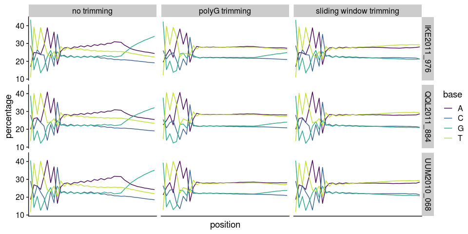

Poly G
================

## Load packages

``` r
library(tidyverse)
```

## Come up with some sample lists and tables

``` r
sample_table <- read_tsv("../../cod/greenland-cod/sample_lists/sample_table_merged_mincov_contamination_filtered.tsv") %>%
  bind_cols(bam_list = read_lines("../../cod/greenland-cod/sample_lists/bam_list_realigned_mincov_contamination_filtered.txt"))
# Note that there are some QQL samples that appear to be "merged", but they were merged from lane 1 and 2
sample_table_batch_effect <- filter(sample_table, 
                                    population %in% c("IKE2011", "QQL2011", "ITV2011", "KNG2011", "BUK2011", "NAR2008", "UUM2010", "PAA2011", "ATP2011")) %>%
  filter(data_type != "pese")
# bam_list_batch_effect <- sample_table_batch_effect %>%
#   dplyr::select(bam_list)
# bam_list_batch_effect_pe <- sample_table_batch_effect %>%
#   filter(data_type == "pe") %>%
#   dplyr::select(bam_list)
# bam_list_batch_effect_se <- sample_table_batch_effect %>%
#   filter(data_type == "se") %>%
#   dplyr::select(bam_list)
# write_tsv(bam_list_batch_effect, "../sample_lists/bam_list_realigned_mincov_contamination_filtered_batch_effect.txt", col_names = F)
# write_tsv(bam_list_batch_effect_pe, "../sample_lists/bam_list_per_pop/bam_list_realigned_mincov_contamination_filtered_batch_effect_pe.txt", col_names = F)
# write_tsv(bam_list_batch_effect_se, "../sample_lists/bam_list_per_pop/bam_list_realigned_mincov_contamination_filtered_batch_effect_se.txt", col_names = F)

sample_table_unmerged <- read_tsv("../../cod/greenland-cod/sample_lists/sample_table.tsv") %>%
  semi_join(sample_table_batch_effect, by=c("sample_id"="sample_id_corrected"))
fastq_list_pe <- filter(sample_table_unmerged, lane_number == 7)$prefix
fastq_list_se <- filter(sample_table_unmerged, lane_number != 7)$prefix
 
write_tsv(sample_table_unmerged, "../sample_lists/sample_table_unmerged.tsv")
sample_table_batch_effect %>%
  dplyr::select(-bam_list) %>%
  write_tsv("../sample_lists/sample_table_merged.tsv")
write_lines(fastq_list_pe, "../sample_lists/fastq_list_pe.txt")
write_lines(fastq_list_se, "../sample_lists/fastq_list_se.txt")
```

## Without trimming

#### Read in the sample table

``` r
sample_table_unmerged_pe <- read_tsv("../sample_lists/sample_table_unmerged.tsv") %>%
  filter(lane_number==7) %>%
  mutate(prefix_new=str_c(sample_id, "_", seq_id, "_", lane_number))
```

#### Run FastQC on three random samples

``` bash
fastqc /workdir/cod/greenland-cod/adapter_clipped/QQL2011_884_55191_7_adapter_clipped_f_paired.fastq.gz
fastqc /workdir/cod/greenland-cod/adapter_clipped/UUM2010_068_55111_7_adapter_clipped_f_paired.fastq.gz
fastqc /workdir/cod/greenland-cod/adapter_clipped/IKE2011_976_55124_7_adapter_clipped_f_paired.fastq.gz
```

## PolyG trimming with default setting

#### Do polyG trimming

``` bash
echo 'BASEDIR=/workdir/batch-effect/
INPUTDIR=/workdir/cod/greenland-cod/adapter_clipped/
SAMPLELIST=$BASEDIR/sample_lists/fastq_list_pe.txt
SAMPLETABLE=$BASEDIR/sample_lists/sample_table_unmerged.tsv

for SAMPLEFILE in `cat $SAMPLELIST`; do
  SAMPLE_ID=`grep -P "${SAMPLEFILE}\t" $SAMPLETABLE | cut -f 4`
  SEQ_ID=`grep -P "${SAMPLEFILE}\t" $SAMPLETABLE | cut -f 3`
  LANE_ID=`grep -P "${SAMPLEFILE}\t" $SAMPLETABLE | cut -f 2`
  SAMPLE_SEQ_ID=$SAMPLE_ID"_"$SEQ_ID"_"$LANE_ID
  
  ## Extract data type from the sample table
  DATATYPE=`grep -P "${SAMPLEFILE}\t" $SAMPLETABLE | cut -f 6`
  
  ## The input and output path and file prefix
  SAMPLEADAPT=$INPUTDIR$SAMPLE_SEQ_ID
  SAMPLEQUAL=$BASEDIR"polyg_trimmed/"$SAMPLE_SEQ_ID

  /workdir/programs/fastp --trim_poly_g -L -A \
  -i $SAMPLEADAPT"_adapter_clipped_f_paired.fastq.gz" \
  -I $SAMPLEADAPT"_adapter_clipped_r_paired.fastq.gz" \
  -o $SAMPLEQUAL"_adapter_clipped_qual_filtered_f_paired.fastq.gz" \
  -O $SAMPLEQUAL"_adapter_clipped_qual_filtered_r_paired.fastq.gz" \
  -h $SAMPLEQUAL"_adapter_clipped_qual_filtered_fastp.html"
done' > /workdir/batch-effect/scripts/trim_polyg_batch_effect.sh

nohup bash /workdir/batch-effect/scripts/trim_polyg_batch_effect.sh > /workdir/batch-effect/nohups/cut_right_batch_effect.nohups &
```

#### Run FastQC and MultiQC

The MultiQC result wasn’t used.

``` bash
nohup fastqc /workdir/batch-effect/polyg_trimmed/*fastq.gz -t 10 > /workdir/batch-effect/run_fastqc_polyg_trimmed.nohup &

export LC_ALL=en_US.UTF-8
export PATH=/programs/miniconda3/bin:$PATH
source activate multiqc

multiqc /workdir/batch-effect/polyg_trimmed/

conda deactivate
```

## Sliding window trimming with default setting

#### Run sliding window trimming

``` bash
echo 'SAMPLELIST=/workdir/cod/greenland-cod/sample_lists/sample_list_pe_1.tsv 
SAMPLETABLE=/workdir/cod/greenland-cod/sample_lists/sample_table_pe.tsv
BASEDIR=/workdir/cod/greenland-cod/

for SAMPLEFILE in `cat $SAMPLELIST`; do
  SAMPLE_ID=`grep -P "${SAMPLEFILE}\t" $SAMPLETABLE | cut -f 4`
  SEQ_ID=`grep -P "${SAMPLEFILE}\t" $SAMPLETABLE | cut -f 3`
  LANE_ID=`grep -P "${SAMPLEFILE}\t" $SAMPLETABLE | cut -f 2`
  SAMPLE_SEQ_ID=$SAMPLE_ID"_"$SEQ_ID"_"$LANE_ID
  
  ## Extract data type from the sample table
  DATATYPE=`grep -P "${SAMPLEFILE}\t" $SAMPLETABLE | cut -f 6`
  
  ## The input and output path and file prefix
  SAMPLEADAPT=$BASEDIR"adapter_clipped/"$SAMPLE_SEQ_ID
  SAMPLEQUAL=$BASEDIR"qual_filtered/"$SAMPLE_SEQ_ID

  /workdir/programs/fastp --trim_poly_g -L -A --cut_right \
  -i $SAMPLEADAPT"_adapter_clipped_f_paired.fastq.gz" \
  -I $SAMPLEADAPT"_adapter_clipped_r_paired.fastq.gz" \
  -o $SAMPLEQUAL"_adapter_clipped_qual_filtered_f_paired.fastq.gz" \
  -O $SAMPLEQUAL"_adapter_clipped_qual_filtered_r_paired.fastq.gz" \
  -h $SAMPLEQUAL"_adapter_clipped_qual_filtered_fastp.html"
done' > /workdir/cod/greenland-cod/scripts/cut_right_batch_effect.sh

nohup bash /workdir/cod/greenland-cod/scripts/cut_right_batch_effect.sh > /workdir/cod/greenland-cod/nohups/cut_right_batch_effect.nohups &
mv /workdir/cod/greenland-cod/qual_filtered/* /workdir/batch_effect/qual_filtered/
```

#### Run FastQC

``` bash
fastqc /workdir/batch-effect/qual_filtered/QQL2011_884_55191_7_adapter_clipped_qual_filtered_f_paired.fastq.gz
fastqc /workdir/batch-effect/qual_filtered/UUM2010_068_55111_7_adapter_clipped_qual_filtered_f_paired.fastq.gz
fastqc /workdir/batch-effect/qual_filtered/IKE2011_976_55124_7_adapter_clipped_qual_filtered_f_paired.fastq.gz
```

## Compile FastQC result

``` r
set.seed(0)
random_sample <- sample_table_unmerged_pe[sample(1:75, 3), ]
paths <- c("../../cod/greenland-cod/adapter_clipped/", "../polyg_trimmed/", "../qual_filtered/")
suffice <- c("_adapter_clipped_f_paired_fastqc", "_adapter_clipped_qual_filtered_f_paired_fastqc", "_adapter_clipped_qual_filtered_f_paired_fastqc")
types <- c("no trimming", "polyG trimming", "sliding window trimming")
for (j in 1:3){
  path <- paths[j]
  suffix <- suffice[j]
  type <- types[j]
  for (i in 1:3){
    sample_id <- random_sample$sample_id[i]
    sample_prefix <- random_sample$prefix_new[i]
    file_name <- str_c(path, sample_prefix, suffix)
    unzip(str_c(file_name, ".zip"), exdir = path, overwrite = FALSE)
    fastqc_data <- read_lines(file = str_c(file_name, "/fastqc_data.txt"))
    first_line <- which(str_detect(fastqc_data, ">>Per base sequence content")) + 1
    last_line <- which(str_detect(fastqc_data, ">>Per sequence GC content")) - 2
    per_base_seq_content_polyg_trimmed <- fastqc_data[first_line:last_line] %>%
      read_tsv() %>%
      rename(position=`#Base`) %>%
      pivot_longer(2:5, names_to = "base", values_to = "percentage") %>%
      mutate(sample_id=sample_id, type = type)
    if (j == 1 & i == 1) {
      per_base_seq_content_polyg_trimmed_final <- per_base_seq_content_polyg_trimmed
    } else {
      per_base_seq_content_polyg_trimmed_final <- bind_rows(per_base_seq_content_polyg_trimmed_final, per_base_seq_content_polyg_trimmed)
    }
  }
}

per_base_seq_content_polyg_trimmed_final %>%
  mutate(position = as_factor(position)) %>%
  ggplot(aes(x=position, y=percentage, color=base, group=base)) +
  geom_line() +
  scale_color_viridis_d(end = 0.9) +
  facet_grid(sample_id~type) +
  cowplot::theme_cowplot() +
  theme(axis.text.x = element_blank(),
        axis.ticks.x = element_blank())
```

<!-- -->
