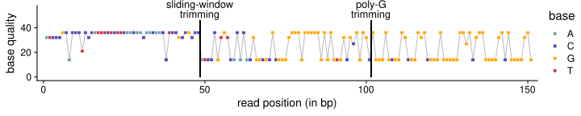

PolyG Trimming
================

## Load packages

``` r
library(tidyverse)
library(cowplot)
```

## Read in the sample table

``` r
sample_table_unmerged_pe <- read_tsv("../sample_lists/sample_table_unmerged.tsv") %>%
  filter(lane_number==7) %>%
  mutate(prefix_new=str_c(sample_id, "_", seq_id, "_", lane_number))
```

## Without trimming

#### Run FastQC on three random samples

``` bash
fastqc /workdir/cod/greenland-cod/adapter_clipped/QQL2011_884_55191_7_adapter_clipped_f_paired.fastq.gz
fastqc /workdir/cod/greenland-cod/adapter_clipped/UUM2010_068_55111_7_adapter_clipped_f_paired.fastq.gz
fastqc /workdir/cod/greenland-cod/adapter_clipped/IKE2011_976_55124_7_adapter_clipped_f_paired.fastq.gz
```

## PolyG trimming with default setting

#### Run FastQC and MultiQC

The MultiQC result wasn’t used.

``` bash
nohup fastqc /workdir/batch-effect/polyg_trimmed/*fastq.gz -t 10 > /workdir/batch-effect/run_fastqc_polyg_trimmed.nohup &

export LC_ALL=en_US.UTF-8
export PATH=/programs/miniconda3/bin:$PATH
source activate multiqc

multiqc /workdir/batch-effect/polyg_trimmed/

conda deactivate
```

## Sliding window trimming with default setting

#### Run FastQC

``` bash
fastqc /workdir/batch-effect/qual_filtered/QQL2011_884_55191_7_adapter_clipped_qual_filtered_f_paired.fastq.gz
fastqc /workdir/batch-effect/qual_filtered/UUM2010_068_55111_7_adapter_clipped_qual_filtered_f_paired.fastq.gz
fastqc /workdir/batch-effect/qual_filtered/IKE2011_976_55124_7_adapter_clipped_qual_filtered_f_paired.fastq.gz
```

## Compile FastQC result

``` r
set.seed(0)
random_sample <- sample_table_unmerged_pe[sample(1:75, 3), ]
paths <- c("../../cod/greenland-cod/adapter_clipped/", "../polyg_trimmed/", "../cut_right/")
suffice <- c("_adapter_clipped_f_paired_fastqc", "_adapter_clipped_qual_filtered_f_paired_fastqc", "_adapter_clipped_qual_filtered_f_paired_fastqc")
types <- c("no trimming", "polyG trimming", "sliding window trimming")
for (j in 1:3){
  path <- paths[j]
  suffix <- suffice[j]
  type <- types[j]
  for (i in 1:3){
    sample_id <- random_sample$sample_id[i]
    sample_prefix <- random_sample$prefix_new[i]
    file_name <- str_c(path, sample_prefix, suffix)
    unzip(str_c(file_name, ".zip"), exdir = path, overwrite = FALSE)
    fastqc_data <- read_lines(file = str_c(file_name, "/fastqc_data.txt"))
    first_line <- which(str_detect(fastqc_data, ">>Per base sequence content")) + 1
    last_line <- which(str_detect(fastqc_data, ">>Per sequence GC content")) - 2
    per_base_seq_content_polyg_trimmed <- fastqc_data[first_line:last_line] %>%
      read_tsv() %>%
      rename(position=`#Base`) %>%
      pivot_longer(2:5, names_to = "base", values_to = "percentage") %>%
      mutate(sample_id=sample_id, type = type)
    if (j == 1 & i == 1) {
      per_base_seq_content_polyg_trimmed_final <- per_base_seq_content_polyg_trimmed
    } else {
      per_base_seq_content_polyg_trimmed_final <- bind_rows(per_base_seq_content_polyg_trimmed_final, per_base_seq_content_polyg_trimmed)
    }
  }
}

seq_content_p <- per_base_seq_content_polyg_trimmed_final %>%
  mutate(position = as_factor(position)) %>%
  ggplot(aes(x=position, y=percentage, color=base, group=base)) +
  geom_line(size=0.8) +
  #scale_color_viridis_d(end = 0.9) +
  #scale_color_brewer(palette = "Dark2") +
  scale_color_manual(values = c("#749dae", "#5445b1", "orange", "#cd3341")) +
  facet_grid(sample_id~type) +
  cowplot::theme_cowplot() +
  theme(axis.text.x = element_blank(),
        axis.ticks.x = element_blank())
seq_content_p
```

<!-- -->

## Example of one read

#### Extract the read and trim it

``` bash
## Save the read as a separate file
zcat /workdir/backup/cod/greenland_cod/fastq/8467_3270_55085_HMK3YBGX2_NAR2008_006_GCTACGCT_CTCTCTAT_R1.fastq.gz | grep ATCCCGCACCCTCCCATTTCTCTTCAACAACAACAACCTCCGCCGCCCATCCCGTGTCACACACGGGCGCGCGGGGGGGGGGGGGGGGGGTGGCGCGGGGC -A2 -B1 > /workdir/batch-effect/misc/polyg_example.fastq
## Trim polyG tail
/workdir/programs/fastp --trim_poly_g -L -A -i /workdir/batch-effect/misc/polyg_example.fastq -o /workdir/batch-effect/misc/polyg_example_trim_polyg.fastq
## Window trim
/workdir/programs/fastp --trim_poly_g -L -A --cut_right -i /workdir/batch-effect/misc/polyg_example.fastq -o /workdir/batch-effect/misc/polyg_example_polyg_cut_right.fastq
```

#### Visualization

``` r
for (file in rev(c("../misc/polyg_example.fastq", "../misc/polyg_example_trim_polyg.fastq", "../misc/polyg_example_polyg_cut_right.fastq"))){
  sequence_vector <- read_lines(file)[2] %>%
    str_split(pattern = "") %>%
    .[[1]]
  base_p <- tibble(base=sequence_vector) %>%
    {mutate(., id=seq(nrow(.)))} %>%
    ggplot(aes(x=id, y=0, fill=base)) +
    geom_tile(color="black", size=0.3) +
    #scale_fill_viridis_d(begin = 0.15) +
    scale_fill_manual(values = c("#749dae", "#5445b1", "orange", "#cd3341")) +
    theme_void() +
    theme(legend.position = "top")
  print(base_p)
}
```

<!-- --><!-- --><!-- -->

``` r
base_p_final <- base_p +
  coord_cartesian(clip = 'off') +
  annotate("text", 48.5, 2.2, label="sliding window\ntrimming", size = 3.8) +
  annotate("segment", 48.5, 1.3, xend=48.5, yend=0.6, arrow=arrow(length = unit(0.1, "npc")), size=1) +
  annotate("text", 101.5, 2.2, label="polyG\ntrimming", size = 3.8) +
  annotate("segment", 101.5, 1.3, xend=101.5, yend=0.6, arrow=arrow(length = unit(0.1, "npc")), size=1)+
  annotate("text", 76, 2.5, label='bold("base")', size = 3.8, parse=TRUE) +
  theme(legend.title=element_blank())

base_p_final
```

<!-- -->

``` r
for (file in rev(c("../misc/polyg_example.fastq", "../misc/polyg_example_trim_polyg.fastq", "../misc/polyg_example_polyg_cut_right.fastq"))){
  quality_vector <- read_lines(file)[4] %>%
    charToRaw() %>%
    as.integer() %>% 
    {.-33}
  quality_p <- tibble(quality=quality_vector) %>%
    {mutate(., id=seq(nrow(.)))} %>%
    ggplot(aes(x=id, y=0, fill=as.factor(quality))) +
    geom_tile(color="black", size=0.3) +
    scale_fill_viridis_d(option = "D", begin = 0.4, direction = -1) +
    theme_void() +
    labs(fill = "base quality score") +
    theme(legend.position = "bottom")
  print(quality_p)
}
```

<!-- --><!-- --><!-- -->

``` r
quality_p_final <- quality_p +
  coord_cartesian(clip = 'off') +
  annotate("text", 48.5, -2.2, label="sliding window\ntrimming", size = 3.8) +
  annotate("segment", 48.5, -1.3, xend=48.5, yend=-0.6, arrow=arrow(length = unit(0.1, "npc")), size=1) +
  annotate("text", 101.5, -2.2, label="polyG\ntrimming", size = 3.8) +
  annotate("segment", 101.5, -1.3, xend=101.5, yend=-0.6, arrow=arrow(length = unit(0.1, "npc")), size=1) +
  annotate("text", 76, -2.5, label='bold("base quality score")', size = 3.8, parse=TRUE) +
  theme(legend.title=element_blank())
quality_p_final
```

<!-- -->

## Assemble everything together

``` r
top <- plot_grid(base_p_final, quality_p_final, rows = 2) + theme(plot.margin=unit(c(1, 1.5, 1, 1), unit="line"))
plot_grid(top, seq_content_p, labels = c('A', 'B'), label_size = 15, nrow = 2, rel_heights = c(2.5, 5))
```

<!-- -->
