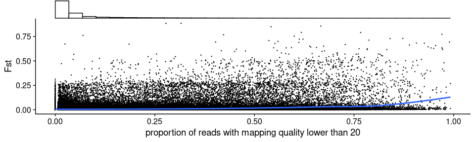
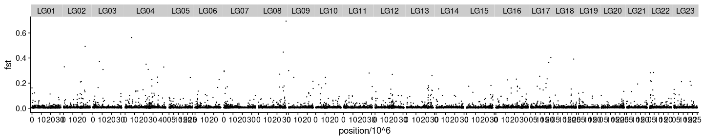
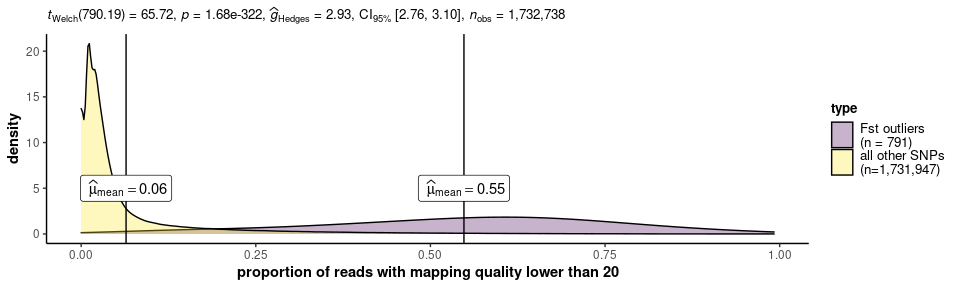
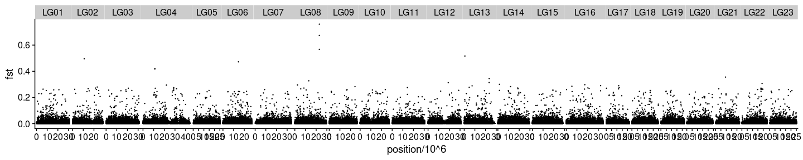
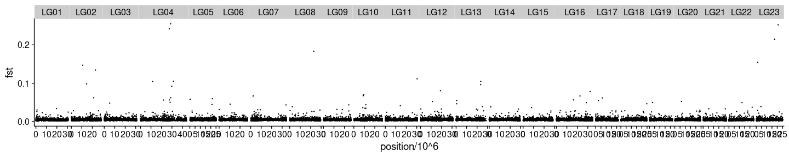

Reference bias
================

  - [Get saf, maf, and Fst with ANGSD](#get-saf-maf-and-fst-with-angsd)
      - [Sliding window trimmed PE samples
        (new)](#sliding-window-trimmed-pe-samples-new)
  - [Plot Fst with sliding window trimmed PE
    samples](#plot-fst-with-sliding-window-trimmed-pe-samples)
      - [Without filtering](#without-filtering)
      - [Check correlation with read depth distribution before mapping
        quality
        filter](#check-correlation-with-read-depth-distribution-before-mapping-quality-filter)
      - [Spot check some outlier SNPs](#spot-check-some-outlier-snps)

``` r
library(tidyverse)
library(RcppCNPy)
library(cowplot)
library(ggstatsplot)
library(statsExpressions)
```

Here, we examine the effect of reference bias by estimating Fst between
two batches of data, and study the source of Fst outliers.

## Get saf, maf, and Fst with ANGSD

#### Sliding window trimmed PE samples (new)

``` bash
## MAF and SAF (minInd=20)
nohup bash /workdir/genomic-data-analysis/scripts/get_maf_per_pop.sh \
/workdir/batch-effect/ \
/workdir/batch-effect/sample_lists/sample_table_merged.tsv \
6 \
bam_list_realigned_ \
/workdir/cod/reference_seqs/gadMor3.fasta \
/workdir/batch-effect/angsd/global_snp_list_bam_list_realigned_mindp46_maxdp184_minind20_minq20.txt \
20 184 20 20 \
> /workdir/batch-effect/nohups/get_maf_per_pop.nohup &
## Fst
nohup bash /workdir/genomic-data-analysis/scripts/get_fst.sh \
/workdir/batch-effect/angsd/popminind20/ \
/workdir/batch-effect/sample_lists/sample_table_merged.tsv \
6 \
_global_snp_list_bam_list_realigned_mindp46_maxdp184_minind20_minq20_popminind20 \
> /workdir/batch-effect/nohups/get_fst.nohup &
## Get depth count from se samples without a mapping quality filter (minInd=2)
cd /workdir/batch-effect
nohup /workdir/programs/angsd0.931/angsd/angsd \
-b sample_lists/bam_list_per_pop/bam_list_realigned_se.txt \
-anc /workdir/cod/reference_seqs/gadMor3.fasta \
-out angsd/popminind2/bam_list_realigned_se_anymapq \
-doCounts 1 -doDepth 1 -dumpCounts 1 \
-P 16 -setMinDepth 2 -minInd 2 -minQ 20 \
-sites /workdir/batch-effect/angsd/global_snp_list_bam_list_realigned_mindp46_maxdp184_minind20_minq20.txt \
-rf /workdir/batch-effect/angsd/global_snp_list_bam_list_realigned_mindp46_maxdp184_minind20_minq20.chrs \
>& nohups/get_depth_anymapq_bam_list_realigned_se.log &
```

## Plot Fst with sliding window trimmed PE samples

#### Without filtering

``` r
maf_se <- read_tsv("../angsd/popminind20/se_global_snp_list_bam_list_realigned_mindp46_maxdp184_minind20_minq20_popminind20.mafs.gz") %>%
  transmute(lg = chromo, position = position, major=major, minor = minor, se_maf = knownEM, se_nind=nInd)
maf_pe <- read_tsv("../angsd/popminind20/pe_global_snp_list_bam_list_realigned_mindp46_maxdp184_minind20_minq20_popminind20.mafs.gz")%>%
  transmute(lg = chromo, position = position, major=major, minor = minor, pe_maf = knownEM, pe_nind=nInd)
fst <- read_tsv("../angsd/popminind20/pe_se_global_snp_list_bam_list_realigned_mindp46_maxdp184_minind20_minq20_popminind20.alpha_beta.txt", col_names = F) %>%
  mutate(X5=X3/X4) %>%
  transmute(lg=X1, position = X2, alpha=X3, beta=X4, fst = X5)
maf_joined <- inner_join(maf_se, maf_pe) %>%
  left_join(fst) %>%
  filter(str_detect(lg, "LG")) %>%
  #filter(se_nind>=20, pe_nind>=20) %>%
  mutate(delta = abs(se_maf- pe_maf)) %>%
  arrange(desc(fst))
summarise(maf_joined, average_fst = sum(alpha)/sum(beta))
```

    ## # A tibble: 1 x 1
    ##   average_fst
    ##         <dbl>
    ## 1     0.00564

``` r
maf_joined %>% filter(se_maf > 0.01 & se_maf<0.99) %>% summarise(average_fst = sum(alpha)/sum(beta))
```

    ## # A tibble: 1 x 1
    ##   average_fst
    ##         <dbl>
    ## 1     0.00518

``` r
head(maf_joined)
```

    ## # A tibble: 6 x 12
    ##   lg    position major minor   se_maf se_nind pe_maf pe_nind alpha  beta   fst
    ##   <chr>    <dbl> <chr> <chr>    <dbl>   <dbl>  <dbl>   <dbl> <dbl> <dbl> <dbl>
    ## 1 LG08  22940754 G     A     1.00          25  0.109      44 0.768 0.868 0.885
    ## 2 LG08  22940755 C     A     1.00          25  0.114      41 0.766 0.867 0.884
    ## 3 LG10   5017171 A     G     0.000003      20  0.891      26 0.714 0.834 0.856
    ## 4 LG17  19229736 G     A     0.000005      23  0.889      24 0.701 0.825 0.850
    ## 5 LG06  13538664 T     C     0.0292        29  0.887      28 0.649 0.820 0.792
    ## 6 LG06  19280341 G     A     0.0176        29  0.858      20 0.603 0.763 0.791
    ## # … with 1 more variable: delta <dbl>

``` r
maf_joined %>%
  ggplot(aes(x=position/10^6, y=fst)) +
  geom_point(size = 0.2) +
  #geom_smooth(aes(color=minor)) +
  facet_grid(~lg, scales = "free_x", space = "free_x") +
  theme_cowplot() +
  theme(panel.spacing = unit(0.0, "lines"))
```

<!-- -->

``` r
fixed_windowed_fst <- function(x, window_length){
  mutate(x, position=cut(position, breaks=seq(0,50*10^6,window_length), labels=seq(window_length/2,50*10^6-window_length/2,window_length))) %>%
  group_by(lg, position) %>%
  summarise(fst=sum(alpha)/sum(beta)) %>%
  mutate(position=as.numeric(as.character(position)))
}
fixed_windowed_fst(maf_joined, 10000) %>%
  ggplot(aes(x=position/10^6, y=fst)) +
  geom_point(size = 0.2) +
  facet_grid(~lg, scales = "free_x", space = "free_x") +
  theme_cowplot() +
  theme(panel.spacing = unit(0.0, "lines"))
```

<!-- -->

#### Check correlation with read depth distribution before mapping quality filter

``` r
anymapq_depth <- read_tsv("../angsd/popminind2/bam_list_realigned_se_anymapq.pos.gz") %>%
  rename(lg=chr, position=pos, total_depth_anymapq=totDepth)
mapq20_depth <- read_tsv("../angsd/popminind20/se_global_snp_list_bam_list_realigned_mindp46_maxdp184_minind20_minq20_popminind20.pos.gz") %>%
  rename(lg=chr, position=pos, total_depth_mapq20=totDepth)
depth <- inner_join(anymapq_depth, mapq20_depth) %>%
  mutate(depth_ratio=1-total_depth_mapq20/total_depth_anymapq)
p <- maf_joined %>%
  left_join(depth) %>%
  ggplot(aes(x=depth_ratio, y=fst)) +
  labs(x="depth ratio in HiSeq-125SE batch", y="Fst") +
  geom_point(size=0.2) +
  geom_smooth(se=T) +
  labs(x="proportion of reads with mapping quality lower than 20") +
  theme_cowplot()
ggExtra::ggMarginal(p, type = "histogram", size=5, margins="x", fill="white")
```

<!-- -->

``` r
maf_divided <- maf_joined %>%
  mutate(type=ifelse(fst > 0.3, "Fst outliers\n(n = 791)", "all other SNPs\n(n=1,731,947)")) %>%
  mutate(type=fct_relevel(type, c("Fst outliers\n(n = 791)", "all other SNPs\n(n=1,731,947)"))) %>%
  left_join(depth) 
maf_divided_stats <- centrality_description(maf_divided, type, depth_ratio)
maf_divided %>%
  ggplot(aes(x=depth_ratio)) +
  geom_density(mapping = aes(fill=type), alpha=0.3, adjust=1.8) +
  geom_vline(data=maf_divided_stats, aes(xintercept = depth_ratio)) +
  geom_label(data=maf_divided_stats, aes(label=expression), y=5, parse=TRUE) +
  scale_fill_viridis_d() +
  #labs(subtitle = two_sample_test(maf_divided, type, depth_ratio)$expression[[1]])
  labs(x="proportion of reads with mapping quality lower than 20",
       y="density",
       subtitle=expression(paste(italic("t")["Welch"], "(", "790.19", ") = ", "65.72", ", ", 
                                 italic("p"), " = ", "1.68e-322", ", ", widehat(italic("g"))["Hedges"], 
                                 " = ", "2.93", ", CI"["95%"], " [", "2.76", ", ", "3.10", 
                                 "], ", italic("n")["obs"], " = ", "1,732,738"))) +
  theme_ggstatsplot() +
  theme(panel.grid = element_blank(),
        axis.line = element_line())
```

<!-- -->

``` r
## To get the test stats
maf_joined %>%
  mutate(type=ifelse(fst > 0.3, "Fst outliers", "all other SNPs")) %>%
  mutate(type=fct_relevel(type, c("Fst outliers", "all other SNPs"))) %>%
  left_join(depth) %>%
  ggbetweenstats(y=depth_ratio, x=type, output="subtitle", bf.message = FALSE)
stats_plot <- maf_joined %>%
  mutate(type=ifelse(fst > 0.3, "Fst outliers", "all other SNPs")) %>%
  mutate(type=fct_relevel(type, c("Fst outliers", "all other SNPs"))) %>%
  left_join(depth) %>%
  ggbetweenstats(y=depth_ratio, x=type, bf.message = FALSE, point.path = FALSE)
gginnards::delete_layers(stats_plot, "GeomPoint")
```

``` r
maf_joined %>%
  left_join(depth) %>%
  filter(depth_ratio < 0.1) %>%
  ggplot(aes(x=position/10^6, y=fst)) +
  geom_point(size = 0.2) +
  facet_grid(~lg, scales = "free_x", space = "free_x") +
  theme_cowplot() +
  theme(panel.spacing = unit(0.0, "lines"))
```

<!-- -->

``` r
maf_joined %>%
  left_join(depth) %>%
  filter(depth_ratio < 0.1) %>%
  fixed_windowed_fst(10000) %>%
  ggplot(aes(x=position/10^6, y=fst)) +
  geom_point(size = 0.2) +
  facet_grid(~lg, scales = "free_x", space = "free_x") +
  theme_cowplot() +
  theme(panel.spacing = unit(0.0, "lines"))
```

<!-- -->

``` r
maf_joined %>%
  left_join(depth) %>% 
  filter(depth_ratio < 0.1) %>%
  summarise(mean_fst=sum(alpha)/sum(beta))
```

    ## # A tibble: 1 x 1
    ##   mean_fst
    ##      <dbl>
    ## 1  0.00476

#### Spot check some outlier SNPs

LG04:13667429  
LG07:9272785  
LG08:22940796  
LG15:7111963  
LG16:25656225  
LG17:19229736  
LG23:6170006

``` bash
cd /workdir/batch-effect/
## SE samples
for FILE in `cat /workdir/batch-effect/sample_lists/bam_list_per_pop/bam_list_realigned_se.txt`; do 
samtools view -b $FILE "LG04:13666429-13668429" > ${FILE%bam}'se_LG04.bam'
samtools view -b $FILE "LG07:9271785-9273785" > ${FILE%bam}'se_LG07.bam'
samtools view -b $FILE "LG08:22939796-22941796" > ${FILE%bam}'se_LG08.bam'
samtools view -b $FILE "LG15:7110963-7112963" > ${FILE%bam}'se_LG15.bam'
samtools view -b $FILE "LG16:25655225-25657225" > ${FILE%bam}'se_LG16.bam'
samtools view -b $FILE "LG17:19228736-19230736" > ${FILE%bam}'se_LG17.bam'
samtools view -b $FILE "LG23:6169006-6171006" > ${FILE%bam}'se_LG23.bam'
done
samtools merge /workdir/batch-effect/bam/fst_outliers/fst_outliers_se.bam /workdir/batch-effect/bam/*se_LG??.bam
samtools index /workdir/batch-effect/bam/fst_outliers/fst_outliers_se.bam
## PE samples
for FILE in `cat /workdir/batch-effect/sample_lists/bam_list_per_pop/bam_list_realigned_pe.txt`; do 
samtools view -b $FILE "LG04:13666429-13668429" > ${FILE%bam}'pe_LG04.bam'
samtools view -b $FILE "LG07:9271785-9273785" > ${FILE%bam}'pe_LG07.bam'
samtools view -b $FILE "LG08:22939796-22941796" > ${FILE%bam}'pe_LG08.bam'
samtools view -b $FILE "LG15:7110963-7112963" > ${FILE%bam}'pe_LG15.bam'
samtools view -b $FILE "LG16:25655225-25657225" > ${FILE%bam}'pe_LG16.bam'
samtools view -b $FILE "LG17:19228736-19230736" > ${FILE%bam}'pe_LG17.bam'
samtools view -b $FILE "LG23:6169006-6171006" > ${FILE%bam}'pe_LG23.bam'
done
samtools merge /workdir/batch-effect/bam/fst_outliers/fst_outliers_pe.bam /workdir/batch-effect/bam/*pe_LG??.bam
samtools index /workdir/batch-effect/bam/fst_outliers/fst_outliers_pe.bam
```
