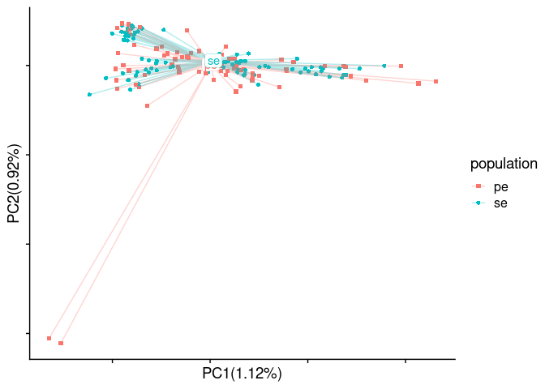
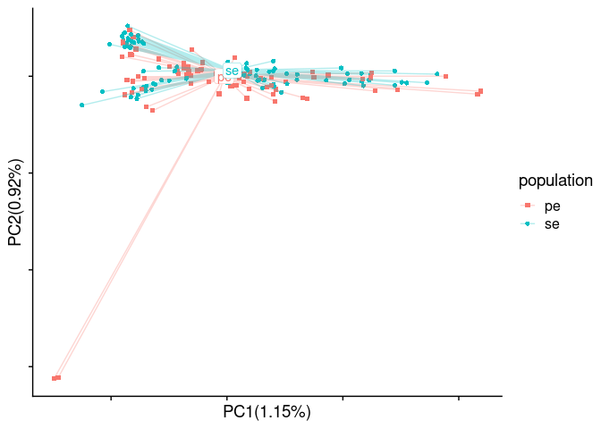

Reference bias
================

  - [Fst outliers caused by reference
    bias](#fst-outliers-caused-by-reference-bias)
      - [Without filtering](#without-filtering)
      - [Check correlation with read depth distribution before mapping
        quality
        filter](#check-correlation-with-read-depth-distribution-before-mapping-quality-filter)
      - [Spot check some outlier SNPs](#spot-check-some-outlier-snps)
  - [PCA results before and after correcting for reference
    bias](#pca-results-before-and-after-correcting-for-reference-bias)
  - [Exclude certain SNPs to mitigate the batch effects in PCA
    results](#exclude-certain-snps-to-mitigate-the-batch-effects-in-pca-results)
      - [Come up with a new SNP list](#come-up-with-a-new-snp-list)
      - [Run ANGSD](#run-angsd)
      - [PCA result with original SNP
        list](#pca-result-with-original-snp-list)
      - [Ascertainment bias when using SNP lists that exclude either PE
        or SE private
        alleles](#ascertainment-bias-when-using-snp-lists-that-exclude-either-pe-or-se-private-alleles)
      - [PCA result with a SNP list that exclude both PE and SE
        SNPs](#pca-result-with-a-snp-list-that-exclude-both-pe-and-se-snps)
      - [PCA result with a depth ratio filtered SNP
        list](#pca-result-with-a-depth-ratio-filtered-snp-list)

``` r
library(tidyverse)
library(RcppCNPy)
library(cowplot)
library(ggstatsplot)
library(statsExpressions)
source("/workdir/genomic-data-analysis/scripts/individual_pca_functions.R")
```

Here, we examine the effect of reference bias by estimating Fst between
two batches of data, and study the source of Fst outliers.

## Fst outliers caused by reference bias

#### Without filtering

``` r
maf_se <- read_tsv("../angsd/popminind20/se_global_snp_list_bam_list_realigned_mindp46_maxdp184_minind20_minq20_popminind20.mafs.gz") %>%
  transmute(lg = chromo, position = position, major=major, minor = minor, se_maf = knownEM, se_nind=nInd)
maf_pe <- read_tsv("../angsd/popminind20/pe_global_snp_list_bam_list_realigned_mindp46_maxdp184_minind20_minq20_popminind20.mafs.gz")%>%
  transmute(lg = chromo, position = position, major=major, minor = minor, pe_maf = knownEM, pe_nind=nInd)
fst <- read_tsv("../angsd/popminind20/pe_se_global_snp_list_bam_list_realigned_mindp46_maxdp184_minind20_minq20_popminind20.alpha_beta.txt", col_names = F) %>%
  mutate(X5=X3/X4) %>%
  transmute(lg=X1, position = X2, alpha=X3, beta=X4, fst = X5)
maf_joined <- inner_join(maf_se, maf_pe) %>%
  left_join(fst) %>%
  filter(str_detect(lg, "LG")) %>%
  #filter(se_nind>=20, pe_nind>=20) %>%
  mutate(delta = abs(se_maf- pe_maf)) %>%
  arrange(desc(fst))
summarise(maf_joined, average_fst = sum(alpha)/sum(beta))
```

    ## # A tibble: 1 x 1
    ##   average_fst
    ##         <dbl>
    ## 1     0.00564

``` r
maf_joined %>% filter(se_maf > 0.01 & se_maf<0.99) %>% summarise(average_fst = sum(alpha)/sum(beta))
```

    ## # A tibble: 1 x 1
    ##   average_fst
    ##         <dbl>
    ## 1     0.00518

``` r
head(maf_joined)
```

    ## # A tibble: 6 x 12
    ##   lg    position major minor   se_maf se_nind pe_maf pe_nind alpha  beta   fst
    ##   <chr>    <dbl> <chr> <chr>    <dbl>   <dbl>  <dbl>   <dbl> <dbl> <dbl> <dbl>
    ## 1 LG08  22940754 G     A     1.00          25  0.109      44 0.768 0.868 0.885
    ## 2 LG08  22940755 C     A     1.00          25  0.114      41 0.766 0.867 0.884
    ## 3 LG10   5017171 A     G     0.000003      20  0.891      26 0.714 0.834 0.856
    ## 4 LG17  19229736 G     A     0.000005      23  0.889      24 0.701 0.825 0.850
    ## 5 LG06  13538664 T     C     0.0292        29  0.887      28 0.649 0.820 0.792
    ## 6 LG06  19280341 G     A     0.0176        29  0.858      20 0.603 0.763 0.791
    ## # … with 1 more variable: delta <dbl>

``` r
maf_joined %>%
  ggplot(aes(x=position/10^6, y=fst)) +
  geom_point(size = 0.2) +
  #geom_smooth(aes(color=minor)) +
  facet_grid(~lg, scales = "free_x", space = "free_x") +
  theme_cowplot() +
  theme(panel.spacing = unit(0.0, "lines"))
```

<!-- -->

``` r
fixed_windowed_fst <- function(x, window_length){
  mutate(x, position=cut(position, breaks=seq(0,50*10^6,window_length), labels=seq(window_length/2,50*10^6-window_length/2,window_length))) %>%
  group_by(lg, position) %>%
  summarise(fst=sum(alpha)/sum(beta)) %>%
  mutate(position=as.numeric(as.character(position)))
}
fixed_windowed_fst(maf_joined, 10000) %>%
  ggplot(aes(x=position/10^6, y=fst)) +
  geom_point(size = 0.2) +
  facet_grid(~lg, scales = "free_x", space = "free_x") +
  theme_cowplot() +
  theme(panel.spacing = unit(0.0, "lines"))
```

<!-- -->

#### Check correlation with read depth distribution before mapping quality filter

``` r
anymapq_depth <- read_tsv("../angsd/popminind2/bam_list_realigned_se_anymapq.pos.gz") %>%
  rename(lg=chr, position=pos, total_depth_anymapq=totDepth)
mapq20_depth <- read_tsv("../angsd/popminind20/se_global_snp_list_bam_list_realigned_mindp46_maxdp184_minind20_minq20_popminind20.pos.gz") %>%
  rename(lg=chr, position=pos, total_depth_mapq20=totDepth)
depth <- inner_join(anymapq_depth, mapq20_depth) %>%
  mutate(depth_ratio=1-total_depth_mapq20/total_depth_anymapq)
p <- maf_joined %>%
  left_join(depth) %>%
  ggplot(aes(x=depth_ratio, y=fst)) +
  labs(x="depth ratio in HiSeq-125SE batch", y="Fst") +
  geom_point(size=0.2) +
  geom_smooth(se=T) +
  labs(x="proportion of reads with mapping quality lower than 20") +
  theme_cowplot()
ggExtra::ggMarginal(p, type = "histogram", size=5, margins="x", fill="white")
```

<!-- -->

``` r
maf_divided <- maf_joined %>%
  mutate(type=ifelse(fst > 0.3, "Fst outliers\n(n = 791)", "all other SNPs\n(n=1,731,947)")) %>%
  mutate(type=fct_relevel(type, c("Fst outliers\n(n = 791)", "all other SNPs\n(n=1,731,947)"))) %>%
  left_join(depth) 
maf_divided_stats <- centrality_description(maf_divided, type, depth_ratio)
maf_divided %>%
  ggplot(aes(x=depth_ratio)) +
  geom_density(mapping = aes(fill=type), alpha=0.3, adjust=1.8) +
  geom_vline(data=maf_divided_stats, aes(xintercept = depth_ratio)) +
  geom_label(data=maf_divided_stats, aes(label=expression), y=5, parse=TRUE) +
  scale_fill_viridis_d() +
  #labs(subtitle = two_sample_test(maf_divided, type, depth_ratio)$expression[[1]])
  labs(x="proportion of reads with mapping quality lower than 20",
       y="density",
       subtitle=expression(paste(italic("t")["Welch"], "(", "790.19", ") = ", "65.72", ", ", 
                                 italic("p"), " = ", "1.68e-322", ", ", widehat(italic("g"))["Hedges"], 
                                 " = ", "2.93", ", CI"["95%"], " [", "2.76", ", ", "3.10", 
                                 "], ", italic("n")["obs"], " = ", "1,732,738"))) +
  theme_ggstatsplot() +
  theme(panel.grid = element_blank(),
        axis.line = element_line())
```

<!-- -->

``` r
## To get the test stats
maf_joined %>%
  mutate(type=ifelse(fst > 0.3, "Fst outliers", "all other SNPs")) %>%
  mutate(type=fct_relevel(type, c("Fst outliers", "all other SNPs"))) %>%
  left_join(depth) %>%
  ggbetweenstats(y=depth_ratio, x=type, output="subtitle", bf.message = FALSE)
stats_plot <- maf_joined %>%
  mutate(type=ifelse(fst > 0.3, "Fst outliers", "all other SNPs")) %>%
  mutate(type=fct_relevel(type, c("Fst outliers", "all other SNPs"))) %>%
  left_join(depth) %>%
  ggbetweenstats(y=depth_ratio, x=type, bf.message = FALSE, point.path = FALSE)
gginnards::delete_layers(stats_plot, "GeomPoint")
```

``` r
maf_joined %>%
  left_join(depth) %>%
  filter(depth_ratio < 0.1) %>%
  ggplot(aes(x=position/10^6, y=fst)) +
  geom_point(size = 0.2) +
  facet_grid(~lg, scales = "free_x", space = "free_x") +
  theme_cowplot() +
  theme(panel.spacing = unit(0.0, "lines"))
```

<!-- -->

``` r
maf_joined %>%
  left_join(depth) %>%
  filter(depth_ratio < 0.1) %>%
  fixed_windowed_fst(10000) %>%
  ggplot(aes(x=position/10^6, y=fst)) +
  geom_point(size = 0.2) +
  facet_grid(~lg, scales = "free_x", space = "free_x") +
  theme_cowplot() +
  theme(panel.spacing = unit(0.0, "lines"))
```

<!-- -->

``` r
maf_joined %>%
  left_join(depth) %>% 
  filter(depth_ratio < 0.1) %>%
  summarise(mean_fst=sum(alpha)/sum(beta))
```

    ## # A tibble: 1 x 1
    ##   mean_fst
    ##      <dbl>
    ## 1  0.00476

#### Spot check some outlier SNPs

LG04:13667429  
LG07:9272785  
LG08:22940796  
LG15:7111963  
LG16:25656225  
LG17:19229736  
LG23:6170006

``` bash
cd /workdir/batch-effect/
## SE samples
for FILE in `cat /workdir/batch-effect/sample_lists/bam_list_per_pop/bam_list_realigned_se.txt`; do 
samtools view -b $FILE "LG04:13666429-13668429" > ${FILE%bam}'se_LG04.bam'
samtools view -b $FILE "LG07:9271785-9273785" > ${FILE%bam}'se_LG07.bam'
samtools view -b $FILE "LG08:22939796-22941796" > ${FILE%bam}'se_LG08.bam'
samtools view -b $FILE "LG15:7110963-7112963" > ${FILE%bam}'se_LG15.bam'
samtools view -b $FILE "LG16:25655225-25657225" > ${FILE%bam}'se_LG16.bam'
samtools view -b $FILE "LG17:19228736-19230736" > ${FILE%bam}'se_LG17.bam'
samtools view -b $FILE "LG23:6169006-6171006" > ${FILE%bam}'se_LG23.bam'
done
samtools merge /workdir/batch-effect/bam/fst_outliers/fst_outliers_se.bam /workdir/batch-effect/bam/*se_LG??.bam
samtools index /workdir/batch-effect/bam/fst_outliers/fst_outliers_se.bam
## PE samples
for FILE in `cat /workdir/batch-effect/sample_lists/bam_list_per_pop/bam_list_realigned_pe.txt`; do 
samtools view -b $FILE "LG04:13666429-13668429" > ${FILE%bam}'pe_LG04.bam'
samtools view -b $FILE "LG07:9271785-9273785" > ${FILE%bam}'pe_LG07.bam'
samtools view -b $FILE "LG08:22939796-22941796" > ${FILE%bam}'pe_LG08.bam'
samtools view -b $FILE "LG15:7110963-7112963" > ${FILE%bam}'pe_LG15.bam'
samtools view -b $FILE "LG16:25655225-25657225" > ${FILE%bam}'pe_LG16.bam'
samtools view -b $FILE "LG17:19228736-19230736" > ${FILE%bam}'pe_LG17.bam'
samtools view -b $FILE "LG23:6169006-6171006" > ${FILE%bam}'pe_LG23.bam'
done
samtools merge /workdir/batch-effect/bam/fst_outliers/fst_outliers_pe.bam /workdir/batch-effect/bam/*pe_LG??.bam
samtools index /workdir/batch-effect/bam/fst_outliers/fst_outliers_pe.bam
```

## PCA results before and after correcting for reference bias

## Exclude certain SNPs to mitigate the batch effects in PCA results

Here, we try to exclude private alleles and regions affected by
reference bias in PCA to address batch effect caused by DNA degradation
and reference bias

#### Come up with a new SNP list

``` r
maf_pe <- read_tsv("../angsd/popminind20/pe_global_snp_list_bam_list_realigned_mindp46_maxdp184_minind20_minq20_downsampled_unlinked_popminind20.mafs.gz") %>%
  transmute(lg = chromo, position = position, major=major, minor = minor, pe_maf = knownEM, pe_nind=nInd)

maf_se <- read_tsv("../angsd/popminind20/se_global_snp_list_bam_list_realigned_mindp46_maxdp184_minind20_minq20_downsampled_unlinked_popminind20.mafs.gz") %>%
  transmute(lg = chromo, position = position, major=major, minor = minor, se_maf = knownEM, se_nind=nInd)

maf_joined <- inner_join(maf_pe, maf_se) %>% 
  mutate(delta=abs(se_maf-pe_maf))

maf_joined_excluding_private <- filter(maf_joined, !((pe_maf<0.01 | pe_maf>0.99)&(se_maf>0.1 & se_maf<0.9))) %>%
  filter(!((se_maf<0.01 | se_maf>0.99)&(pe_maf>0.1 & pe_maf<0.9)))

maf_excluding_pe <- maf_se %>%
  filter(!(se_maf<0.1 | se_maf>0.9))

maf_excluding_se <-  maf_pe %>%
  filter(!(pe_maf<0.1 | pe_maf>0.9))

original_snp_list <- read_tsv("/workdir/batch-effect/angsd/global_snp_list_bam_list_realigned_mindp46_maxdp184_minind20_minq20_downsampled_unlinked.txt", col_names = c("lg", "position", "major", "minor")) 
  
new_snp_list <- semi_join(original_snp_list, maf_joined_excluding_private)
write_tsv(new_snp_list, "../angsd/global_snp_list_private_snps.txt", col_names = F)

se_snp_list <- semi_join(original_snp_list, maf_excluding_pe)
write_tsv(se_snp_list, "../angsd/global_snp_list_se_snps.txt", col_names = F)

pe_snp_list <- semi_join(original_snp_list, maf_excluding_se)
write_tsv(pe_snp_list, "../angsd/global_snp_list_pe_snps.txt", col_names = F)

anymapq_depth <- read_tsv("../angsd/popminind2/bam_list_realigned_se_anymapq.pos.gz") %>%
  rename(lg=chr, position=pos, total_depth_anymapq=totDepth)
mapq20_depth <- read_tsv("../angsd/popminind20/se_global_snp_list_bam_list_realigned_mindp46_maxdp184_minind20_minq20_popminind20.pos.gz") %>%
  rename(lg=chr, position=pos, total_depth_mapq20=totDepth)
depth <- inner_join(anymapq_depth, mapq20_depth) %>%
 mutate(depth_ratio=total_depth_mapq20/total_depth_anymapq)

depth_ratio_filtered_snp_list <- semi_join(original_snp_list, filter(depth, depth_ratio > 0.9))
write_tsv(depth_ratio_filtered_snp_list, "../angsd/global_snp_list_depth_ratio_filtered_snps.txt", col_names = F)
```

#### Run ANGSD

``` bash
## Private SNPs
cd /workdir/batch-effect/
/workdir/programs/angsd0.931/angsd/angsd sites index /workdir/batch-effect/angsd/global_snp_list_private_snps.txt
nohup /workdir/programs/angsd0.931/angsd/angsd \
-b sample_lists/bam_list_realigned.txt \
-anc /workdir/cod/reference_seqs/gadMor3.fasta \
-out angsd/bam_list_realigned_private_snps \
-GL 1 -doGlf 2 -doMaf 1 -doMajorMinor 3 -doCounts 1 -doDepth 1 -dumpCounts 1 \
-P 16 -setMinDepth 2 -setMaxDepth 661 -minInd 2 -minQ 20 -minMapQ 20 -minMaf 0.05 \
-doIBS 2 -makematrix 1 -doCov 1 \
-sites /workdir/batch-effect/angsd/global_snp_list_private_snps.txt \
-rf /workdir/batch-effect/angsd/global_snp_list_bam_list_realigned_mindp46_maxdp184_minind20_minq20_downsampled_unlinked.chrs \
>& nohups/get_gl_bam_list_realigned_private_snps.log &
## SE SNPs
cd /workdir/batch-effect/
/workdir/programs/angsd0.931/angsd/angsd sites index /workdir/batch-effect/angsd/global_snp_list_se_snps.txt
nohup /workdir/programs/angsd0.931/angsd/angsd \
-b sample_lists/bam_list_realigned.txt \
-anc /workdir/cod/reference_seqs/gadMor3.fasta \
-out angsd/bam_list_realigned_se_snps \
-GL 1 -doGlf 2 -doMaf 1 -doMajorMinor 3 -doCounts 1 -doDepth 1 -dumpCounts 1 \
-P 16 -setMinDepth 2 -setMaxDepth 661 -minInd 2 -minQ 20 -minMapQ 20 -minMaf 0.05 \
-doIBS 2 -makematrix 1 -doCov 1 \
-sites /workdir/batch-effect/angsd/global_snp_list_se_snps.txt \
-rf /workdir/cod/greenland-cod/angsd/global_snp_list_bam_list_realigned_mincov_contamination_filtered_mindp151_maxdp661_minind102_minq20_downsampled_unlinked.chrs \
>& nohups/get_gl_bam_list_realigned_se_snps.log &
## PE SNPs
cd /workdir/batch-effect/
/workdir/programs/angsd0.931/angsd/angsd sites index /workdir/batch-effect/angsd/global_snp_list_pe_snps.txt
nohup /workdir/programs/angsd0.931/angsd/angsd \
-b sample_lists/bam_list_realigned.txt \
-anc /workdir/cod/reference_seqs/gadMor3.fasta \
-out angsd/bam_list_realigned_pe_snps \
-GL 1 -doGlf 2 -doMaf 1 -doMajorMinor 3 -doCounts 1 -doDepth 1 -dumpCounts 1 \
-P 16 -setMinDepth 2 -setMaxDepth 661 -minInd 2 -minQ 20 -minMapQ 20 -minMaf 0.05 \
-doIBS 2 -makematrix 1 -doCov 1 \
-sites /workdir/batch-effect/angsd/global_snp_list_pe_snps.txt \
-rf /workdir/cod/greenland-cod/angsd/global_snp_list_bam_list_realigned_mincov_contamination_filtered_mindp151_maxdp661_minind102_minq20_downsampled_unlinked.chrs \
>& nohups/get_gl_bam_list_realigned_pe_snps.log &
## Depth ratio filtered SNPs
cd /workdir/batch-effect/
/workdir/programs/angsd0.931/angsd/angsd sites index /workdir/batch-effect/angsd/global_snp_list_depth_ratio_filtered_snps.txt
nohup /workdir/programs/angsd0.931/angsd/angsd \
-b sample_lists/bam_list_realigned.txt \
-anc /workdir/cod/reference_seqs/gadMor3.fasta \
-out angsd/bam_list_realigned_depth_ratio_filtered_snps \
-GL 1 -doGlf 2 -doMaf 1 -doMajorMinor 3 -doCounts 1 -doDepth 1 -dumpCounts 1 \
-P 16 -setMinDepth 2 -setMaxDepth 661 -minInd 2 -minQ 20 -minMapQ 20 -minMaf 0.05 \
-doIBS 2 -makematrix 1 -doCov 1 \
-sites /workdir/batch-effect/angsd/global_snp_list_depth_ratio_filtered_snps.txt \
-rf /workdir/cod/greenland-cod/angsd/global_snp_list_bam_list_realigned_mincov_contamination_filtered_mindp151_maxdp661_minind102_minq20_downsampled_unlinked.chrs \
>& nohups/get_gl_bam_list_realigned_depth_ratio_filtered_snps.log &
```

#### PCA result with original SNP list

``` r
sample_table <- read_tsv("../sample_lists/sample_table_merged.tsv")
genome_cov <- read_tsv("../angsd/bam_list_realigned_downsampled_unlinked.covMat", col_names = F)[1:163,]
PCA(genome_cov, sample_table$sample_id_corrected, sample_table$data_type, 1, 2, show.ellipse = F, show.line = T)
```

<!-- -->

``` r
pca_table_data_type <- pca_table[,1:6] %>% rename(data_type=population)
PCA(genome_cov, sample_table$sample_id_corrected, sample_table$population, 1, 2, show.ellipse = F, show.line = T)
```

<!-- -->

``` r
pca_table_population <- pca_table[,1:6]

genome_dist <- read_tsv("../angsd/bam_list_realigned_downsampled_unlinked.ibsMat", col_names = F)[1:163,]
PCoA(genome_dist, sample_table$sample_id_corrected, sample_table$data_type, 10, 1, 2, show.ellipse = F, show.line = T)
```

<!-- -->

``` r
PCoA(genome_dist, sample_table$sample_id_corrected, sample_table$population, 10, 1, 2, show.ellipse = F, show.line = T)
```

<!-- -->

``` r
pca_table_data_type_summary <- group_by(pca_table_data_type, data_type) %>%
  summarise(PC1_mean=mean(PC1), PC2_mean=mean(PC2), PC3_mean=mean(PC3), PC4_mean=mean(PC4))
pca_table_population_summary <- group_by(pca_table, population) %>%
  summarise(PC1_mean=mean(PC1), PC2_mean=mean(PC2), PC3_mean=mean(PC3), PC4_mean=mean(PC4))
pca_table_combined <- left_join(pca_table_data_type, pca_table_population)

pca_table_combined %>%
  left_join(pca_table_data_type_summary) %>%
  ggplot() +
  geom_point(aes(x=PC1, y=PC2, color=population)) +
  geom_segment(aes(x=PC1, y=PC2, xend=PC1_mean, yend=PC2_mean, color=population), size = 0.1) +
  geom_label(aes(x=PC1_mean, y=PC2_mean, label=data_type)) +
  ylim(-0.15, NA) +
  theme_cowplot()
```

<!-- -->

``` r
pca_table_combined %>%
  left_join(pca_table_population_summary) %>%
  ggplot() +
  geom_point(aes(x=PC1, y=PC2, color=data_type)) +
  geom_segment(aes(x=PC1, y=PC2, xend=PC1_mean, yend=PC2_mean, color=data_type), size = 0.1) +
  geom_label(aes(x=PC1_mean, y=PC2_mean, label=population)) +
  ylim(-0.15, NA) +
  theme_cowplot()
```

<!-- -->

``` r
pca_table_combined %>%
  left_join(pca_table_data_type_summary) %>%
  ggplot() +
  geom_point(aes(x=PC1, y=PC2, color=population)) +
  geom_segment(aes(x=PC1, y=PC2, xend=PC1_mean, yend=PC2_mean, color=population), size = 0.1) +
  #geom_label(aes(x=PC1_mean, y=PC2_mean, label=data_type)) +
  ylim(-0.15, NA) +
  facet_wrap(~data_type) +
  theme_cowplot()
```

<!-- -->

``` r
pca_table_combined %>%
  left_join(pca_table_population_summary) %>%
  ggplot() +
  geom_point(aes(x=PC1, y=PC2, color=data_type)) +
  geom_segment(aes(x=PC1, y=PC2, xend=PC1_mean, yend=PC2_mean, color=data_type), size = 0.1) +
  #geom_label(aes(x=PC1_mean, y=PC2_mean, label=population)) +
  ylim(-0.15, NA) +
  facet_wrap(~population) +
  theme_cowplot()
```

<!-- -->

#### Ascertainment bias when using SNP lists that exclude either PE or SE private alleles

``` r
rename_pop <- tibble(population = c("ITV2011", "KNG2011", "QQL2011", "all pops"),
                     population_new =c("pop 1", "pop 2", "pop 3", "all pops"))
pca_combined <- bind_rows(bind_cols(pca_pe, type="NextSeq-150PE SNPs"), 
                          bind_cols(pca_se, type="HiSeq-125SE SNPs")) %>%
  mutate(batch=ifelse(data_type=="se", "HiSeq-125SE", "NextSeq-150PE")) %>%
  filter(! individual %in% c("UUM2010_036", "UUM2010_038"))
pca_combined_select_pops <- filter(pca_combined, population %in% c("KNG2011", "QQL2011", "ITV2011"))
pca_plot <- pca_combined_select_pops %>%
  bind_rows(mutate(pca_combined, population = "all pops")) %>%
  left_join(rename_pop) %>%
  mutate(population_new=fct_relevel(population_new, c("pop 1", "pop 2", "pop 3", "all pops"))) %>%
  ggplot(aes(x=PC1, y=PC2)) +
  geom_point(data=pca_combined, color="grey", size=0.5) +
  geom_point(aes(color=batch), size=2) +
  scale_color_viridis_d(begin=0.25, end=0.75) +
  facet_grid(population_new~type) +
  ylim(c(NA, 0.25)) +
  xlim(c(-0.15, NA)) +
  theme_cowplot() +
  theme(axis.text = element_blank(),
        axis.ticks = element_blank(),
        panel.border = element_rect(colour="black",size=0.5),
        legend.position = c(0.78, 0.94),
        legend.key.size = unit(0.5, 'lines'),
        strip.text.x = element_text(face = "bold", size=20),
        legend.key = element_rect(fill = "white", colour = "black"))
pca_plot
```

<!-- -->

#### PCA result with a SNP list that exclude both PE and SE SNPs

``` r
genome_cov <- read_tsv("../angsd/bam_list_realigned_private_snps.covMat", col_names = F)[1:163,]
PCA(genome_cov, sample_table$sample_id_corrected, sample_table$data_type, 1, 2, show.ellipse = F, show.line = T)
```

<!-- -->

``` r
pca_table %>%
  dplyr::select(1:4) %>%
  mutate(data_type=population, population=str_sub(individual, 1, 7)) %>%
  ggplot() +
  geom_point(aes(x=PC1, y=PC2, color=data_type)) +
  ylim(NA, 0.15) +
  facet_wrap(~population) +
  theme_cowplot()
```

<!-- -->

#### PCA result with a depth ratio filtered SNP list

``` r
genome_cov <- read_tsv("../angsd/bam_list_realigned_depth_ratio_filtered_snps.covMat", col_names = F)[1:163,]
PCA(genome_cov, sample_table$sample_id_corrected, sample_table$data_type, 1, 2, show.ellipse = F, show.line = T)
```

<!-- -->

``` r
pca_table %>%
  dplyr::select(1:4) %>%
  mutate(data_type=population, population=str_sub(individual, 1, 7)) %>%
  ggplot() +
  geom_point(aes(x=PC1, y=PC2, color=data_type)) +
  ylim(NA, 0.15) +
  facet_wrap(~population) +
  theme_cowplot()
```

<!-- -->
