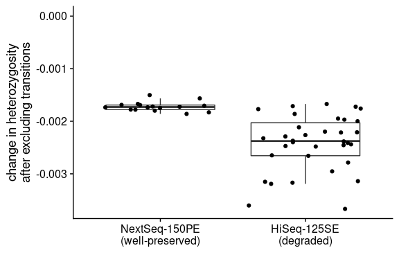

SFS-based analyses
================

``` r
library(tidyverse)
library(cowplot)
```

## Heterozygosity

#### With transitions

``` bash
## Original setup
nohup nice -n 19 bash /workdir/genomic-data-analysis/scripts/get_heterozygosity.sh \
/workdir/batch-effect/ \
/workdir/batch-effect/sample_lists/bam_list_realigned.txt \
/workdir/cod/reference_seqs/gadMor3.fasta \
2 \
10 \
20 \
30 \
> /workdir/batch-effect/nohups/get_heterozygosity.nohup &
## Relaxed filter, LG03 only
#nohup bash /workdir/batch-effect/scripts/get_heterozygosity_per_lg.sh \
#/workdir/batch-effect/ \
#/workdir/batch-effect/sample_lists/bam_list_realigned.txt \
#/workdir/cod/reference_seqs/gadMor3.fasta \
#2 \
#10 \
#20 \
#30 \
#LG03 \
#> /workdir/batch-effect/nohups/get_heterozygosity_lg03_relaxed.nohup &
## More stringent quality and depth filter, LG03 only
nohup nice -n 19 bash /workdir/genomic-data-analysis/scripts/get_heterozygosity.sh \
/workdir/batch-effect/ \
/workdir/batch-effect/sample_lists/bam_list_realigned.txt \
/workdir/cod/reference_seqs/gadMor3.fasta \
2 \
10 \
33 \
30 \
> /workdir/batch-effect/nohups/get_heterozygosity_stringent.nohup &
```

#### Without transitions

``` bash
## old
nohup bash /workdir/cod/greenland-cod/scripts/get_heterozygosity_notrans.sh \
/workdir/batch-effect/ \
/workdir/batch-effect/sample_lists/bam_list_realigned.txt \
/workdir/cod/reference_seqs/gadMor3.fasta \
2 \
10 \
20 \
30 \
> /workdir/batch-effect/nohups/get_heterozygosity_notrans.nohup &
## Relaxed filter, LG03 only
#nohup bash /workdir/batch-effect/scripts/get_heterozygosity_notrans_per_lg.sh \
#/workdir/batch-effect/ \
#/workdir/batch-effect/sample_lists/bam_list_realigned.txt \
#/workdir/cod/reference_seqs/gadMor3.fasta \
#2 \
#10 \
#20 \
#30 \
#LG03 \
#> /workdir/batch-effect/nohups/get_heterozygosity_notrans_lg03_relaxed.nohup &
## More stringent quality and depth filter
nohup nice -n 19 bash /workdir/cod/greenland-cod/scripts/get_heterozygosity_notrans.sh \
/workdir/batch-effect/ \
/workdir/batch-effect/sample_lists/bam_list_realigned.txt \
/workdir/cod/reference_seqs/gadMor3.fasta \
2 \
10 \
33 \
30 \
> /workdir/batch-effect/nohups/get_heterozygosity_notrans_stringent.nohup &
```

#### Summarize and plot

###### Genome wide, relaxed mapping quality filter excluding inversions

``` r
sample_table <- read_tsv("../sample_lists/sample_table_merged.tsv")
for (i in 1:nrow(sample_table)){
  sample_seq_id <- sample_table$sample_seq_id[i]
  sample_id <- sample_table$sample_id_corrected[i]
  population <- sample_table$population[i]
  data_type <- sample_table$data_type[i]
  if (str_detect(data_type,"pe")){
    path <- str_c("../angsd/heterozygosity/", sample_seq_id,  "_bt2_gadMor3_sorted_dedup_overlapclipped_realigned_mindp2_maxdp10_minq20_minmapq30")
  } else {
    path <- str_c("../angsd/heterozygosity/", sample_seq_id,  "_bt2_gadMor3_sorted_dedup_realigned_mindp2_maxdp10_minq20_minmapq30")
  }
  theta <- read_tsv(str_c(path, ".average_thetas.tsv.pestPG")) %>% 
    janitor::clean_names() %>%
    dplyr::select(chr, t_w, n_sites) %>%
    filter(str_detect(chr, "LG")) %>%
    mutate(sample_id=sample_id, population=population, data_type=data_type, type="Including transitions")
  theta_notrans <- read_tsv(str_c(path, "_notrans.average_thetas.tsv.pestPG")) %>% 
    janitor::clean_names() %>%
    dplyr::select(chr, t_w, n_sites) %>%
    filter(str_detect(chr, "LG")) %>%
    mutate(sample_id=sample_id, population=population, data_type=data_type, type="Excluding transitions")
  theta_combined <- bind_rows(theta, theta_notrans)
  if(i==1){
    theta_final <- theta_combined
  } else {
    theta_final <- bind_rows(theta_final, theta_combined)
  }
}
## Calculate average heterozygosity while filtering out inversions
het <- theta_final %>%
  filter(! is.na(chr)) %>% 
  filter(! chr %in% c("LG01", "LG02", "LG07", "LG12")) %>%
  group_by(sample_id, population, data_type, type) %>%
  summarise(sum_t_w=sum(t_w), sum_n_sites=sum(n_sites), heterozygosity=sum_t_w/sum_n_sites)
set.seed(42)
het %>%
  ggplot(aes(x=population, y=heterozygosity)) +
  geom_boxplot(outlier.alpha = 0) +
  geom_jitter(aes(color=data_type), height = 0) +
  facet_wrap(~type) +
  coord_flip() +
  theme_cowplot()
```

<!-- -->

###### Genome-wide, relaxed vs. stringent mapping quality filter and including vs. excluding transitions

``` r
for (i in 1:nrow(sample_table)){
  sample_seq_id <- sample_table$sample_seq_id[i]
  sample_id <- sample_table$sample_id_corrected[i]
  population <- sample_table$population[i]
  data_type <- sample_table$data_type[i]
  if (str_detect(data_type,"pe")){
    path <- str_c("../angsd/heterozygosity/", sample_seq_id,  "_bt2_gadMor3_sorted_dedup_overlapclipped_realigned_mindp2_maxdp10_minq20_minmapq30")
    path_stringent <- str_c("../angsd/heterozygosity/", sample_seq_id,  "_bt2_gadMor3_sorted_dedup_overlapclipped_realigned_mindp2_maxdp10_minq33_minmapq30")
  } else {
    path <- str_c("../angsd/heterozygosity/", sample_seq_id,  "_bt2_gadMor3_sorted_dedup_realigned_mindp2_maxdp10_minq20_minmapq30")
    path_stringent <- str_c("../angsd/heterozygosity/", sample_seq_id,  "_bt2_gadMor3_sorted_dedup_realigned_mindp2_maxdp10_minq33_minmapq30")
  }
  het_relaxed <- read_delim(str_c(path, ".ml"), col_names = F, delim = " ") %>% 
    transmute(n_sites=(X1+X2+X3), n_snp=X2, het=n_snp/n_sites) %>%
    mutate(sample_id=sample_id, population=population, data_type=data_type, tran="Including transitions", filter="relaxed")
  het_relaxed_notrans <- read_delim(str_c(path, "_notrans.ml"), col_names = F, delim = " ") %>% 
    transmute(n_sites=(X1+X2+X3), n_snp=X2, het=n_snp/n_sites) %>%
    mutate(sample_id=sample_id, population=population, data_type=data_type, tran="Excluding transitions", filter="relaxed")
  het_stringent <- read_delim(str_c(path_stringent, ".ml"), col_names = F, delim = " ") %>% 
    transmute(n_sites=(X1+X2+X3), n_snp=X2, het=n_snp/n_sites) %>%
    mutate(sample_id=sample_id, population=population, data_type=data_type, tran="Including transitions", filter="stringent")
  het_stringent_notrans <- read_delim(str_c(path_stringent, "_notrans.ml"), col_names = F, delim = " ") %>% 
    transmute(n_sites=(X1+X2+X3), n_snp=X2, het=n_snp/n_sites) %>%
    mutate(sample_id=sample_id, population=population, data_type=data_type, tran="Excluding transitions", filter="stringent")
  het_combined <- bind_rows(het_relaxed, het_relaxed_notrans, het_stringent, het_stringent_notrans)
  if(i==1){
    het_final <- het_combined
  } else {
    het_final <- bind_rows(het_final, het_combined)
  }
}
het_per_ind <- het_final %>%
  unite(col = type, tran, filter, sep = " ") %>%
  dplyr::select(sample_id, population, data_type, type, het) %>%
  pivot_wider(names_from = type, values_from = het)
## Calculate average heterozygosity while filtering out inversions
set.seed(42)
het_final %>%
  ggplot(aes(x=population, y=het)) +
  geom_boxplot(outlier.alpha = 0) +
  geom_jitter(aes(color=data_type), height = 0, size=0.8) +
  facet_grid(filter~tran) +
  coord_flip() +
  theme_cowplot() +
  theme(panel.background=element_rect(colour="black", size=0.8))
```

<!-- -->

``` r
het_final %>%
  ggplot(aes(x=n_sites, y=het, color=data_type)) +
  geom_point(height = 0, size=1) +
  geom_smooth(se = F, color="black", aes(group=data_type)) +
  facet_grid(filter~tran) +
  theme_cowplot() +
  theme(panel.background=element_rect(colour="black", size=0.8))
```

<!-- -->

###### Effect of excluding transitions

``` r
set.seed(42)
delta_het <- het_final %>%
  dplyr::select(het, sample_id, population, data_type, tran, filter) %>%
  pivot_wider(names_from = tran,  values_from = het) %>%
  mutate(delta = `Excluding transitions`-`Including transitions`) 
delta_het %>%
  ggplot(aes(x=data_type, y=delta)) +
  geom_boxplot(outlier.alpha = 0) +
  geom_jitter(height = 0) +
  facet_wrap(~filter) +
  theme_cowplot()
```

<!-- -->

``` r
delta_het %>%
  filter(filter=="stringent") %>%
  ggplot(aes(x=data_type, y=delta)) +
  geom_boxplot(outlier.alpha = 0) +
  geom_jitter(height = 0) +
  annotate(geom = "text", label="p-value=0.014", x=1.5, y=0.001) +
  scale_x_discrete(labels=c("less degraded", "more degraded")) +
  ylab("Change in heterozygosity\nafter excluding transitions") +
  theme_cowplot()
```

<!-- -->

``` r
t.test(filter(delta_het, filter=="relaxed", data_type=="se")$delta,
       filter(delta_het, filter=="relaxed", data_type=="pe")$delta)$p.value
```

    ## [1] 0.02878372

``` r
t.test(filter(delta_het, filter=="stringent", data_type=="se")$delta,
       filter(delta_het, filter=="stringent", data_type=="pe")$delta)$p.value
```

    ## [1] 0.01429416

This shows that DNA damage has an stronger effect on SE samples (which
are more degraded).

###### Effect of having a stringent filter

``` r
set.seed(42)
delta_het_filter <- het_final %>%
  dplyr::select(het, sample_id, population, data_type, tran, filter) %>%
  pivot_wider(names_from = filter,  values_from = het) %>%
  mutate(delta = `stringent`- `relaxed`) 
delta_het_filter %>%
  ggplot(aes(x=data_type, y=delta)) +
  geom_boxplot(outlier.alpha = 0) +
  geom_jitter(height = 0) +
  facet_wrap(~tran) +
  theme_cowplot()
```

<!-- -->

``` r
delta_het_filter %>%
  filter(tran=="Excluding transitions") %>%
  ggplot(aes(x=data_type, y=delta)) +
  geom_boxplot(outlier.alpha = 0) +
  geom_jitter(height = 0) +
  geom_hline(yintercept=0, color="red") +
  annotate(geom = "text", label="p-value=0.039", x=1, y=0.001) +
  annotate(geom = "text", label="p-value=0.322", x=2, y=0.001) +
  scale_x_discrete(labels=c("more biased\nbase quality", "less biased\nbase quality")) +
  ylab("Change in heterozygosity after\n a more stringent mapping quality filter") +
  theme_cowplot()
```

<!-- -->

``` r
t.test(filter(delta_het_filter, tran=="Including transitions", data_type=="pe")$delta,
       filter(delta_het_filter, tran=="Including transitions", data_type=="se")$delta)$p.value
```

    ## [1] 0.135872

``` r
t.test(filter(delta_het_filter, tran=="Excluding transitions", data_type=="pe")$delta,
       filter(delta_het_filter, tran=="Excluding transitions", data_type=="se")$delta)$p.value
```

    ## [1] 0.1332339

``` r
t.test(filter(het_per_ind, data_type=="se")$`Excluding transitions relaxed`,
       filter(het_per_ind, data_type=="se")$`Excluding transitions stringent`,
       paired=TRUE)$p.value
```

    ## [1] 0.3222135

``` r
t.test(filter(het_per_ind, data_type=="pe")$`Excluding transitions relaxed`,
       filter(het_per_ind, data_type=="pe")$`Excluding transitions stringent`,
       paired=TRUE)$p.value
```

    ## [1] 0.03979679

A more stringent filter decreases heterozygosity estimate of PE samples
but increases that of the the SE samples (very slightly). The difference
is not statistically significant, but it is likely due to several
outliers mostly in PE samples. Using more of the genome to estimate He
might make the signal clearer.

###### PE vs. SE

``` r
## Within KNG2011 only
set.seed(42)
het_final %>%
  filter(str_detect(sample_id, "KNG2011")) %>%
  ggplot(aes(x=data_type, y=het)) +
  geom_boxplot(outlier.alpha = 0) +
  geom_jitter(height = 0) +
  facet_grid(filter~tran, scales = "free") +
  theme_cowplot() +
  theme(panel.background=element_rect(colour="black", size=0.8))
```

<!-- -->

``` r
## PE vs SE before filtering and excluding transitions
t.test(filter(het_final, str_detect(sample_id, "KNG2011"), filter=="relaxed", tran == "Including transitions", data_type=="se")$het,
       filter(het_final, str_detect(sample_id, "KNG2011"), filter=="relaxed", tran == "Including transitions", data_type=="pe")$het)$p.value
```

    ## [1] 0.0007423342

``` r
## PE vs SE after filtering and excluding transitions
t.test(filter(het_final, str_detect(sample_id, "KNG2011"), filter=="stringent", tran == "Excluding transitions", data_type=="se")$het,
       filter(het_final, str_detect(sample_id, "KNG2011"), filter=="stringent", tran == "Excluding transitions", data_type=="pe")$het)$p.value
```

    ## [1] 0.001729581

``` r
## With all populations, controlling for population
##lm(`Including transitions`~population + data_type, data = filter(delta_het, filter=="relaxed")) %>% summary()
##lm(`Including transitions`~population + data_type, data = filter(delta_het, filter=="stringent")) %>% summary()
##lm(`Excluding transitions`~population + data_type, data = filter(delta_het, filter=="relaxed")) %>% summary()
##lm(`Excluding transitions`~population + data_type, data = filter(delta_het, filter=="stringent")) %>% summary()
```

This shows that after excluding transitions and using stringent depth
and quality filters, batch effect on heterozygosity estimate is
significantly reduced.
