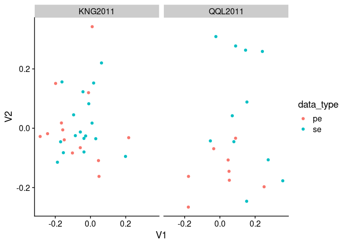
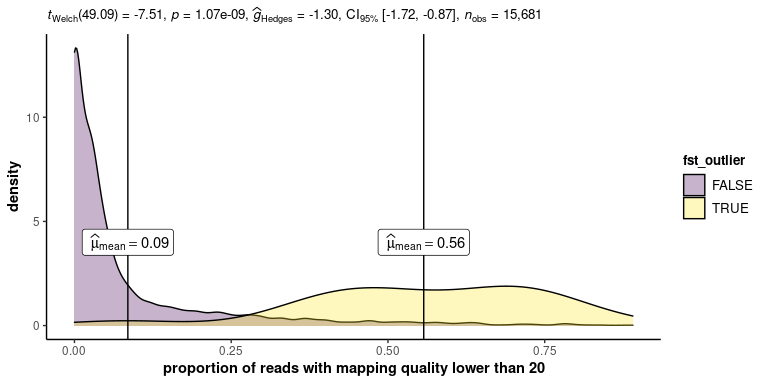
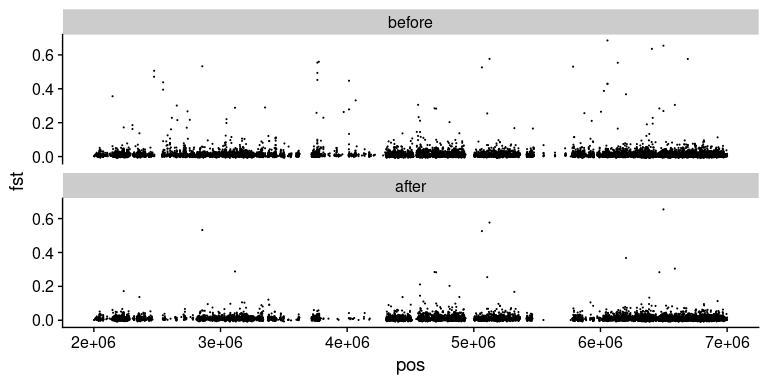

Tutorial
================

  - [Introduction](#introduction)
  - [Poly-G tail](#poly-g-tail)
  - [Base quality score
    miscalibration](#base-quality-score-miscalibration)
  - [Reference bias](#reference-bias)
  - [DNA degradation](#dna-degradation)

## Introduction

``` bash
BASEDIR=/workdir/batch-effect/tutorial
REFERENCE=/workdir/cod/reference_seqs/gadMor3.fasta
FASTP=/workdir/programs/fastp_0.19.7/fastp
FASTQC=fastqc
ANGSD=/programs/angsd0.930/angsd/angsd 
REALSFS=/workdir/programs/angsd0.931/angsd/misc/realSFS
```

``` r
library(tidyverse)
library(cowplot)
library(ggstatsplot)
library(statsExpressions)
```

## Poly-G tail

#### Poly-G tail trimming with fastp

``` bash
$FASTP --trim_poly_g -L -A \
  -i $BASEDIR/data/before_trimming_f.fastq.gz \
  -I $BASEDIR/data/before_trimming_r.fastq.gz \
  -o $BASEDIR/results/poly_g_trimming_f.fastq.gz \
  -O $BASEDIR/results/poly_g_trimming_r.fastq.gz \
  -h $BASEDIR/results/poly_g_trimming.html \
  -j $BASEDIR/results/poly_g_trimming.json
```

#### Sliding window trimming with fastp

``` bash
$FASTP --trim_poly_g -L -A --cut_right \
  -i $BASEDIR/data/before_trimming_f.fastq.gz \
  -I $BASEDIR/data/before_trimming_r.fastq.gz \
  -o $BASEDIR/results/sliding_window_trimming_f.fastq.gz \
  -O $BASEDIR/results/sliding_window_trimming_r.fastq.gz \
  -h $BASEDIR/results/sliding_window_trimming.html \
  -j $BASEDIR/results/sliding_window_trimming.json
```

#### Run FastQC

``` bash
$FASTQC $BASEDIR/data/before_trimming_f.fastq.gz -o $BASEDIR/results/
$FASTQC $BASEDIR/results/poly_g_trimming_f.fastq.gz -o $BASEDIR/results/
$FASTQC $BASEDIR/results/sliding_window_trimming_f.fastq.gz -o $BASEDIR/results/
```

#### Visualize base composition

``` r
basedir="/workdir/batch-effect/tutorial/results/"
file_list=c("before_trimming_f_fastqc", "poly_g_trimming_f_fastqc", "sliding_window_trimming_f_fastqc")
type_list <- c("no trimming", "poly-G trimming", "sliding-window trimming")
for (i in 1:3){
  file <- file_list[i]
  type <- type_list[i]
  unzip(str_c(basedir, file, ".zip"), exdir = basedir)
  fastqc_data <- read_lines(file = str_c(basedir, file, "/fastqc_data.txt"))
  first_line <- which(str_detect(fastqc_data, ">>Per base sequence content")) + 1
  last_line <- which(str_detect(fastqc_data, ">>Per sequence GC content")) - 2
  per_base_seq_content_polyg_trimmed <- fastqc_data[first_line:last_line] %>%
    read_tsv() %>%
    rename(position=`#Base`) %>%
    pivot_longer(2:5, names_to = "base", values_to = "percentage") %>%
    mutate(type = type)
  if (i == 1) {
    per_base_seq_content_polyg_trimmed_final <- per_base_seq_content_polyg_trimmed
  } else {
    per_base_seq_content_polyg_trimmed_final <- bind_rows(per_base_seq_content_polyg_trimmed_final, per_base_seq_content_polyg_trimmed)
  }
}

seq_content_p <- per_base_seq_content_polyg_trimmed_final %>%
  mutate(position = as_factor(position)) %>%
  ggplot(aes(x=position, y=percentage, color=base, group=base)) +
  geom_line(size=0.8) +
  scale_color_manual(values = c("#749dae", "#5445b1", "orange", "#cd3341")) +
  xlab("read position (in bp)") +
  facet_wrap(~type, nrow = 3) +
  cowplot::theme_cowplot() +
  theme(axis.text.x = element_blank(),
        axis.ticks.x = element_blank())
seq_content_p
```

<!-- -->

## Base quality score miscalibration

#### Heterozygosity estimation

``` bash
MINDP=2
MAXDP=10
MINMAPQ=30

for MINQ in {20,33}; do
  for LINE in `cat $BASEDIR/data/bam_list.txt`; do
      NAME_TEMP=`echo "${LINE%.*}"`
      NAME=`echo "${NAME_TEMP##*/}"`
      echo $NAME
      OUTBASE=$NAME'_mindp'$MINDP'_maxdp'$MAXDP'_minq'$MINQ'_minmapq'$MINMAPQ
      
      ## Get saf file
      $ANGSD \
      -i $LINE \
      -anc $REFERENCE \
      -out $BASEDIR/results/$OUTBASE \
      -doSaf 1 \
      -GL 1 \
      -P 8 \
      -doCounts 1 \
      -setMinDepth $MINDP \
      -setMaxDepth $MAXDP \
      -minQ $MINQ \
      -minmapq $MINMAPQ 

      ## Estimate sfs
      /workdir/programs/angsd0.931/angsd/misc/realSFS \
      $BASEDIR/results/$OUTBASE'.saf.idx' \
      -tole 0.0000001 \
      -P 8 \
      -seed 42 \
      > $BASEDIR/results/$OUTBASE'.ml'
  done
done
```

``` r
basedir="/workdir/batch-effect/tutorial/"
sample_table <- read_tsv(str_c(basedir, "data/sample_table.tsv"))
for (i in seq_len(nrow(sample_table))){
  data_type <- sample_table$data_type[i]
  if (data_type=="se"){
    prefix <- str_c(sample_table$sample_seq_id[i], "_bt2_gadMor3_sorted_dedup_realigned_subsetted_mindp2_maxdp10_minq")
  } else {
    prefix <- str_c(sample_table$sample_seq_id[i], "_bt2_gadMor3_sorted_dedup_overlapclipped_realigned_subsetted_mindp2_maxdp10_minq")
  }
  for (minq in c(20, 33)) {
    ml <- read_delim(str_c(basedir, "results/", prefix, minq, "_minmapq30.ml"), col_names = FALSE, delim = " ")
    het <- ml$X2/(ml$X1 + ml$X2 + ml$X3)
    line <- tibble(het=het, sample_id=sample_table$sample_id_corrected[i], data_type=sample_table$data_type[i], minq=minq)
    if (i==1 & minq==20) {
      het_final <- line
    } else{
      het_final <- bind_rows(het_final, line)
    }
  }
}

het_final %>%
  mutate(data_type=ifelse(data_type=="pe", "NextSeq-150PE (more miscalibration in base quality scores)", "HiSeq-125SE (less miscalibration in base quality scores)")) %>%
  mutate(filter=ifelse(minq==20, "relaxed base quality filter (minQ = 20)", "stringent base quality filter (minQ = 33)")) %>%
  mutate(data_type=factor(data_type, levels = c("NextSeq-150PE (more miscalibration in base quality scores)", "HiSeq-125SE (less miscalibration in base quality scores)"))) %>%
  ggstatsplot::grouped_ggwithinstats(
  x = filter,
  y = het,
  #type = "np", # non-parametric statistics
  point.path.args=list(alpha=0.2),
  xlab = element_blank(),
  ylab = "estimated heterozygosity",
  grouping.var = data_type,
  ggtheme = theme_ggstatsplot(),
  bf.message = FALSE,
  ggplot.component = list(theme(panel.grid = element_blank(),
                                axis.line = element_line()))
  )
```

<!-- -->

Note that since we took a very small subsample of the data, the result
is not exactly the same as what our paper shows. Here, the NextSeq-150PE
samples are not significantly affected by the more stringent mapping
quality filter, and the HiSeq-125PE samples consistently get higher
heterozygosity estimates after the filter is applied.

## Reference bias

#### SNP calling and PCA

``` bash
$ANGSD -b $BASEDIR/data/bam_list.txt \
-anc $REFERENCE \
-out $BASEDIR/results/bam_list_minmapq20 \
-GL 1 -doGlf 2 -doMaf 1 -doMajorMinor 1 -doCounts 1 -doDepth 1 -dumpCounts 1 -doIBS 2 -makematrix 1 -doCov 1 -P 8 \
-SNP_pval 1e-6 -setMinDepth 8 -setMaxDepth 66 -minInd 2 -minQ 20 -minMaf 0.05 -minMapQ 20 

zcat $BASEDIR/results/bam_list_minmapq20.mafs.gz | cut -f 1,2,3,4 | tail -n +2 > $BASEDIR/results/bam_list_minmapq20.snp_list.txt
$ANGSD sites index $BASEDIR/results/bam_list_minmapq20.snp_list.txt
```

``` r
test <- read_tsv("results/bam_list_minmapq20.pos.gz")
test %>% 
  count(totDepth)
test %>% 
  count(totDepth) %>%
  ggplot(aes(y=n, x=totDepth)) +
  geom_line()
```

#### Get saf file per population

``` bash
## NextSeq-150PE
$ANGSD \
-b $BASEDIR/data/bam_list_pe.txt \
-anc $REFERENCE \
-out $BASEDIR/results/bam_list_pe_minmapq20 \
-doSaf 1 \
-GL 1 \
-P 8 \
-doCounts 1 \
-dumpCounts 1 \
-setMinDepth 5 \
-minQ 20 \
-minmapq 20 \
-sites $BASEDIR/results/bam_list_minmapq20.snp_list.txt

## HiSeq-125SE
$ANGSD \
-b $BASEDIR/data/bam_list_se.txt \
-anc $REFERENCE \
-out $BASEDIR/results/bam_list_se_minmapq20 \
-doSaf 1 \
-GL 1 \
-P 8 \
-doCounts 1 \
-dumpCounts 1 \
-setMinDepth 5 \
-minQ 20 \
-minmapq 20 \
-sites $BASEDIR/results/bam_list_minmapq20.snp_list.txt
```

#### Get 2dSFS and Fst

``` bash
$REALSFS \
$BASEDIR/results/bam_list_pe_minmapq20.saf.idx \
$BASEDIR/results/bam_list_se_minmapq20.saf.idx \
-P 8 \
-seed 42 \
-maxiter 500 \
> $BASEDIR/results/bam_list_pe_minmapq20_bam_list_se_minmapq20.2dSFS

$REALSFS fst index \
$BASEDIR/results/bam_list_pe_minmapq20.saf.idx \
$BASEDIR/results/bam_list_se_minmapq20.saf.idx \
-sfs $BASEDIR/results/bam_list_pe_minmapq20_bam_list_se_minmapq20.2dSFS \
-fstout $BASEDIR/results/bam_list_pe_minmapq20_bam_list_se_minmapq20.alpha_beta

$REALSFS fst print \
$BASEDIR/results/bam_list_pe_minmapq20_bam_list_se_minmapq20.alpha_beta.fst.idx \
> $BASEDIR/results/bam_list_pe_minmapq20_bam_list_se_minmapq20.alpha_beta.txt
```

#### Get depth in HiSeq-125SE without mapping quality filter

``` bash
$ANGSD \
-b $BASEDIR/data/bam_list_se.txt \
-anc $REFERENCE \
-out $BASEDIR/results/bam_list_se_minmapq0 \
-P 8 \
-doCounts 1 \
-dumpCounts 1 \
-setMinDepth 2 \
-minQ 20 \
-minmapq 0 \
-sites $BASEDIR/results/bam_list_minmapq20.snp_list.txt
```

#### Examine PCA results

``` r
basedir="/workdir/batch-effect/tutorial/"
sample_table <- read_tsv(str_c(basedir, "data/sample_table.tsv"))
bam_list <- read_tsv(str_c(basedir, "data/bam_list.txt"), col_names = FALSE) %>%
  transmute(sample_id=str_sub(X1, 37, 47))
genome_cov <- read_tsv(str_c(basedir, "results/bam_list_minmapq20.covMat"), col_names = F)[1:nrow(sample_table),1:nrow(sample_table)] %>% as.matrix
pca_table <- eigen(genome_cov)$vectors %>% 
  as_tibble() %>%
  #transmute(PC1=V1, PC2=V2) %>%
  bind_cols(bam_list, .) %>%
  left_join(sample_table, ., by=c("sample_id_corrected"="sample_id"))
pca_table %>%
  ggplot(aes(x=V1, y=V2, color=data_type)) +
  facet_wrap(~population) +
  geom_point() +
  theme_cowplot()
```

<!-- -->

#### Examine Fst results

``` r
basedir="/workdir/batch-effect/tutorial/"
fst <- read_tsv(str_c(basedir, "results/bam_list_pe_minmapq20_bam_list_se_minmapq20.alpha_beta.txt"), col_names = FALSE) %>%
  transmute(pos=X2, fst=X3/X4)
fst %>%
  ggplot(aes(x=pos, y=fst)) +
  geom_point(size=0.1) +
  theme_cowplot()
```

<!-- -->

At some SNPs, Fst is very high between samples from the same populations
but two different batches, which is not expected. Let’s investigate what
is causing such high Fst values.

``` r
## Depth in HiSeq-125SE without mapping quality filter
depth_minmapq0 <- read_tsv(str_c(basedir, "results/bam_list_se_minmapq0.pos.gz")) %>%
  rename(minmapq0=totDepth)
## Depth in HiSeq-125SE with minimum mapping quality = 20
depth_minmapq20 <- read_tsv(str_c(basedir, "results/bam_list_se_minmapq20.pos.gz"))%>%
  rename(minmapq20=totDepth)
## Calculate depth ratio for each SNP
depth_joined <- left_join(depth_minmapq20, depth_minmapq0) %>%
  mutate(depth_ratio=1-minmapq20/minmapq0) %>%
  dplyr::select(pos, depth_ratio)
## Join fst with depth ratio
fst_depth_ratio <- fst %>%
  left_join(depth_joined) %>%
  mutate(fst_outlier=fst>0.2)
## Fst vs. depth ratio
fst_depth_ratio %>%
  ggplot(aes(x=depth_ratio, y=fst)) +
  geom_point(size=0.2) +
  theme_cowplot()
```

<!-- -->

``` r
## Get test stats
fst_depth_ratio %>%
  ggbetweenstats(y=depth_ratio, x=fst_outlier, output="subtitle", bf.message = FALSE)
```

    ## paste(italic("t")["Welch"], "(", "49.09", ") = ", "-7.51", ", ", 
    ##     italic("p"), " = ", "1.07e-09", ", ", widehat(italic("g"))["Hedges"], 
    ##     " = ", "-1.30", ", CI"["95%"], " [", "-1.72", ", ", "-0.87", 
    ##     "], ", italic("n")["obs"], " = ", "15,681")

``` r
fst_depth_ratio_stats <- fst_depth_ratio %>%
  centrality_description(fst_outlier, depth_ratio)
## Distrution of depth ratio in Fst outliers (those with Fst > 0.2) vs. all other SNPs
fst_depth_ratio %>%
  ggplot(aes(x=depth_ratio)) +
  geom_density(mapping = aes(fill=fst_outlier), alpha=0.3) +
  geom_vline(data=fst_depth_ratio_stats, aes(xintercept = depth_ratio)) +
  geom_label(data=fst_depth_ratio_stats, aes(label=expression), y=4, parse=TRUE) +
  scale_fill_viridis_d() +
  labs(x="proportion of reads with mapping quality lower than 20",
       y="density",
       subtitle=expression(paste(italic("t")["Welch"], "(", "49.09", ") = ", "-7.51", ", ", 
    italic("p"), " = ", "1.07e-09", ", ", widehat(italic("g"))["Hedges"], 
    " = ", "-1.30", ", CI"["95%"], " [", "-1.72", ", ", "-0.87", 
    "], ", italic("n")["obs"], " = ", "15,681"))) +
  theme_ggstatsplot() +
  theme(panel.grid = element_blank(),
        axis.line = element_line())
```

<!-- -->

``` r
## Fst before and after correction
fst_depth_ratio %>%
  filter(depth_ratio < 0.1) %>%
  mutate(type="after") %>%
  bind_rows(mutate(fst_depth_ratio, type="before")) %>%
  mutate(type=fct_relevel(type, c("before", "after"))) %>%
  ggplot(aes(x=pos, y=fst)) +
  geom_point(size=0.1) +
  facet_wrap(~type, ncol=1) +
  theme_cowplot()
```

<!-- -->

Again, due to limited sample size, the result is not exactly the same as
what our paper shows, but it is still clear that Fst outliers are
enriched in regions where a high proportion of reads get low mapping
quality scores.

#### Corrected PCA

First, let’s come up with a new SNP list excluding SNPs that are
affected by reference bias.

``` r
## Come up with a new SNP list
read_tsv(str_c(basedir, "results/bam_list_minmapq20.snp_list.txt"), col_names = FALSE) %>%
  semi_join(filter(fst_depth_ratio, depth_ratio < 0.1), by=c("X2"="pos")) %>%
  write_tsv(str_c(basedir, "results/bam_list_minmapq20.depth_ratio_filtered_snp_list.txt"), col_names = FALSE)
```

Now, let’s run PCA at this new SNP list.

``` bash
$ANGSD sites index $BASEDIR/results/bam_list_minmapq20.depth_ratio_filtered_snp_list.txt

$ANGSD -b $BASEDIR/data/bam_list.txt \
-anc $REFERENCE \
-out $BASEDIR/results/bam_list_minmapq20_depth_ratio_filtered \
-GL 1 -doMajorMinor 1 -doCounts 1 -doIBS 2 -makematrix 1 -doCov 1 -P 8 \
-minQ 20 -minMapQ 20 \
-sites $BASEDIR/results/bam_list_minmapq20.depth_ratio_filtered_snp_list.txt
```

``` r
basedir="/workdir/batch-effect/tutorial/"
sample_table <- read_tsv(str_c(basedir, "data/sample_table.tsv"))
bam_list <- read_tsv(str_c(basedir, "data/bam_list.txt"), col_names = FALSE) %>%
  transmute(sample_id=str_sub(X1, 37, 47))
genome_cov_depth_ratio_filtered <- read_tsv(str_c(basedir, "results/bam_list_minmapq20_depth_ratio_filtered.covMat"), col_names = F)[1:nrow(sample_table),1:nrow(sample_table)] %>% as.matrix
pca_table_depth_ratio_filtered <- eigen(genome_cov_depth_ratio_filtered)$vectors %>% 
  as_tibble() %>%
  #transmute(PC1=V1, PC2=V2) %>%
  bind_cols(bam_list, .) %>%
  left_join(sample_table, ., by=c("sample_id_corrected"="sample_id"))
pca_table_depth_ratio_filtered %>%
  ggplot(aes(x=V1, y=V2, color=data_type)) +
  facet_wrap(~population) +
  geom_point() +
  theme_cowplot()
```

<!-- -->

## DNA degradation

#### Heterozygosity estimation

``` bash
MINDP=2
MAXDP=10
MINMAPQ=30
MINQ=33

for NOTRANS in {0,1}; do
  for LINE in `cat $BASEDIR/data/bam_list_degradation.txt`; do
      NAME_TEMP=`echo "${LINE%.*}"`
      NAME=`echo "${NAME_TEMP##*/}"`
      echo $NAME
      OUTBASE=$NAME'_mindp'$MINDP'_maxdp'$MAXDP'_minq'$MINQ'_minmapq'$MINMAPQ'_notrans'$NOTRANS
      
      ## Get saf file
      $ANGSD \
      -i $LINE \
      -anc $REFERENCE \
      -out $BASEDIR/results/$OUTBASE \
      -doSaf 1 \
      -GL 1 \
      -P 8 \
      -doCounts 1 \
      -setMinDepth $MINDP \
      -setMaxDepth $MAXDP \
      -minQ $MINQ \
      -minmapq $MINMAPQ \
      -noTrans $NOTRANS

      ## Estimate sfs
      /workdir/programs/angsd0.931/angsd/misc/realSFS \
      $BASEDIR/results/$OUTBASE'.saf.idx' \
      -tole 0.0000001 \
      -P 8 \
      -seed 42 \
      > $BASEDIR/results/$OUTBASE'.ml'
  done
done
```

``` r
basedir="/workdir/batch-effect/tutorial/"
sample_table <- read_tsv(str_c(basedir, "data/sample_table_degradation.tsv"))
for (i in seq_len(nrow(sample_table))){
  data_type <- sample_table$data_type[i]
  if (data_type=="se"){
    prefix <- str_c(sample_table$sample_seq_id[i], "_bt2_gadMor3_sorted_dedup_realigned_subsetted_mindp2_maxdp10_minq33_minmapq30_notrans")
  } else {
    prefix <- str_c(sample_table$sample_seq_id[i], "_bt2_gadMor3_sorted_dedup_overlapclipped_realigned_subsetted_mindp2_maxdp10_minq33_minmapq30_notrans")
  }
  for (notrans in c(0, 1)) {
    ml <- read_delim(str_c(basedir, "results/", prefix, notrans, ".ml"), col_names = FALSE, delim = " ")
    het <- ml$X2/(ml$X1 + ml$X2 + ml$X3)
    line <- tibble(het=het, sample_id=sample_table$sample_id_corrected[i], data_type=sample_table$data_type[i], notrans=notrans)
    if (i==1 & notrans==0) {
      het_final <- line
    } else{
      het_final <- bind_rows(het_final, line)
    }
  }
}

het_final %>%
  pivot_wider(names_from = notrans, values_from = het) %>%
  mutate(delta=`1`-`0`) %>%
  mutate(data_type=ifelse(data_type=="pe", "NextSeq-150PE (well-preserved)", "HiSeq-125SE (degraded)")) %>%
  mutate(data_type=factor(data_type, levels = c("NextSeq-150PE (well-preserved)", "HiSeq-125SE (degraded)"))) %>%
  ggstatsplot::ggbetweenstats(x = data_type, 
                              y = delta,  
                              type = "p", 
                              p.adjust.method = "holm",
                              pairwise.comparisons = TRUE,
                              ggsignif.args = list(textsize = 3),
                              ggplot.component = list(coord_cartesian(ylim=c(-0.005, 0.0001)),
                                                      theme(panel.grid = element_blank(),
                                                            axis.line = element_line()))) +
  #geom_signif(comparisons = list(c("pe\nless degraded", "se\nmore degraded"), c("se\nless degraded", "se\nmore degraded")), y_position = c(-0.001, -0.0012)) +
  ylab("change in heterozygosity estimates \nafter excluding transitions") +
  xlab("sample type") +
  geom_hline(yintercept = 0, linetype=2, color="red")
```

<!-- -->
